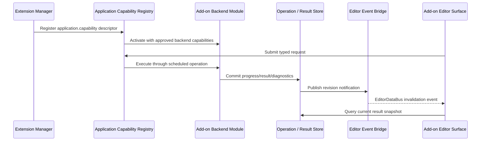
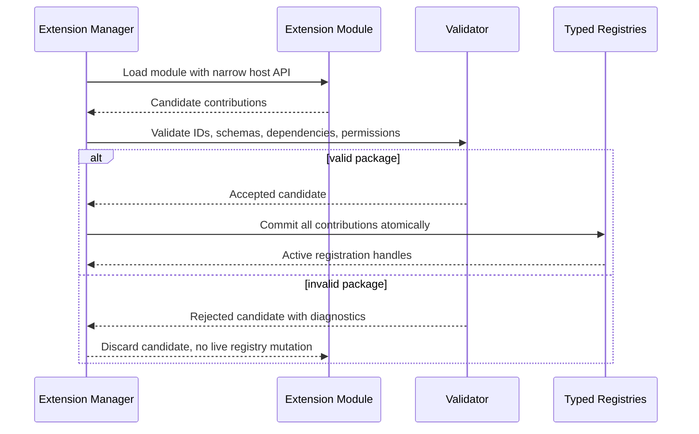
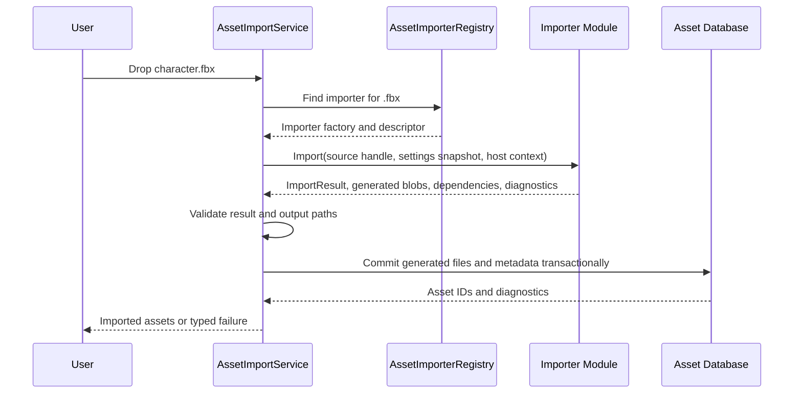

# Extension System Architecture

## Purpose

This document defines Horo's extension system: installable packages that add
modules and typed contributions to editor, tooling, asset-pipeline, MCP, and
approved runtime surfaces.

The user-facing goal is a Lego-like model: install an extension, enable it for a
project, and attach its capabilities to the appropriate part of the engine. The
engine-facing rule is stricter: extensions can only contribute to explicit,
typed extension points with validated descriptors, narrow host APIs, and clear
ownership.

Core engine correctness, project opening, and build execution do not depend on a
marketplace or network service. Marketplace discovery is optional; local and
project-declared packages remain first-class.

The ecosystem's staged capability progression is recorded in
[Extension Capability Roadmap](./extension-capability-roadmap.md). Those stages
are not product milestones or a serial delivery plan; engine workstreams advance
in parallel, while GitHub dependencies record the real technical ordering.

## Scope

This system covers:

- editor and tool extension packages
- asset importers, cookers, validators, commands, panels, tabs, modal pages,
  settings pages, status-bar items, menu items, toolbar actions, and MCP tools
- install, enable, trust, update, disable, and project requirement flows
- marketplace-backed package discovery using GitHub-hosted registry metadata
- runtime-facing contributions only when they use runtime-approved extension
  points and obey gameplay module boundaries

This system does not turn arbitrary native code into a sandbox. Native extension
modules are trusted code. High-risk or untrusted integrations require an
out-of-process helper model rather than pretending in-process dynamic libraries
are isolated.

Gameplay behavior authoring and project-owned gameplay modules are defined by
[Gameplay Module](./gameplay-module.md) and
[Gameplay Module Boundary](./gameplay-module-boundary.md). This document defines
how installable packages contribute modules and extension-point descriptors.

## Terminology

| Term | Meaning |
|---|---|
| Extension package | A `.horopkg` whose package manifest declares one or more extension contribution descriptors. |
| Module | A code/lifecycle boundary inside a package or project. Native modules may be dynamic libraries; script modules may be interpreted or compiled by a host runtime. |
| Contribution | A manifest-declared item added to a typed extension point, such as an asset importer or editor panel. |
| Extension point | A host-owned slot with a public descriptor contract and registry validation rules. |
| Registry | Host-owned typed table that stores accepted contributions after validation. |
| Marketplace | Optional package discovery layer. It helps users find packages; it is not required for local package loading. |

The practical model is:

```text
Extension Package
  contains Modules
  declares Contributions
  targets typed Extension Points
  receives narrow Host APIs
  commits transactionally into host Registries
```

Use these names deliberately:

- **Module** for code boundaries such as `Horo.Network`, `MyGame.Gameplay`, or
  `Vendor.FbxImporter`.
- **Extension point** for engine slots such as `asset.importer`,
  `editor.panel`, or `network.transport`.
- **Extension package** for something a user installs, trusts, enables, updates,
  or removes.

## Core Decisions

- Built-in features, official add-ons, and external packages use the same typed
  contribution and registry concepts.
- An extension package may contain one or more modules and one or more
  contributions.
- `horo-package.toml`, `files.manifest.json` and the verified package install
  record own package identity, files and cross-package dependencies;
  `extension.json` is only a module/contribution descriptor. See
  [ADR-054](../../adr/054-extension-and-package-authority-boundary.md).
- The descriptor is decoded and then cross-reference validated into the immutable,
  backend- and GUI-neutral v1 model from
  [ADR-055](../../adr/055-extension-manifest-v1-typed-model.md). Only that
  validated value may enter package composition, trust planning or activation.
- Embedded third-party editor surfaces are host-rendered typed schemas under
  [ADR-056](../../adr/056-external-editor-ui-boundary.md). The extension C ABI
  carries copied schema/state/action values and lifecycle, never ImGui, SDL,
  renderer handles or C++ panel objects.
- Extension packages may be backend-only, frontend-only, or hybrid. GUI support
  is optional presentation over host-approved backend capabilities; it is not
  the definition of an extension.
- External binary tool/editor modules cross a versioned C ABI entry point; STL
  types, exceptions, allocators, and C++ object ownership do not cross this ABI.
- Project gameplay modules may use the SDK-generation C++ module boundary from
  [Gameplay Module Boundary](./gameplay-module-boundary.md), but that is not a
  long-term binary extension ABI.
- Contributions are declarative. The host validates all IDs, capabilities,
  dependencies, permissions, and schema versions before committing anything to
  live registries.
- A module receives narrow API tables for the extension points it contributes to,
  not engine internals or a service locator.
- Project package requirements are portable configuration, but trust decisions
  are local user/workspace state. Cloning a repository must not auto-load native
  code.
- Runtime unload is not generally supported. Disable, update, and removal take
  effect after restart unless a specific API proves safe live unload.

## Ownership

```text
User / Project
  -> declares package requirements in .horo/packages.json

PackageService / PackageLifecycleService / TrustService
  -> resolve one package graph
  -> verify package and file manifests, integrity and compatibility
  -> evaluate local trust and contribution enablement
  -> produce exact immutable extension activation candidates

ExtensionHost
  -> validates the selected module descriptor and ABI binding
  -> loads only the artifact named by the verified install record
  -> builds a candidate contribution set

Typed Registries
  -> own accepted descriptors and factories
  -> expose stable lookup APIs to engine subsystems
  -> reject duplicate, incompatible, or unauthorized contributions

Engine Subsystems
  -> call registries through normal services
  -> never depend on marketplace availability
```

The host owns all engine registries, project state, GUI hosts, asset database
mutation, and runtime scene activation. Extension modules may create opaque
instances through host-provided allocator and destroy callbacks, but they do not
own engine registries and do not mutate project state directly unless an API
explicitly grants that authority.

## Package Layout

```text
com.vendor.fbx-importer-1.2.0.horopkg
  horo-package.toml
  files.manifest.json
  extensions/
    com.vendor.fbx-importer.native/
      extension.json
      bin/
        macos-arm64/libhoro_fbx_importer.dylib
        linux-x64/libhoro_fbx_importer.so
        windows-x64/horo_fbx_importer.dll
      resources/
        icons/fbx.svg
  licenses/
```

The package manifest declares the extension descriptor path and contribution
root. The signed file manifest declares the descriptor, binaries and resources.
Paths are normalized and must remain inside the verified package root. Symlinks,
`..` traversal, absolute paths, undeclared executable files and platform-specific
path tricks do not bypass containment checks.

## Module Descriptor Schema

`extension.json` separates one module's ABI/entry variants, explicit roles,
contributions, service/script surfaces and requested permissions. Package
identity, dependencies, sources, trust and enablement remain in the package
system. The JSON below is a readable projection of the typed v1 model; consumers
do not retain a JSON DOM or reinterpret its strings after validation. Every path
in the descriptor is relative to the verified package root, not to the descriptor
directory:

```json
{
  "schemaVersion": 1,
  "ownerPackage": {
    "id": "com.vendor.fbx-importer",
    "version": "1.2.0"
  },
  "module": {
    "id": "com.vendor.fbx-importer.native",
    "version": "2.0.0",
    "kind": "native-c-abi",
    "roles": ["backend-capability", "editor-presentation"],
    "abi": "horo-extension-1",
    "entries": [
      {
        "platform": "macos",
        "architecture": "arm64",
        "path": "extensions/com.vendor.fbx-importer.native/bin/macos-arm64/libhoro_fbx_importer.dylib"
      },
      {
        "platform": "linux",
        "architecture": "x86_64",
        "path": "extensions/com.vendor.fbx-importer.native/bin/linux-x64/libhoro_fbx_importer.so"
      },
      {
        "platform": "windows",
        "architecture": "x86_64",
        "path": "extensions/com.vendor.fbx-importer.native/bin/windows-x64/horo_fbx_importer.dll"
      }
    ]
  },

  "contributions": [
    {
      "type": "asset.importer",
      "id": "com.vendor.fbx-importer.importer",
      "module": "com.vendor.fbx-importer.native",
      "fileExtensions": [".fbx"],
      "assetTypes": ["StaticMesh", "SkeletalMesh", "AnimationClip"]
    },
    {
      "type": "editor.panel",
      "id": "com.vendor.fbx-importer.settings-panel",
      "module": "com.vendor.fbx-importer.native",
      "placement": "ProjectSettings/Importers"
    }
  ],

  "permissions": [
    "project.read",
    "project.write.generated"
  ]
}
```

Every module has its own canonical semantic version. The package contribution
points to exactly one descriptor; packages with multiple modules declare multiple
descriptor paths. Contribution registries snapshot package, module and
contribution versions so a module upgrade remains distinguishable from an
importer-contract upgrade.

Validation rules:

- Package IDs come only from the verified package install record. Module and
  contribution IDs are globally canonical and stable.
- Package, module, contribution, permission, setting, event, error, service
  export and script API identities are distinct bounded types; textual equality
  does not make their domains interchangeable.
- An optional `ownerPackage` binding must exactly match that install record.
- Module IDs belong to exactly one package.
- Contribution IDs are unique across all active packages and built-in
  contributions.
- A contribution references the descriptor's module. Cross-package dependencies
  are declared only in `horo-package.toml` and the resolved package graph.
- Descriptor-requested permissions must be a subset of the package contribution
  capability envelope and approved by trust policy before load.
- Module roles are non-empty and explicit. GUI, backend, script-provider and
  runtime contributions cannot grant their matching role by inference.
- Contribution payloads are closed typed variants selected by a registered
  extension-point schema ID/version. Arbitrary property maps cannot enter a live
  registry.
- Settings, events, errors, service exports and script APIs are declared as typed
  records and every reference resolves within the validated package composition.
- A script API adds its permissions to those of its referenced service export;
  validation, trust approval and invocation enforce the complete set union.
- Unknown fields reject schema v1 except inside its bounded extension envelope;
  unknown required extensions reject the descriptor and unknown optional
  extensions remain inert canonical data.
- Decoded or partially validated descriptors cannot construct an activation
  candidate. Complete rules and the migration contract are defined by
  [ADR-055](../../adr/055-extension-manifest-v1-typed-model.md).

## Extension Point Catalog

Initial editor and tool extension points:

| Extension point | Purpose | Typical host authority |
|---|---|---|
| `asset.importer` | Convert source files into typed asset import results. | Host owns asset database writes and generated output placement. |
| `asset.preview` | Produce a bounded rendering-neutral RGBA8 editor preview for an imported asset type. | Host owns scheduling, validation, texture upload/cache lifetime, card chrome, and type-specific fallbacks; modules never receive ImGui or renderer handles. |
| `asset.cooker` | Convert imported assets into runtime-ready platform variants. | Host owns cook graph, cache keys, and output commits. |
| `project.validator` | Validate project configuration, assets, or package requirements. | Host owns diagnostics and project mutation policy. |
| `application.capability` | Add a headless use-case capability that GUI, CLI, MCP, or other approved contributions can call. | Application layer owns operation IDs, scheduling, cancellation, permission checks, and result storage. |
| `process.observer` | Observe approved process-level lifecycle or operation notifications. | Host owns event allowlists, payload shape, threading, and teardown. |
| `pipeline.step` | Add a build, cook, validation, or packaging step to a declared pipeline phase. | Pipeline owns ordering, cache keys, inputs, outputs, and rollback. |
| `toolchain.provider` | Provide compiler, SDK, signing, or packaging toolchain discovery. | Toolchain service owns credential policy, platform filtering, and selected profile state. |
| `editor.panel` | Add dockable editor panels or tabs. | `EditorPanelHost` owns layout, focus, and persistence. |
| `editor.tab` | Add a tab to a host-owned tab stack. | `EditorPanelHost` owns placement, activation, and workspace state limits. |
| `editor.modal` | Add modal workflow factories. | `EditorModalHost` owns exclusivity and input capture. |
| `editor.modal_page` | Add a page inside an existing extensible modal workflow. | Owning modal controls navigation, validation, and commit policy. |
| `editor.settings_page` | Add settings UI backed by typed configuration descriptors. | Configuration service owns validation, persistence, and reload policy. |
| `editor.inspector` | Add custom inspector presentation for declared component, behavior, asset, or project types. | Inspector host owns selection, document commands, validation, and undo routing. |
| `editor.property_drawer` | Add field-level presentation for declared property descriptors. | Property host owns value binding, validation, localization, and fallback rendering. |
| `editor.viewport_overlay` | Add bounded viewport presentation such as labels, guides, or diagnostics. | Viewport host owns draw ordering, visibility policy, and input routing. |
| `editor.gizmo` | Add authoring-only manipulators for declared editable types. | Gizmo host owns picking, transform transactions, snapping, and undoable commands. |
| `editor.asset_preview` | Add preview renderers or summaries for declared asset types. | Asset browser owns preview cache, resource budgets, and fallback thumbnails. |
| `editor.status_item` | Add bounded status-bar presentation. | Status bar owns ordering, visibility, and click routing. |
| `editor.activity_item` | Add an icon button to the activity bar (left or right side) that toggles a drawer or switches a view. | `EditorActivityBar` owns side placement, ordering, activation state, drawer binding, and tooltip. |
| `editor.menu_item` | Add a menu or command-palette entry. | Host owns command routing, shortcuts, and permission checks. |
| `editor.toolbar_action` | Add an optional toolbar action. | Toolbar host owns grouping, overflow, and interaction policy. |
| `command` | Add typed commands and menu contributions. | Host owns command routing, undo policy, and shortcuts. |
| `project.browser_action` | Add project-browser actions. | Host owns selected project context and confirmation UI. |
| `mcp.tool` | Add MCP tools subject to permission policy. | MCP host owns transport, schema, and authorization. |

The host-owned `EditorSurfaceRegistry` now borrows registry limits and provider
status keys during construction and status updates, then copies the values it
retains. Existing source callers use the same call form; consumers holding exact
constructor or member-function signatures must update those signatures. No
caller-owned reference survives either call. This narrows copies without changing
the registry's provider or workspace ownership.

`AssetCookerRegistry` is the synchronous typed host boundary for `asset.cooker`.
Each publication declares one stable contribution identity, an exact provider
generation, one imported asset type, sorted target identities, and the cooker
and artifact-format versions that enter the deterministic cache key. The host
validates the source digest and all bounds before selection, rejects ambiguous
type/target claims unless project policy names one exact contribution, and
computes the cache key itself. Providers receive only immutable borrowed source
bytes, typed identities, canonical digests, cooperative cancellation, and a
bounded staging sink. Payload, dependencies, and structured diagnostics become
visible only after a complete successful call; failure, cancellation, malformed
output, unregistration, and shutdown discard staged output. Cache storage,
dependency scheduling, output placement, and generation publication remain
Assets host authorities rather than provider capabilities.

`ProjectValidatorRegistry` is the synchronous typed host boundary for
`project.validator`. Registration publishes inert provider metadata only. At
validation admission, the registry takes strong provider leases in canonical
validator-identity order and releases its registry lock before invoking any
provider. Each callback receives only a project ID, operation mode, normalized
project-relative resource identities, immutable borrowed bytes, a host-bounded
finding sink, and cooperative cancellation. It receives no project root,
filesystem writer, mutation service, scheduler, or operation store. The host
validates findings through its immutable error registry and publishes results
only after every provider completes; each result retains the exact provider ID
and activation generation. Cancellation, provider failure, invalid findings,
unregistration, and shutdown cannot publish a partial unattributed result.

`PipelineStepRegistry` is the synchronous typed host boundary for
`pipeline.step`. A descriptor declares the exact phase, prerequisite step IDs,
input artifact IDs, output artifact IDs, provider identity, and activation
generation. Registration order never determines execution order: the host
constructs a dependency graph, rejects missing prerequisites, backward phase
edges and cycles, and chooses ready peers by phase and stable step identity.
Callbacks receive only their declared immutable inputs, cooperative
cancellation, and a bounded host-owned staging sink that accepts every declared
output exactly once. Generated bytes become visible to dependent steps inside
the same run, but the result is published only after the complete graph
succeeds. Provider failure, cancellation, malformed output, unregistration, or
shutdown discards the transaction-local staging set and cannot expose partial
output.

`ToolchainProviderRegistry` is the host-owned `toolchain.provider` invocation
gateway. A publication declares canonical provider identity, activation
generation, and the logical tools it may request; it never declares executable
paths or receives the platform process runner. A provider submits a bounded
logical tool and argument intent. Host policy resolves that intent into the
complete shell-free platform request, including the executable, final arguments,
working directory, environment, timeout, termination grace, output bounds, and
output callback. The registry then invokes only `IExternalProcessRunner`,
preserves provider/tool attribution, and wraps policy or platform failures with
their typed cause. Releasing a publication or beginning shutdown revokes future
calls and requests cancellation of every admitted process for that exact
generation.

`HeadlessExtensionHost` is the CLI and automation composition owner for these
backend extension points. Before startup it retains every application-capability,
cooker, validator, pipeline-step, and toolchain-provider registration and the
mutable importer candidate. `Start` discovers only package-graph-declared
locations under approved roots, activates modules with the `Headless` profile,
and publishes the importer catalog only after the complete activation set
succeeds. Typed work is admitted only while the host is ready; failures retain
their original error and cause chain in a bounded attributed diagnostic snapshot.
Shutdown first closes registry admission and cancels registry-owned process work,
then removes registrations, releases the manager lease, and finally releases
importer snapshots that may still retain native code. The terminal host links
Extensions, Assets, Platform, and Security but no GUI, ImGui, window, or renderer
target.

`editor.status_item` contributions are declarative bounded snapshots; they do
not receive ImGui callbacks. The shell owns validation, active-panel visibility,
width admission, overflow, localization, modal input exclusion, and typed
invocation routing. The current host renders any unresolved non-empty icon
resource ID as a semantic dot; a host icon registry may replace known IDs while
preserving that fallback. See
[Editor Status Bar](../editor/editor-status-bar.md).

Runtime-facing extension points are stricter and must also satisfy gameplay and
runtime lifecycle contracts:

| Extension point | Purpose | Related architecture |
|---|---|---|
| `runtime.system` | Register runtime systems with phase/access descriptors. Disabled for arbitrary marketplace packages until runtime participation, shipping, lifetime, fingerprint, unload, and permission contracts are fully implemented. Limited to first-party or explicitly trusted runtime packages in the initial contract. | [Gameplay Module Boundary](./gameplay-module-boundary.md) |
| `behavior.provider` | Deferred runtime-facing point for script or graph runtime adapters and generated descriptor providers. It is disabled in the initial contract unless the provider also satisfies gameplay module validation, trust, `runtime.participate` permission, module fingerprint, lifetime, and safe-reload rules. | [Gameplay Behavior Authoring](./gameplay-behavior-authoring.md) |
| `asset.runtime_loader` | Load game-owned asset types at runtime. | [Gameplay Runtime Integration](./gameplay-runtime-integration.md) |
| `network.transport` | Provide approved network transport implementations. | [Runtime Lifecycle](../runtime/runtime-lifecycle.md) |
| `platform.services.provider` | Provide a trusted private adapter for closed platform-service SDKs through the versioned Horo C ABI. Discovery/trust/load remain package/ExtensionHost concerns; application composition selects one provider generation. | [Platform Services Architecture](../runtime/platform-services-architecture.md) |

The initial provider contribution ABI is an additive 1.2 host-table tail. It
stages exactly one provider-only package contribution, then the Platform Services
composition bridge publishes its existing backend-service factory before the
matching application capability. The capability is the final visibility edge.
Manager release auto-revokes that publication; pending candidate/request leases
and `BUSY` native retirement retain module code until owner-thread drain or
restart quarantine. Importer-only package behavior is unchanged. Mixed provider
and importer packages require a future cross-catalog atomic commit and are
rejected before module load.

The catalog is intentionally typed. A package cannot draw arbitrary UI, mutate
scene state, or open sockets merely because it is installed. It must contribute
to the matching extension point and receive the matching approved permissions.

`behavior.provider` is not a shortcut around project gameplay module boundaries.
An extension package may provide a scripting or visual-graph runtime adapter, or
a descriptor generator, but it cannot directly register object-attached gameplay
behavior by load order. Any runtime behavior descriptors accepted from an
extension provider must flow through the same generated descriptor bundle
validation, trust policy, `runtime.participate` permission, fingerprint/lifetime
checks, and reload-safe-point rules used by project gameplay modules. Until that
contract is implemented and tested, the extension point remains future/deferred.

`runtime.system` is not a shortcut around project gameplay module boundaries
either. An extension package may provide an approved runtime-system
implementation, but it cannot register arbitrary runtime systems by load order.
Any `runtime.system` contribution from an extension package must satisfy the
same runtime participation, shipping, lifetime, fingerprint, unload, and
permission contracts required for `runtime.participate`. Until those contracts
are implemented and tested, the extension point is limited to first-party or
explicitly trusted runtime packages.

Game-owned asset type descriptors and extension-package asset importer/cooker
contributions commit into host-owned asset registries. Duplicate asset type IDs
fail validation. File-extension conflicts require explicit priority, user
selection, or project policy; registration order is never used as the tie
breaker. Project gameplay modules cannot override trusted package importers or
cookers implicitly by loading later.

Asset importer settings UI is host-owned and declarative. An importer
contribution supplies stable field IDs, kinds, defaults, validation bounds,
localized labels, choices, and an `includeInPresets` policy for each field. The
host renders the same form in editor, CLI, MCP, and automation adapters where
applicable; native modules do not receive ImGui callbacks. `includeInPresets`
means that a user-created import preset may retain and later reapply that field.
It defaults to false so per-source identifiers, credentials, paths, and other
instance-specific values are never retained accidentally. The host may also
retain its own non-unique destination options, but asset names and other
host-declared unique fields are excluded from presets.

External binary importers expose this descriptor and their import operation
through the versioned asset-importer C function table supplied by the host.
`AssetImporterContribution`, STL containers, C++ virtual interfaces, exceptions,
and allocator ownership do not cross the binary ABI. The C ABI adapter validates
and copies module-owned descriptor data into the host-owned typed registry before
the module can participate in import operations.

## GUI, Backend, Script-Consumable, And Mixed Modules

An add-on is not synonymous with an editor panel. Each module declares the exact
roles needed by its shape; packages may compose multiple modules:

| Shape | Examples | Required boundary |
|---|---|---|
| GUI-only | diagnostics tab over existing stores, command-palette shortcut, Settings page for built-in capability | Declares `EditorPresentation`, contributes presentation only and consumes existing approved capabilities. |
| Backend-only | asset importer, cooker, project validator, network transport, build pipeline step, toolchain provider | Declares `BackendCapability` and optional `HeadlessTooling`, plus typed capabilities, permissions, errors, settings and observability. |
| Script-consumable | backend service with an approved Lua 5.4 binding | Declares `BackendCapability` and `ScriptProvider`; the script API references a compatible typed service export. |
| Mixed-role | shader tools with compile service plus inspector tab, network transport plus connection diagnostics panel, importer plus import-settings page | Declares the explicit union of its real roles and separate GUI/CLI/MCP adapters over the backend authority. |

The backend side is authoritative. It owns state transitions, jobs, cache keys,
generated outputs, and operation results through host APIs. The frontend side is
a presentation adapter: it observes revisions, queries bounded stores, and calls
typed capabilities. A hybrid package must not hide backend work inside a GUI tab
factory; the headless contribution must remain usable from CLI, MCP, automation,
and tests when no editor surface is open.



This keeps GUI, CLI, MCP, and headless hosts aligned. The same backend capability
can be invoked from multiple frontends without duplicating business logic or
requiring ImGui to exist in the process.

### Script-consumable module boundary

Script APIs follow
[ADR-059](../../adr/059-script-consumable-module-boundary.md). A validated script
API descriptor is an independently versioned language-neutral projection over
one compatible service export. The backend service remains authoritative; the
script runtime adapter owns only VM-specific bindings and value/error projection.

The host resolves declared imports from the verified package graph, trust and
permission state, context profile and immutable provider generation. Resolution
never uses package load order, filesystem discovery, native symbol names or
runtime globals. Calls pass through the host invocation gateway using bounded
values and host-owned async operations. Provider disablement, reload and shutdown
revoke bindings before callbacks, jobs, service objects or native code are
released.

The initial adapter is an in-process sandbox. Script code receives no provider
function table, native pointer, C++ service object, platform handle or extension
GUI object. A future isolated provider or runtime must preserve the same service,
script API, value, error and lifecycle semantics rather than defining a parallel
transport-specific contract.

## Discovery And Resolution

Packages are discovered from:

1. built-in package install records composed by the product host
2. verified user-installed package records
3. the project package graph after restore and trust approval
4. explicit package-system development overrides

Arbitrary current-directory and raw extension-root scanning are forbidden in the
production activation path.

Project requirements live in `.horo/packages.json`:

```json
{
  "dependencies": {
    "com.vendor.fbx-importer": {
      "registry": "official",
      "version": "^1.2.0",
      "contributions": ["editor", "tools"]
    }
  }
}
```

This file is portable project intent, not a trust grant and not a resolved local
path. `PackageResolver` resolves package IDs and versions once and pins the exact
graph in `.horo/packages.lock`. `PackageLifecycleService` and `TrustService`
produce activation candidates; ExtensionHost does not resolve another graph.
Duplicate package IDs, conflicting version ranges, missing dependencies, owner
binding mismatches or incompatible platform artifacts fail before any binary
loads. Legacy `.horo/plugins.json` is migration input only under ADR-054.

## Trust And Permissions

Permissions are capability-oriented:

```text
project.read
project.write
project.write.generated
process.execute
process.thread
network.client
network.server
credential.request
mcp.register_tool
runtime.participate
```

Trust decisions are local user/workspace state. A project can request a package,
but it cannot force another machine to trust or load native code. First load of a
native package must show package identity, publisher, version, source,
permissions, and contributions before approval.

The host denies undeclared capabilities. Native packages remain trusted code;
permissions reduce accidental authority and support informed decisions, but they
are not a memory-safety sandbox.

The implemented admission primitive is `ExtensionCapabilityAdmission`. The
application composition root supplies one immutable policy revision containing
the sealed permission catalog, its approved subset, and the capabilities present
in that host composition. ExtensionHost evaluates a module's complete
manifest-derived request before exposing any service handle. A malformed policy,
unknown or unapproved permission, unavailable capability, duplicate request, or
invalid owner/generation rejects the complete request without a partial grant.
Each granted handle is bound to its extension ID, module ID, and activation
generation. Callback boundaries atomically acquire a use lease for that exact
tuple; admission revocation or destruction closes every retained handle to later
acquisitions. This contract is an admission gate, not a global capability
registry or a native-code sandbox.

`ApplicationCapabilityRegistry` is the composition-owned provider index layered
on that admission. Providers publish inert canonical IDs, exact semantic contract
versions, and non-zero generations through move-only lifetime registrations.
Resolution selects the highest version inside an explicit closed range and also
acquires the calling extension's exact admission handle. Missing and incompatible
providers fail distinctly. Shutdown and registration destruction remove future
discoverability while already leased calls retain their admission lease. The
registry exposes no concrete service pointer; capability-specific host adapters
own invocation, scheduling, cancellation, and result storage.

`BackendServiceRegistry` is the typed in-process adapter boundary behind those
capability leases. The composition root publishes one stable service and contract
identity bound to the exact capability provider version and generation. Callers
resolve a one-shot typed operation handle, never the provider object or a reusable
factory. The registry enforces the declared caller/owner-thread rule before entry,
combines caller cancellation with provider-generation cancellation, attributes
typed provider failures without flattening their cause, and owns reverse-order
revocation. Revocation removes discovery first, cancels and drains admitted calls,
then invokes the provider's `Shutdown()` exactly once. The contract depends only
on Extensions and Foundation, so the same service is usable in graphical and
headless composition without editor or renderer construction. External module C
function tables remain behind a host-owned typed adapter and do not cross this C++
boundary directly.

`BackendOperationRegistry` is the host-owned asynchronous lifecycle boundary for
backend capabilities that need polling rather than callback transport. A provider
generation registers one or more typed operation contracts, each bound to its
expected typed result identity and the existing
`ApplicationCapabilityProviderIdentity`. A move-only registration owns publication
and revocation; it never invokes provider code while holding the registry lock.
`Begin` returns a move-only producer and a copyable handle. The producer owns
progress, bounded Foundation diagnostics, optional bounded result bytes, and the
single terminal transition; the handle only snapshots and requests caller
cancellation. The registry is the sole operation authority for this extension
point and does not mirror records into Foundation `OperationStore`.

Operation snapshots use a monotonic revision and stage-local exact work units.
Progress cannot regress within one phase, while a new typed phase resets its
stage-local counters. Completion, failure, abandonment, cancellation, provider
revocation, and host shutdown all compete under one operation mutex; the first
terminal transition wins and every later producer transition returns
`AlreadyTerminal`. Parent and caller cancellation are observable through the
producer's token. Provider reset and registry shutdown request that token before
forcibly publishing `Cancelled` so backend work can stop without a callback or
wait during teardown.

Provider operations do not own host lifecycle, but a defensive re-entrant shutdown
request cannot wait on its own call. That provider is marked revoked and cancelled
immediately; its final call guard wakes one registry-owned retirement coordinator
after the operation returns. The coordinator processes the retired queue in reverse
registration order and stops at the first deferred provider, so an earlier provider
cannot overtake a later nested or active call. Ordinary host-driven revocation closes
admission and requests cancellation for every provider before the coordinator waits
on the registry's finite shared drain deadline.

`Shutdown()` runs in an explicit `Finalizing` state. Completion is published only
after the callback returns, and concurrent retirement observes the same deadline
rather than treating callback entry as completion. Owner-thread services remain at
the head of the retired queue until `FinalizeRetiredOnOwnerThread` runs on their
recorded thread. Every registration also carries an opaque shared executable-code
lease. A deadline breach makes `RestartRequired` sticky and retains the service,
code lease, and registry state in a process-lifetime quarantine; teardown never
destroys or unloads code that may still be active or awaiting safe destruction.
The application composition owns one backend-service registry per process. Once
that registry enters process-lifetime quarantine, replacement is a process restart;
attempting to quarantine a second registry fails fast instead of creating an
unbounded collection of executable-code leases.

Module resolution emits an opaque immutable `ResolvedExtensionServiceImport` for
every declared service import. Required missing or incompatible imports reject the
whole plan; optional imports remain explicit `Unavailable` or `Incompatible`
records rather than falling through by load order. Headless filtering considers
only required edges when deciding whether an excluded presentation module blocks a
surviving module; an optional binding to an excluded provider becomes
`Unavailable`. Bound records name the consumer package/module and local import,
exact service/contract, provider module and selected version, sorted by consumer
and import identity. Callers can inspect but cannot construct or mutate these
records.

The host combines that static record with an admitted application-capability lease
through `BindImport`. Binding compares the exact consumer activation, canonical
service version, and the provider's explicit module-to-provider identity and
generation before returning a move-only `BackendServiceImportBinding`.
`ResolveImported` consumes that token exactly once. Consumer revocation, capability
unpublication, backend-provider replacement, or registry shutdown invalidates the
token before provider entry and never falls through to another provider. Provider
descriptors therefore use the typed `provider = {moduleId, providerId, generation}`
record; callers migrating from the earlier flat fields must supply the owning
module explicitly. Module code receives only the resulting call adapter, never a
registry or a token constructor.

## Module Loading And ABI Boundary

The generic module C ABI is a bootstrap/control boundary, not sufficient for every
domain hot path. In particular,
[ADR-069](../../adr/069-audio-extension-capability-and-abi.md) requires callback-
executed DSP and spatial contributions to expose a separate versioned Audio RT ABI
after generic package/trust/module activation. ExtensionHost may hand its exact
leased activation candidate and Audio descriptors/tables to Audio, but cannot cast
a generic callback or `void*` into the real-time path or select Audio capability
fallback. Generic and Audio ABI versions negotiate independently.

Tool/editor native modules use a stable C ABI entry point:

```c
typedef struct HoroExtensionHostApi HoroExtensionHostApi;
typedef struct HoroExtensionModuleApi HoroExtensionModuleApi;

HORO_EXTENSION_EXPORT HoroExtensionStatus
horo_extension_load(const HoroExtensionHostApi* host,
                       HoroExtensionModuleApi* module);
```

ABI structures include `size`, version identity, and reserved fields for
append-only extension. A loaded module may return `moduleId` and
`moduleVersion`; when present the host validates both against the manifest.
The manifest remains the durable authority for legacy binaries that omit these
appended fields. Function tables use C-compatible types and explicit ownership
callbacks. The host rejects:

- unsupported API versions
- structure size mismatch
- missing required functions
- incompatible platform, architecture, or build profile
- invalid manifest and binary identity binding
- required permissions not approved by trust policy

No STL containers, exceptions, RTTI-dependent ownership, allocator ownership, or
C++ object deletion crosses this ABI. Module-allocated memory is released by the
module through module-provided callbacks. Host-allocated memory is released by
the host.

The implemented `asset.importer` v1 port is declared in
`include/Horo/Extensions/ExtensionAbi.h`. During `horo_extension_load`, the host
provides `registerAssetImporter`. The module submits a bounded descriptor,
declarative setting schema, import callback, optional RGBA8 preview callback,
and a module-owned context/destroy callback. Descriptor text is copied
immediately; import and preview output is written only through host-owned byte
sinks. The import response appends host-owned dependency, structured-diagnostic,
and progress sinks after the original v1 prefix. Legacy modules that use only the
original response prefix remain valid; modules using the appended sinks must
check `structSize`. Sink rejection is sticky for the invocation, cancellation is
checked before and after provider entry, and no rejected or cancelled output is
published. A successful registration transfers the importer context to the host
adapter even if a later contribution causes the package transaction to fail. The
host then invokes the module destroy callback exactly once after the last catalog
snapshot or in-flight adapter lease releases it.

The build publishes that header as a self-contained, versioned
`HoroEngineExtensionSdk` CMake package. The package exposes only the
`HoroEngine::ExtensionSdk` header target, machine-readable SDK-to-host ABI range
metadata, and the project license. It has no engine-library or third-party link
dependencies and is verified by an external C consumer copied away from the
engine build tree. Configuration recreates the exact versioned SDK staging root,
and reused-build regression coverage verifies its complete artifact set so removed
or renamed files cannot survive publication. Its scaffolder generates portable
GUI-only, backend/library, script-provider, and hybrid C projects. Every generated
module owns a separate ABI entry unit and contract test. Hybrid presentation and
script adapters import the backend's typed service instead of duplicating backend
authority. Generated projects use only `HoroEngine::ExtensionSdk`, relative project
paths, and CPack ZIP configuration. The generated manifest template resolves the
native module suffix during CMake configuration and records the installed `bin/`
path; hosted regression coverage extracts the ZIP and activates every scaffold
shape through the real extension host. Scaffolding rejects a base identity when
any shape-derived module/service/import identity would exceed the manifest limit
or any generated module, contract-test, or archive filename would exceed the
portable 255-byte component limit. Manifest schemas, validation, and distribution
commands remain separately versioned SDK deliverables.

The SDK also stages a platform-native `horo-extension-validate` executable and
the matching V1 authoring schema. The command calls the same bounded manifest
parser as `ExtensionHost`, emits deterministic human or JSON diagnostics with
exact field paths, rejects unsupported requested schema versions, and never
loads module code. The schema supports editor completion; the executable remains
the behavioral authority for cross-field and identity-reference rules.

The SDK additionally stages `horo-extension-conformance` for trusted native
author builds. It exercises the production ABI negotiation and module-table
normalization rules, supplies bounded host callback ownership, destroys every
accepted callback-owned contribution before module unload, and reports stable
stage-specific human or JSON outcomes. Compatible legacy/current fixtures and
intentionally incompatible version/table fixtures protect the harness contract.
Because this command executes native module code in its own process, it is a
developer conformance tool rather than a trust or sandbox boundary.

Project gameplay modules may use the SDK-generation C++ boundary documented in
[Gameplay Module Boundary](./gameplay-module-boundary.md). That boundary is
rebuilt with the project and SDK generation; it is not the same compatibility
promise as marketplace-distributed binary tool modules.

## Contribution Registration Transaction

Module load builds a candidate contribution set. The host validates the complete
set before committing anything to live registries:



Failure discards the complete candidate. Other packages and engine subsystems
never observe partial registration.

The implemented importer catalog supports atomic `RegisterBatch`: every
external descriptor is copied and validated in a load-local candidate first,
then the complete batch is admitted or rejected without mutating the catalog.
Contribution IDs must also be declared as `asset.importer` entries in the
manifest and bind to the module being loaded. Catalog snapshots retain a shared
module lease through their C ABI adapters. `UnloadExtension` therefore releases
the manager lease but cannot unload executable code while an importer or preview
snapshot can still call it.

Before publication, the extension host owns the complete activation transaction.
Failure destroys staged contribution adapters in reverse registration order and
then unloads activated modules in reverse activation order. Cleanup continues
after an unload callback failure; the primary activation error is preserved and
each contained cleanup failure is appended as a diagnostic. Registry validation
precedes ownership transfer, so a rejected batch leaves the prior candidate and
published snapshot unchanged.

## Asset Importer Example

A file-type importer is the reference extension use case. The package declares an
`asset.importer` contribution for one or more file extensions. The host owns all
project mutation; the module owns only the conversion logic.



Importer modules should receive:

- read-only source file access through a host-provided file handle or path token
- an immutable import-settings snapshot
- a diagnostic sink
- a bounded output writer or memory blob API
- stable asset type descriptors for the asset types they emit

Importer modules should return:

- typed imported asset records
- generated blob payloads or host-owned output intents
- dependency records for incremental reimport
- warnings and errors with stable diagnostic codes

Importer modules must not:

- write arbitrary files into the project tree
- update the asset database directly
- retain borrowed host pointers past the callback
- spawn untracked background work
- infer trust from a project manifest request

The host commits generated files, metadata, and asset registry updates in one
transaction. If validation or writing fails, the asset database remains in its
previous state and diagnostics identify the rejected contribution or output.

## Network Module Example

Networking is a module concern first and an extension point second. A first-party
`Horo.Network` module may ship with the engine or SDK, while optional packages
can contribute implementations to typed network slots:

```text
com.horo.network.enet
  -> module: Horo.Network.Enet
  -> contribution: network.transport

com.vendor.steam-networking
  -> module: Vendor.SteamNetworking
  -> contribution: network.transport
  -> contribution: editor.panel for connection diagnostics
```

Runtime network contributions require stricter approval because they can open
sockets, create threads, affect determinism, and ship with packaged games. A
network package manifest should declare runtime support explicitly:

```json
{
  "id": "com.horo.network.enet",
  "version": "0.3.0",
  "runtime": {
    "shippingSupported": true,
    "platforms": ["windows-x64", "linux-x64", "macos-arm64"],
    "linkage": "dynamic"
  },
  "contributions": [
    {
      "type": "network.transport",
      "id": "com.horo.network.enet.transport",
      "module": "com.horo.network.enet.native",
      "protocols": ["udp"]
    }
  ],
  "permissions": ["network.client", "network.server", "process.thread"]
}
```

The engine must not reduce this to a generic extension hook. Network transports need
explicit lifecycle, threading, packet ownership, platform, packaging, and
security contracts before they can be enabled for runtime use.

## GUI And IDE Extensions

Horo's editor is extensible by design. Add-on packages may introduce new IDE
features such as dockable tabs, dedicated panels, modal workflow pages, Settings
sections, status-bar widgets, menu items, command-palette actions, toolbar
actions, diagnostics views, and MCP-backed tools. Built-in editor features and
external add-ons use the same contribution model; first-party code does not get
a private UI integration path that packages cannot use.

GUI modules register factories and metadata. The normal `EditorPanelHost`,
`EditorModalHost`, design system, input scope, localization, configuration, and
data-bus rules still apply. The extension contributes a surface; the host owns
where that surface lives, when it is constructed, what capabilities it receives,
and when it is destroyed.

Example contribution set:

```json
{
  "contributions": [
    {
      "type": "editor.tab",
      "id": "com.vendor.shader-tools.shader-inspector",
      "module": "com.vendor.shader-tools.native",
      "label": "Shader Inspector",
      "fallbackPlacement": "bottom.tools",
      "openByDefault": false
    },
    {
      "type": "editor.settings_page",
      "id": "com.vendor.shader-tools.settings",
      "module": "com.vendor.shader-tools.native",
      "settingsPrefix": "vendor.shader_tools",
      "placement": "ProjectSettings/Tools"
    },
    {
      "type": "mcp.tool",
      "id": "com.vendor.shader-tools.compile-preview",
      "module": "com.vendor.shader-tools.native",
      "schema": "schemas/compile-preview.schema.json"
    }
  ]
}
```

The tab, settings page, and MCP tool are separate contributions even if one
module implements all three. Each receives only the capabilities required for
its extension point. A shader-inspector tab may receive asset-query,
shader-compile, log-query, and editor-notification capabilities; it does not
receive raw access to editor internals, renderer backend objects, or the whole
application service graph.

### Extension Surface Context

Editor UI contributions receive an extension-scoped context shaped by their
descriptor:

```cpp
struct EditorExtensionSurfaceContext {
    ExtensionId extension;
    EditorDataBus& editorEvents;
    EditorSurfaceQueries& surfaceQueries;
    EditorCommandDispatcher* commands;
    CapabilityTable capabilities;
    WorkspaceStateStore& workspaceState;
};
```

The context is not a service locator. `CapabilityTable` contains only validated,
permission-approved interfaces named by the contribution descriptor. Examples:

- `SceneQueries` for read-only scene inspection;
- `SelectionQueries` and selected editor commands for selection-aware tools;
- `AssetQueries` or `AssetImportOperations` for asset tools;
- `LogQuery` and `MetricsQuery` for diagnostic panels;
- `ConfigurationDraftPage` for Settings-page contributions;
- `McpToolRegistration` for protocol tools.

The host may provide null or restricted capabilities when a project, workspace,
or trust policy does not allow the requested operation. The contribution must
render a disconnected or permission-required state instead of probing global
state.

The implemented host boundary is `EditorSurfaceContextDescriptor` plus the
host-owned `EditorSurfaceContextProvider` in the Extensions module. The
descriptor carries the inert surface descriptor and bounded, typed allowlists
for commands, state keys, backend-neutral services, localization keys, and
diagnostic identities. `EditorSurfaceContextProvider::Attach` binds that
descriptor to an `ExtensionActivationLease` and returns a move-only
`EditorSurfaceContextRegistration`; the copied `EditorSurfaceContext` view
contains only immutable metadata, allowlist queries, and activation-scoped
capability-use leases. A provider shutdown or activation revocation invalidates
every retained view and rejects new attachments. Omitted capability grants
remain unavailable even when the surface descriptor declares that capability.
The contract exposes no `EditorLayer`, ImGui, renderer, native platform handle,
service locator, or callback ownership across the extension boundary.

Host-rendered GUI contributions consume the versioned
[`EditorThemeFrame`](./editor-theme-token-contract.md) at the frame boundary.
The frame carries semantic roles and accessibility/DPI evidence; it does not
expose the active theme file or host-owned font/icon resources. Theme, project,
accessibility, and scale changes publish a new revision to the next projection
pass, so extensions do not keep presentation caches or restart to follow a live
theme update.

### Data Bus Participation

Host-owned surface sessions are normal `EditorDataBus` subscribers. They may
observe allowlisted editor-session notifications, invalidate copied presentation
snapshots, and query authoritative stores through approved capabilities. External
controller/module code never receives the C++ bus; it receives versioned bounded
invalidation hints through its UI session or capability context.

Rules:

- Host UI sessions for extension tabs and panels use a provider-owned
  `EditorSurfaceEventContext`, subscribe through move-only RAII tokens, and
  release them during detach. The context is bounded and revocable; it exposes
  sanitized typed payloads, not `EditorDataBus&`.
- An extension does not subscribe directly to `EngineDataBus` from a GUI surface;
  process events enter the editor through `EditorEngineEventBridge` allowlists.
- Surface descriptors declare editor-session requests separately from
  process-event bridge requests. The host may grant only the intersection of the
  descriptor request, the fixed bridge allowlist, and the active capability and
  permission policy.
- Provider activation generation is copied into the context and is invalidated
  on teardown. Closing a context revokes its subscriptions even if the provider
  retained a token.
- Extension event types use the extension's stable module ID as a prefix and are
  declared in the package descriptor before activation.
- High-volume data such as logs, file-watch batches, profiler samples, compiler
  output, or asset thumbnails remains in host-owned bounded stores. The data bus
  carries revisions, ranges, or invalidation hints.
- Event handlers must be cheap, non-blocking, and non-throwing. Expensive work
  goes through approved job or application capabilities.
- Subscriber order is not part of the contract. Coordination that requires a
  result uses typed commands or use cases, not event ordering.
- Process queue backpressure is host-owned and observable. The default is
  `DropNewest`; hosts may use `DropOldest` or same-type `Merge` for bounded
  invalidation traffic. Consumers must tolerate dropped intermediate revisions
  and query the authoritative store.

Host UI sessions use `EditorDataBus` rather than direct `EngineDataBus`
subscriptions because their lifetime is tied to one editor session, not the
whole process. Process-level events that matter to UI are imported through an
allowlisted bridge so payloads can be permission-checked, redacted, normalized,
and scoped to the active workspace. Add-ons that need true process-level
observation declare a separate process-observer contribution or event-import
request instead of hiding that dependency inside a surface schema.

### Modal And Settings Page Contributions

`editor.modal` contributes a complete root workflow factory. `editor.modal_page`
contributes a page to an existing extensible workflow, such as an import wizard
or diagnostics workflow. `editor.settings_page` contributes a Settings page whose
fields are backed by typed configuration descriptors.

The owning modal controls navigation, dirty state, validation, preview, apply,
cancel, and close policy. Extension pages provide page content, validation
diagnostics, and draft-field bindings; they do not commit settings directly or
close the root modal by mutating modal-host state.

The host UI session for an extension modal page may subscribe to `EditorDataBus`;
the external controller receives only allowlisted invalidation hints through its
versioned session/capability contract. Extension pages follow the same interaction
and focus rules as built-in modal content and cannot bypass the active modal scope.

### Activity Bar Contributions

The activity bar is the vertical icon strip on the left and right edges of the
editor workspace. Modules contribute icon buttons through `editor.activity_item`.
Each button can:

- Toggle a side drawer (left or right panel) owned by the module
- Switch the active view or tab in the main editor area
- Open a modal workflow

The activity bar host (`EditorActivityBar`) owns:

- **Side placement**: each item declares `side: "left"` or `"right"`. Left-side
  items are grouped above the spacer; right-side items appear after the spacer
  (or on the dedicated right activity bar).
- **Ordering**: declared via `order` (lower values appear first). Unordered
  items append after ordered items in registration order.
- **Activation state**: only one item per side is active at a time. Activating
  an item deactivates the previous one and toggles its bound drawer. Clicking
  the active item closes the drawer and clears activation.
- **Drawer binding**: each item declares a `drawerId` matching a drawer
  registered via `editor.panel`. The host opens and closes the drawer when the
  item is toggled.
- **Tooltip**: the `label` field provides the hover tooltip and ARIA label.

Example contribution:

```json
{
  "type": "editor.activity_item",
  "id": "com.vendor.curve-tools.activity",
  "module": "com.vendor.curve-tools.native",
  "side": "right",
  "order": 10,
  "label": "Curve Editor",
  "drawerId": "com.vendor.curve-tools.drawer",
  "icon": "icons/curve-editor.svg"
}
```

The icon is an SVG resource bundled with the package. The host renders it at a
fixed size inside the activity button. When the drawer is open, the button
receives the `active` state and `aria-pressed="true"`.

Module authors combine `editor.activity_item` with `editor.panel` (for the
drawer content) and `editor.toolbar_action` (for toolbar buttons inside the
drawer or main view) to deliver a complete side-panel tool.

### Drawer Content (Panel UI)

When the activity bar icon is clicked, the bound drawer opens. The module owns
the backend behavior and semantic view projection; Horo owns the content area's
rendering, interaction and presentation state. External packages use two typed
composition paths:

#### 1. Declarative component layout

Modules register a bounded `EditorUiSchemaV1`. The host renders standard Horo
layout, text, input, choice, list, table, progress, diagnostics, image and action
components without module drawing code. The schema owns stable semantic IDs,
localization keys, accessibility metadata, typed value bindings and actions.

```json
{
  "schemaVersion": 1,
  "root": {
    "type": "column",
    "children": [
      { "type": "number-field", "id": "tension", "label": "curve.tension" },
      { "type": "number-field", "id": "bias", "label": "curve.bias" },
      { "type": "toggle", "id": "closed-loop", "label": "curve.closed_loop" },
      { "type": "action", "id": "preview", "label": "curve.preview" }
    ]
  }
}
```

User interaction becomes a typed action request to an approved backend capability.
The GUI frame renders the latest host-owned immutable snapshot and does not call
module code during widget traversal or draw submission.

#### 2. Registered specialized typed views

Graphical tools use registered plot, timeline, node-graph, image/canvas annotation
or property-inspector schemas. Each view defines bounded data, semantic keyboard/
accessibility behavior, input actions and a performance budget. Missing advanced
semantics require a reviewed extension-point/schema revision; they do not grant a
generic drawing callback.

External modules never receive `ImGuiContext`, draw lists, SDL events, native
windows, dock IDs, GPU textures or Horo internal panel/component objects. A
separate external application may be launched through an approved process
capability, but its window is not embedded or docked and it does not inherit Horo
theme/accessibility guarantees. The complete in-process, C ABI and isolated-helper
policy is [ADR-056](../../adr/056-external-editor-ui-boundary.md).

Users discover and install these modules through the Plugin Manager
(`Window → Plugin Manager`), which fetches package metadata from the
[registry](#marketplace-and-github-registry). Install, trust and enable follow the
package lifecycle; native contribution activation is restart-applied by default.

### Layout, State, And Teardown

The host owns layout persistence, focus routing, docking, shortcut conflicts,
workspace-state byte limits, and safe teardown. Extension surfaces persist only
bounded presentation state under their contribution ID. State for a missing
provider remains opaque and cannot grant capabilities when the provider returns.

GUI modules do not draw directly, bypass modal interaction exclusivity, install
process-global shortcuts, or retain direct editor internals. The host performs
all hit testing, focus, accessibility traversal and rendering from copied typed
state.
During disable, update, shutdown, or future live unload, contributed surfaces are
detached before module shutdown and all subscriptions, callbacks, jobs, and
queued continuations into module code are drained or rejected.

## Marketplace And GitHub Registry

The marketplace is a package discovery and trust-assistance layer, not a hard
runtime dependency. The first implementation should be registry-as-code hosted on
GitHub:

```text
github.com/horo-engine/extension-registry
  registry.json
  packages/
    com.vendor.fbx-importer.json
    com.horo.network.enet.json
```

Each package entry points to immutable GitHub Release artifacts:

```json
{
  "id": "com.vendor.fbx-importer",
  "latest": "1.2.0",
  "versions": {
    "1.2.0": {
      "packageUrl": "https://github.com/vendor/horo-fbx/releases/download/v1.2.0/com.vendor.fbx-importer-1.2.0.horopkg",
      "sha256": "...",
      "signature": "...",
      "engineVersion": ">=0.8 <0.9",
      "platforms": ["windows-x64", "linux-x64", "macos-arm64"]
    }
  }
}
```

Registry pull requests must be validated by CI:

- schema-valid package metadata
- reachable immutable release URLs
- SHA-256 match for downloadable packages
- package manifest ID/version match registry metadata
- valid engine semantic version range
- platform artifacts present for declared platforms
- license file present
- no path traversal or absolute paths in the package archive
- declared permissions and contribution types known to the current registry
- signature verification when package signing is enabled

Native module activation is never controlled by the marketplace's optional
display metadata. [ADR-178](../../adr/178-application-security-primitive-and-signature-baseline.md)
requires a host-composed gate to authenticate the selected library's exact bytes
against explicit trusted roots before the platform loader runs. Hash mismatch,
invalid signature, unknown algorithm/key, missing provider/evidence, or evidence
for older bytes is terminal for that activation transaction; no entry point or
registration callback is invoked.

CLI surface:

```bash
horo extension search fbx
horo extension info com.vendor.fbx-importer
horo extension install com.vendor.fbx-importer@1.2.0
horo extension trust com.vendor.fbx-importer
horo extension enable com.vendor.fbx-importer --project .
horo extension list
horo extension update
```

Editor surface:

```text
Extensions
  Installed
  Available
  Project Required
  Updates
  Trust & Permissions
```

Offline, private, and enterprise projects can use local package directories or a
private registry mirror with the same metadata schema.

## Lifecycle

```text
Resolved -> Verified -> Installed -> Trusted -> Enabled -> Loaded -> Registered -> Active
```

Disable, update, and removal operations are staged and applied on restart by
default. Shutdown reverses active registrations before host registries disappear,
then invokes module shutdown. Dynamic libraries remain loaded until no live
manager, catalog, importer, or preview lease remains. The current asset importer
adapter implements this conservative lease rule; it does not force-unload a
library that still has callable function pointers.

Safe runtime unload requires all of the following to be proven for a specific
module API:

- contributed GUI surfaces are detached and destroyed
- subscriptions and registered callbacks are removed
- queued callbacks into module code are drained
- module-owned asynchronous work is cancelled or joined
- host registries no longer retain module pointers, deleters, spans, string
  views, or function pointers
- localization, configuration, and layout snapshots no longer require executable
  module code

If any invariant cannot be proven, restart remains the only supported unload
path.

One provider may retain at most its active generation and one draining
predecessor. Further update candidates are coalesced without activation; a drain
deadline or retained-code budget breach requires restart instead of accumulating
loaded libraries.

## Failure Isolation

Extension callbacks are guarded at host boundaries. A module error disables the
affected contribution when safe and records a diagnostic. Callback failures must
not corrupt registries, asset database state, panel layout state, or runtime
scene activation.

Native memory corruption cannot be fully isolated in-process. Packages that need
strong isolation, untrusted execution, or crash containment should run in a
separate helper process and communicate through a bounded protocol.

## Anti-Patterns

- Do not expose a global service locator to extension modules.
- Do not let modules mutate project files or registries directly when a host
  transaction should own the mutation.
- Do not auto-load native code merely because a project file requests a package.
- Do not promise C++ ABI compatibility across independent compiler, standard
  library, or SDK generations.
- Do not support arbitrary current-directory scanning for packages.
- Do not implement runtime unload before every callback, async job, registry,
  and snapshot lifetime has a proven teardown path.
- Do not treat marketplace availability as required for local development,
  offline projects, or private enterprise registries.

## Current Editor Integration

Editor Settings presents the user-facing concept as **Extensions**. An extension
package contains one or more versioned **Modules**, and those modules publish
typed **Contributions**. The editor no longer invents separate plugin records for
features that do not exist in the running composition.

The current implementation provides:

- a deterministic inventory containing compiled built-in asset importers and
  packages installed directly below the absolute user extension root
  `~/.horo/extensions`;
- local directory installation through a bounded staging copy that rejects
  symlinks, path escape, duplicate package IDs, oversized trees, and relative
  source paths;
- durable project enablement intent and exact-composition local-trust records in
  the managed extension root; legacy ID-only trust records are not promoted;
- one typed lifecycle projection separating installation, trust, project
  enablement, host compatibility, desired activation, loaded/runtime-active
  state, restart reason, and typed activation outcome;
- optimistic lifecycle revisions, monotonic activation generations, explicit
  transition-owner tags, and bounded immutable audit batches for accepted
  state transitions;
- version, origin, module, contribution, absolute manifest path, typed
  activation failure, runtime-active, and restart-required projections in
  Editor Settings;
- startup-only native activation into the candidate asset-importer catalog.
- an optional Marketplace tab backed by the public GitHub-hosted static
  registry URL, with asynchronous search, platform filtering, bounded HTTPS
  downloads, canonical SHA-256 verification, bounded ZIP extraction, and
  transactional publication through the installed-extension inventory.

Newly installed native packages are disabled and untrusted. Enabling records
portable project intent only; it never grants local execution trust. Trust is a
separate local or organization decision bound to the exact verified package
composition, and an update or replacement invalidates that decision unless its
bounded policy explicitly covers the new digest. Install, enable, trust,
compatibility, desired activation, load, runtime activity, restart requirement,
and activation failure remain orthogonal facts. Marketplace installation does
not grant trust or activate native code.

The lifecycle reducer is the canonical state-machine contract. `TrustService`
owns grant/revoke transitions, `PackageLifecycleService` owns durable
enablement, compatibility, replacement and typed activation outcomes, and
`ExtensionHost` owns load/active/inactive evidence for an exact composition and
generation. Commands with a stale revision, duplicate or
out-of-order action, wrong owner, mismatched composition, or invalid generation
fail without partially changing the projection. Audit records are evidence of
accepted transitions, not a second authority.

Artifact signatures, updates, dependency resolution, per-project requirements,
removal, private-registry credentials, and live-safe contribution types remain
future work.

The direct-directory inventory/manager remains a transitional adapter and does
not turn its exact encoded-manifest digest into verified package or trust
authority. It uses that digest to invalidate local trust when publisher,
capability, entry, or other manifest evidence changes, and projects its
existing persisted enablement and exact-composition trust decisions through the
typed lifecycle contract; activation candidates
from the package system must instead carry the verified artifact/manifest
digest and trust evidence required by ADR-054. The ADR-054 migration inventories
top-level legacy `extension.json`
directories without loading them, generates canonical package and file manifests
in staging, obtains trust review for the generated digest, publishes one verified
package install record and converts `.horo/plugins.json` requests into the package
graph transactionally. After that cutover ExtensionHost accepts only immutable
activation candidates from verified install records; direct directory loading is
retained only in an explicitly marked development/test adapter until removed.

## Testing

Required tests cover:

- manifest schema validation and path containment
- package archive traversal rejection
- ABI version, structure-size, and required-function rejection
- manifest-to-binary identity mismatch rejection
- dependency resolution, duplicate IDs, and incompatible version ranges
- permission denial and trust-required flows
- transactional registration rollback
- asset importer result validation and asset database rollback
- backend-only packages run in headless hosts without constructing GUI or ImGui
- hybrid packages keep backend capabilities callable from GUI, CLI, MCP,
  automation, and tests through the same typed operation path
- application capability, pipeline step, process observer, and toolchain provider
  registrations validate permissions, scheduling policy, result storage, and
  teardown
- GUI focus, layout, workspace-state, and data-bus behavior for extension tabs,
  panels, modal pages, settings pages, status items, menu items, and toolbar
  actions
- extension process-event bridge requests require allowlist approval, safe
  payload shape, permission coverage, and tests
- extension surface handlers cannot perform blocking work inline and are reported
  by slow-handler diagnostics
- callback error mapping and contribution disable behavior
- restart-required update, disable, and removal
- shutdown ordering and no host callbacks after module teardown
- no STL, exceptions, or cross-allocator ownership in ABI fixtures
- platform-services provider fixtures reject SDK/native handles, retained borrowed
  spans, callbacks after sink revocation and partial capability registration; failed
  candidate activation rolls back without changing the active provider generation
- marketplace registry schema, SHA-256, signature, and release URL validation
- extension-only and hybrid `.horopkg` authority fixtures
- raw directory and undeclared descriptor/binary activation rejection
- legacy directory and `.horo/plugins.json` migration dry-run, rollback and
  idempotent resume

The repository's executable reference fixture lives under
`examples/extensions/asset-importer-basic`. Its automated contract test loads
the real platform library, binds manifest/module/contribution versions,
imports, generates a preview, releases the manager lease, invokes the
snapshot-pinned importer again, and performs an identity-preserving reimport.

## Related Documents

- [Plugin Manager UI](./plugin-manager.html): HTML reference design for installed
  plugins, marketplace, updates, and dependency diagnostics.
- [Configuration System](../foundation/configuration-system.md)
- [Application Security](../security/application-security.md)
- [Gameplay Module](./gameplay-module.md)
- [Gameplay Module Boundary](./gameplay-module-boundary.md)
- [Gameplay Runtime Integration](./gameplay-runtime-integration.md)
- [GUI Screen Host](../editor/gui-screen-host.md)
- [Editor Panel Host](../editor/editor-panel-host.md)
- [Editor Modal Host](../editor/editor-modal-host.md)
- [Asset Pipeline](../runtime/asset-pipeline.md)
- [Platform Services Architecture](../runtime/platform-services-architecture.md)
- [ADR-131: Platform Services Closed SDK, Extension ABI, Package and Composition Boundary](../../adr/131-platform-services-closed-sdk-extension-abi-package-and-composition-boundary.md)
- [MCP Architecture](../interfaces/mcp-architecture.md)
- [Horo Package System](../packages/package-system.md): game and hybrid packages that may declare editor extensions
