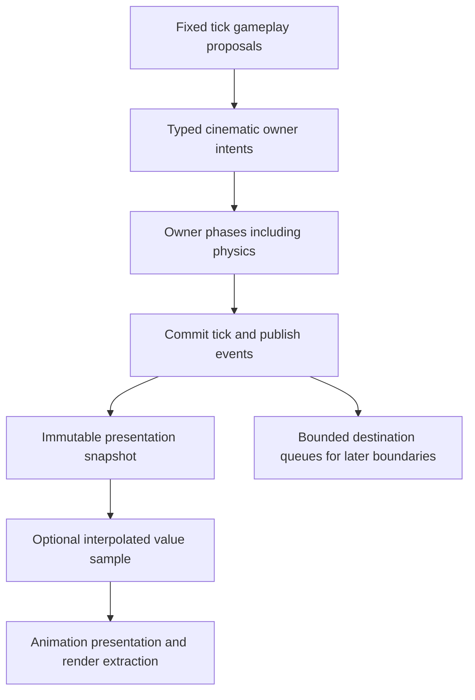

# Cinematic Sequencer Architecture

## Purpose

This document defines Horo Engine's cinematic sequencer runtime and authoring architecture. It specifies timeline data structures, track evaluation models, clock authority, frame evaluation scheduling, object and property binding resolution, camera cut coordination, event dispatching, and editor integration.

The goal is to provide a bounded, data-oriented cinematic runtime capable of driving in-game cutscenes, interactive timelines, UI animations, and complex scene staging while maintaining strict architectural boundaries and zero heap allocations on frame-hot evaluation paths.

## Normative Decision Reference

This subsystem is governed by [ADR-014: Sequencer Ownership, Clock Authority and Binding Boundary Decision](../../adr/014-sequencer-ownership-clock-authority-and-binding-boundary.md).
[ADR-117](../../adr/117-playback-ownership-frame-order-and-determinism.md)
refines live-player ownership, activation identity, multi-player batch order,
replay/headless evidence, numeric determinism and random-access seek.
[ADR-118](../../adr/118-animation-character-and-gameplay-authority-during-cinematics.md)
defines Animation, Character and Gameplay authority while those players target
skeletal pose or actor control.
[ADR-119](../../adr/119-camera-authority-during-cinematics.md) defines per-view
runtime, PIE and editor camera authority, cinematic cut handoff, frame-commit
validity and tiered transition/render contracts.
[ADR-120](../../adr/120-cinematic-event-dispatch-and-audio-coupling-boundary.md)
defines cooked typed EventTrack bindings, session-safe-point gameplay dispatch,
failure outcomes and the AudioFrontend handoff governed by AUD-family decisions.
[ADR-121](../../adr/121-cinematic-editor-document-and-authoring-context.md)
defines persistent sequence documents/tabs, command and persistence ownership,
detachable scene authoring context, stale-reference inspection and preview isolation.
[ADR-122](../../adr/122-cinematic-trigger-sources-and-capability-policy.md)
defines the common typed start request and capability/trust/authority/product-profile
policy for gameplay, scene autoplay, event, editor, MCP and remote trigger sources.
[ADR-068](../../adr/068-music-transport-and-cross-system-ownership.md) owns the
AudioTrack handoff: Sequencer retains sequence clock, directed event traversal,
seek/scrub and preroll intent while Audio alone maps accepted requests to sample
time and schedules the callback.

## Core Decisions

- **Clock source and policy are separate**: Committed simulation time, unscaled
  fixed control time, monotonic wall time and an external master have different
  guarantees. Pause following and optional dilation are explicit validated settings.
- **Two evaluation paths**: Fixed-tick authoritative sampling/events are separate
  from optional interpolated presentation sampling. Rendering never fires gameplay
  events or mutates physics-owned state.
- **History-independent values, stateful events**: Value curves sample at time T
  without replay. Event dispatch evaluates directed intervals with an explicit
  cursor, loop identity and seek policy.
- **Domain authority**: SceneModel binds scene/component-authored properties only.
  Physics, camera and gameplay pause owners admit typed requests; sequencing does
  not grant unrestricted writes or scheduler control.
- **Durable bindings**: Stable authored identities resolve to generation-checked
  runtime handles. Lifecycle invalidation and bounded rebind cover same-scene
  destruction, respawn, component replacement and scene transitions.
- **Coordinate and capacity contracts**: Local transform tracks use durable parent
  or sequence anchors. Typed CPU/memory budgets bound players, nested tracks,
  events, binding retries and per-boundary work independently of graphics APIs.
- **Runtime-service player ownership**: Scene components are inert authored start
  descriptors. One session-owned service retains live players, tokens, leases,
  nested instances, event cursors and late-completion fences.
- **Stable batch order and qualified determinism**: Boundary snapshots order players
  by domain, descending priority and stable identity. Exact cross-platform float bits
  are not promised; identities/time/event order are exact and samples use declared
  tolerances across build/platform fingerprints.
- **Owner-issued cinematic authority**: Animation composes per-joint pose claims,
  Character resolves exclusive cinematic movement, and Gameplay returns typed
  suppression/acceptance. Whole-game pause never moves an authoritative Character.
- **Per-view camera authority**: Runtime and PIE Camera services resolve gameplay
  plus cinematic proposals independently; the editor viewport controller retains
  authoring-camera authority. One immutable selection covers one rendered frame.
- **One typed event path**: A session `CinematicEventDispatcher` invokes cooked,
  versioned gameplay adapters at destination owner boundaries. `EngineDataBus` is
  not gameplay EventTrack delivery, and AudioTrack submits intent through AudioFrontend.
- **Document-owned authoring**: Sequence assets use persistent document tabs and the
  shared typed command/history/save/conflict model. Scene context and preview are
  detachable projections and never become a second source of authored truth.
- **Capability-gated triggers**: Every source submits the same typed application start
  request. Authored Shipping triggers remain product behavior; debug/MCP/remote start
  adapters are omitted from Retail Shipping and cannot be enabled by runtime flags.

## System Boundaries and Target Topology

```text
[HoroEngine::Foundation]
       ^
       |
[HoroEngine::SceneModel] <---------------+
       ^                                 |
       |                                 |
[HoroEngine::CinematicModel]             | (Shared PropertyBindingRegistry)
       ^                                 |
       |                                 |
[HoroEngine::CinematicRuntime]           |
       ^                                 |
       |                                 |
[HoroEngine::EditorServices] ------------+
       ^
       |
[HoroEngine::Gui] (Timeline UI / Inspector)
```

| Target | Layer | Responsibilities | Dependencies |
|---|---|---|---|
| `HoroEngine::CinematicModel` | Model / Asset | `SequenceAsset`, tracks, keyframes, curves, interpolation math, playback settings, schemas, and bounded asset parsers. | `Foundation`, `Runtime` (stable scene identities), `SceneModel`, `Assets` |
| `HoroEngine::CinematicRuntime` | Runtime | `SequencePlayer`, `SequencePlaybackClock`, `SequenceBindingAuthority`, `SequenceEvaluationSystem`, camera requests, and event queues. Host-injected domain adapters enforce authority. | `CinematicModel`, `RuntimeScene`, `Runtime` |
| `HoroEngine::EditorServices` | Presentation / Tooling | Timeline workspace controllers, property recording, curve editing services, track solo/mute adapters, and Problems panel integration. | `CinematicRuntime`, `CinematicModel`, `SceneModel`, `EditorModel` |

`HoroEngine::CinematicRuntime` contains zero dependencies on `HoroEngine::EditorServices`, `HoroEngine::Gui`, or ImGui.

## Player Ownership And Lifetime

`CinematicRuntimeService` is owned by one application/runtime session and owns every
live `SequencePlayer`. Its registry retains clocks, event cursors, binding caches,
nested-player trees, capacity reservations, asset/provider leases, domain tokens and
queued-effect lifetime. It closes before Scene/Runtime dependencies and no player
survives the session.

An optional scene `SequencePlaybackComponent` contains only authored configuration:
sequence asset identity, stable activation identity, settings, priority, autoplay and
`SceneBound`/`ApplicationBound` scope. Runtime conversion submits a typed request and
receives a generation-checked handle; the component does not embed a player or retain
callbacks into its own memory. Application/gameplay starts use the same service API.

SceneBound players stop before their `SceneRuntimeId` is replaced. ApplicationBound
players survive travel only when the descriptor has no required old-scene binding and
every retained adapter admits travel. Preview, PIE and packaged runtime use separate
session registries. Component removal, UI close or dropping a handle requests stop;
only the service retires tokens, leases and queued effects at an owning boundary.

Preparation validates assets/nesting, compiles the plan, reserves aggregate capacity,
resolves required adapters and acquires tokens before the player enters a batch. Stop
closes admission, removes it from a later batch, releases only its tokens, cancels
owned work where possible and ignores late completions by session/player generation.
Nested players are registry-owned children identified by root activation plus stable
track/key/instance path; they cannot acquire an independent session or budget pool.

Root activation IDs come from stable scene object/playback-slot identity, a recorded
gameplay command/event occurrence or a recorded application operation identity.
Allocation order, pointers, thread arrival, worker completion, unordered-map order and
process-random hash seeds are never player identity or tie-breakers.

### Implemented Playback State Contract

`Horo/Cinematic/SequencePlayer.h` is the implemented owner-side control state machine.
`CinematicRuntimeService` creates and stores each value; application, scene and tool
callers retain only `SequencePlayerHandle`. Every command validates the exact runtime
session and player generations. `SequencePlayerOperationFence` additionally captures
the monotonically increasing control revision so a completion prepared before play,
pause, seek, rate, stop, failure or close cannot commit into newer state.

The implemented transitions are `Ready -> Playing <-> Paused`, any controllable state
to `Stopping -> Stopped`, and every non-terminal state to `Closing -> Stopped` or
`Failed`. `Stopped` and `Failed` are terminal; replay requires a newly registry-issued
player generation. Repeating an already-satisfied Play, Pause, Stop, Close or Fail is
an explicit no-change result and emits no signal. Invalid transitions fail without
changing state or control revision.

Stop and close deliberately differ. Stop closes future evaluation/event admission and
drains occurrences already admitted by the owning boundary. Close is cancellation,
scene/session loss or shutdown: it closes admission immediately and discards pending,
not-yet-admitted work. Neither transition synchronously destroys leases or provider
payloads. Their owning registry publishes the terminal state only after retained work
retires.

Seek accepts any exact target in the inclusive sequence range and publishes the target
directly; it never advances from the prior cursor. Its signal resets event traversal
without dispatching the crossed interval. Playback rate is a bounded exact rational.
Zero rate leaves a player `Playing` with a frozen clock and is observably different
from `Paused`; negative rate remains available for reverse-capable clocks.

## Trigger Sources And Admission

Gameplay scripts/native behaviors, scene-load autoplay descriptors, committed
gameplay events, editor UI/preview, MCP/agent tools, local debug/CLI and authenticated
remote/server adapters all submit one bounded `SequenceStartRequest` through an
injected `ICinematicPlaybackCapability`. No caller constructs a player or discovers a
global service. Admission validates source/principal, build profile, project/package
trust, capability grant, session/scene/world authority, cooked asset revision, full
effect capability plan and shared budgets before acquiring any player/domain state.

Gameplay and cooked scene/event triggers are ordinary product behavior and may ship
when their modules/assets and effect plans are admitted. Scene autoplay begins only
after successful aggregate scene activation. Event-triggered starts occur after the
source occurrence commits and use occurrence-derived stable activation identity;
cycles/nesting share ADR-117 capacity. Client requests cannot gain server authority.

Editor preview is isolated; PIE uses PIE world authority. MCP/agent/debug/remote
adapters reuse their existing tool schema, project trust, permission, product-profile,
server-authority, revision-bound approval and audit infrastructure. Authentication or
localhost is not authorization. Retail Shipping omits these tooling start descriptors;
a runtime flag cannot restore them. Dedicated Server admits only explicitly registered,
authenticated `Restricted`, server-authoritative and headless-compatible operations.

Denial creates no player, cursor, lease/token or downstream Audio/VFX/event request.
Stable results distinguish unsupported source/adapter, product-profile/trust/
capability/approval/world denial, unavailable asset, effect denial, conflict, capacity
and headless incompatibility. ADR-122 owns the complete source matrix and lifecycle.

## Sequencer Data Model

### Sequence Asset

A sequence asset is an immutable, cookable project asset defining tracks, timeline parameters, and playback configuration:

```cpp
struct SequenceAsset {
    SequenceId                  id;
    std::string                 name;
    Duration                    duration;
    FrameRate                   frameRate;          // Authoring frame rate (e.g. 24, 30, 60 fps)
    std::vector<SequenceTrack>  tracks;
    SequencePlaybackSettings    defaultSettings;
};
```

The implemented source contract is `SequenceSchemaVersion { major, minor }` with
current version `1.0`. The reader accepts only the exact current version. An older
minor in the current major is classified as `MigrationRequired`; a newer minor,
different major, or reserved zero version is `Unsupported`. No best-effort field
dropping, silent default insertion, or parallel legacy reader is permitted. A
migration must produce and validate the exact current schema before cook.

Sequence source JSON is treated as hostile input. The CinematicModel parser enforces
compiled and project-lowerable byte, nesting, name, track, dependency, and key-count
ceilings before a value becomes a `SequenceAsset`. Unknown/duplicate fields,
duplicate stable track identities, duplicate per-track dependencies, invalid clock
combinations, non-canonical asset identities, and type-incompatible track references
return stable typed errors. The validated value owns its data and contains no live
provider, editor, runtime, native, or backend handle.

Audio, sub-sequence, and external binding-descriptor references persist only stable
path-independent `AssetId` values plus their declared domain kind. Cook pins one
Asset Registry/provider snapshot and requires exact resolution evidence for every
reference. `Missing`, `Moved`, `Unloadable`, type mismatch, and a cyclic reachable
sub-sequence are separate actionable failures; cook never substitutes, skips, or
synchronously loads a dependency. A moved asset is usable only after the Asset
Registry publishes a later snapshot in which the same `AssetId` is `Available` at
its new location. The authored reference is not rewritten.

Editor delete/move notifications are revision hints under ADR-121: they invalidate
derived compile/preview state and trigger bounded revalidation against a fresh
registry snapshot. Runtime activation performs the same stable-ID/provider check on
the exact cooked generation; deletion, package unload, or replacement invalidates
the provider generation and yields a typed unavailable result rather than retaining
a stale pointer. Existing players retain only explicitly leased old generations;
reload never retargets a live reference in place.

Cook profiles use the provider-neutral Compact/Standard/Large evaluation tiers from
this document. The resolved immutable plan records exact track, key, dependency, and
root-inclusive nesting counts. Profile limits cannot be raised by source data, and
tier overflow fails before artifact output or runtime activation.

### Track Structure

Each track animates an object transform, component property, camera cut, audio source, sub-sequence, or event timeline:

```cpp
enum class TrackType : uint8_t {
    Transform,
    Property,
    CameraCut,
    Event,
    Audio,
    SubSequence
};

struct SequenceTrack {
    TrackId                     id;
    std::string                 displayName;
    TrackType                   type;
    StableObjectId              targetObject;       // Durable UUID resolved to EntityId at activation
    ComponentTypeId             targetComponent;    // Target component type when applicable
    PropertyBindingId           targetProperty;     // Resolved via PropertyBindingRegistry
    std::vector<Keyframe>       keyframes;
    TrackBlendSettings          blend;
    bool                        muted;
    bool                        solo;
};
```

### Keyframe and Curve Interpolation

Keyframes define discrete control points with configurable interpolation modes:

```cpp
enum class InterpolationType : uint8_t {
    Constant,       ///< Step / hold value until next keyframe
    Linear,         ///< Direct linear interpolation (LERP / SLERP)
    CubicBezier,    ///< Cubic Bezier with explicit tangents
    HermiteSpline   ///< Smooth cubic Hermite spline
};

struct Tangent {
    float timeOffset;
    float valueOffset;
};

struct Keyframe {
    KeyframeId          id;
    SequenceTime        time;               // Canonical rational/fixed-point timeline position
    PropertyValue       value;              // Strongly typed variant (float, Vec3, Quat, Color, etc.)
    InterpolationType   interpolation;
    Tangent             tangentIn;
    Tangent             tangentOut;
};
```

## Track Types

### 1. Transform Track

Animates local position, rotation, and scale of a scene object:

```cpp
struct TransformKeyframe {
    SequenceTime        time;
    Vec3                position;           // Local position
    Quat                rotation;           // Local orientation
    Vec3                scale;              // Local scale
    InterpolationType   interpolation;
    Tangent             tangentIn;
    Tangent             tangentOut;
};
```

- **Hierarchy-Aware Evaluation**: Transform application uses parent-to-child order
  within its semantic phase, not as a global ordering rule for all track types.
- **Local-Space Authoring**: Stores offsets relative to a durable parent or sequence
  anchor. Root tracks require an anchor in canonical world coordinates; they never
  treat a rebased root transform as a permanently stable origin. See Origin Rebase.

The CIN-001.5 model contract compiles exact binding topology into one stable
parent-before-child order at activation. Compilation rejects missing or stale
bindings, parent cycles, duplicate identities, unsupported versions and the
1,024-track hard ceiling. Evaluation then samples the ten scalar translation,
quaternion and scale channels directly into caller-owned output; it performs no
allocation or topology search. Runtime application and editor preview use this
same path, so preview values cannot drift into a second interpolation model.
Scene and binding revisions fence replacement, while each root resolves its
canonical anchor against the current non-zero origin epoch exactly once. Child
outputs remain local-space across origin changes.

### 2. Property Track

Animates typed component properties registered in `PropertyBindingRegistry`:

- **Numeric**: `float`, `int32_t`, `double` (e.g. light intensity, camera FOV, post-process bloom threshold)
- **Vector**: `Vec2`, `Vec3`, `Vec4` (e.g. material tint, particle spawn velocity, UI offset)
- **Color**: `Color` (linear RGBA with HDR support)
- **Boolean**: `bool` (e.g. visibility, mesh renderer enable, light enable; evaluated as step function)
- **Asset References**: `AssetId` (e.g. material swap, mesh swap; step interpolation)

### 3. Camera Cut Track

Coordinates the active rendering camera and cinematic camera transitions:

```cpp
struct CameraCutKeyframe {
    SequenceTime        time;
    StableObjectId      cameraObject;       // Target camera entity
    CameraTransitionTier transitionTier;    // HardCut, SingleViewBlend, or DualViewCrossFade
    CameraTransitionFallback fallback;      // Explicit admitted fallback or Fail
    SequenceTime        transitionDuration; // Zero for HardCut; finite otherwise
    CameraBlendCurve    transitionCurve;    // Used only by a blending tier
};
```

Camera cuts carry camera identity and blend metadata, not world-space positions.
A host-injected typed camera adapter requests an owner-issued, generation-safe
override lease for one `CameraViewContextId`. Runtime and PIE sessions own isolated
Camera services; the editor viewport controller retains its authoring camera and
admits preview only through an editor-scoped proposal. The sequencer never writes a
global active-camera pointer or takes editor viewport authority.

The track has no effective override before its first cut. Its compiled end policy is
either the default `HoldLastUntilPlayerEnd` or explicit `ReleaseAtTrackEnd`. Stop,
cancellation, completion, binding loss, scene replacement and context destruction
close proposal admission and release only that player's lease at the owner safe
point. The owner then resolves the current gameplay, cinematic or editor proposal;
restoring an older pointer is forbidden. Conflicts use descending priority then
stable player identity, independent of evaluation order.

The Camera owner commits one immutable selection after `VariableUpdate` and before
`RenderExtraction`; late changes apply to the next rendered frame. The baseline is a
one-view `HardCut`. `SingleViewBlend` is a Camera-owned backend-neutral pose/
projection interpolation, while `DualViewCrossFade` requires an explicitly admitted
two-view frontend capability and budget. Fallback to a hard cut must be authored;
transition modes are never silently substituted. Rendering consumes the resulting
camera snapshot, selection epoch and generic discontinuity evidence without choosing
camera authority or exposing backend APIs to Cinematic Runtime. ADR-119 owns the
complete contract.

### 4. Event Track

Cook resolves authoring event names into typed bindings and immutable payloads:

```cpp
struct EventKeyframe {
    SequenceTime        time;
    EventBindingId      binding;
    EventPayloadRef     payload;       // schema-validated immutable cooked data
    bool                fireInReverse;
};
```

Host composition registers versioned descriptors and maps each cooked binding to a
narrow gameplay/application adapter. Cook rejects unknown qualified names, duplicate
or colliding identities, incompatible payload schemas, oversized payloads and
forbidden build contexts. Activation rejects a required missing handler/capability;
an optional binding may disable only under its explicit policy.

After the source tick commits, one session `CinematicEventDispatcher` drains fixed-
size occurrence records at each destination owner's next safe point and invokes the
registered adapter in canonical occurrence order. The handler may submit an ordinary
domain command or application operation; it cannot reenter active sequence
evaluation. Occurrence IDs provide exactly-once/idempotent retry identity, and every
admission, authority, target, backpressure or handler outcome is typed and retained
within bounded generation-scoped result storage.

Gameplay EventTrack delivery never uses `EngineDataBus`. The bus may announce that
result state changed, but subscribers, dead-event policy and bus backpressure cannot
alter delivery/order/success. Neither string lookup nor dynamic payload-map
construction occurs during sampling or dispatch. ADR-120 owns the full boundary.

### 5. Audio Track

Coordinates timeline-synchronized audio playback:

```cpp
struct AudioTrackKeyframe {
    SequenceTime        startTime;
    float               duration;
    AssetId             audioClip;
    float               volume;
    float               pitch;
    bool                loop;
};
```

Audio-track evaluation emits one bounded generation-tagged schedule/cancel/seek
bundle through the application Audio/Cinematic adapter. It carries stable player,
track, keyframe and traversal identities plus `SequenceTime`; it never stores a
voice handle or computes a device sample index. Render-frame sampling and editor
scrub do not replay cues. Seek/scrub invalidate stale schedules, request prepared
Audio positioning/preroll, and resume only under the typed acknowledgement policy
defined by ADR-068.

Audio preparation resolves stable cooked asset/cue identity and retains an admitted
media lease. Required missing/corrupt/incompatible media fails activation with
`AudioTrackAssetUnavailable`; optional silence/skip must be authored and remains
diagnostic. Not-yet-resident media uses bounded asynchronous preparation, never
synchronous evaluation/callback I/O. Device/backend loss and missed schedule horizons
retain Audio-owned typed outcomes and policy.

This seam consumes [AUD-001.1 #525](https://github.com/HoroCore/horo-engine/issues/525)
for runtime/callback ownership, [AUD-002.1 #537](https://github.com/HoroCore/horo-engine/issues/537)
for cooked media/readiness, and [AUD-008.1 #607](https://github.com/HoroCore/horo-engine/issues/607)
for sequence-to-sample correlation, transport, seek/preroll and acknowledgements.
Cinematic does not duplicate or override those Audio decisions.

### 6. Sub-Sequence Track

Nests child sequence assets to enable modular cutscene assembly and multi-shot composition:

```cpp
struct SubSequenceKeyframe {
    SequenceTime        startTime;
    AssetId             sequenceAsset;
    float               playbackSpeed;
    bool                syncToParent;
};
```

## Clock Authority: `SequencePlaybackClock`

The following are schematic domain contracts, not implemented public headers.
`SequenceTime` is a validated rational/fixed-point timeline position; cook converts
finite authoring times to it once. Tick-derived advancement uses checked arithmetic
and retained fractional remainder, not repeated accumulation of float frame deltas.

```cpp
enum class SequenceClockSource : uint8_t {
    CommittedSimulation,
    UnscaledFixedControl,
    MonotonicWall,
    External
};

enum class SequencePausePolicy : uint8_t {
    FollowGameplay,
    PlayerOnly
};

enum class SequenceDilationPolicy : uint8_t {
    SourceNative,
    ApplyGameplayScale
};

struct SequenceClockSettings {
    SequenceClockSource source{SequenceClockSource::CommittedSimulation};
    SequencePausePolicy pause{SequencePausePolicy::FollowGameplay};
    SequenceDilationPolicy dilation{SequenceDilationPolicy::SourceNative};
};
```

### Sources, Validation And Time Advancement

- **CommittedSimulation** advances once per successfully committed fixed tick by
  `fixedDelta * playbackSpeed`. The scheduler's simulation delta is consumed as
  supplied, including any upstream dilation; it is never scaled again. Evaluation
  stages the attempted tick's cursor/values/events and publishes them only on
  success. Failed ticks discard staged output and do not advance the cursor.
- **UnscaledFixedControl** uses a separate host Runtime-owned fixed control clock
  for cutscenes that must advance while gameplay is paused. It does not invent
  committed simulation ticks. Its positive quantum, catch-up cap and dropped-time
  policy are explicit host configuration, using Runtime Lifecycle's bounded clock
  rules. It runs in the host's service/variable-update phase, never inside a paused
  physics loop. Control-tick input histories can be recorded/replayed.
- **MonotonicWall** uses clamped monotonic elapsed time at a presentation/service
  boundary. It supports UI/intro playback but makes no fixed-tick replay guarantee.
- **External** consumes timestamped samples from a host-injected media provider.
  The external timeline is authoritative, not the player's accumulated deltas.
  Its guarantees are bounded synchronization and explicit discontinuity handling,
  not deterministic simulation tick reproduction.

`ApplyGameplayScale` is allowed only for UnscaledFixedControl and MonotonicWall;
these multiply raw source delta by the captured gameplay scale exactly once, then
by playback speed. CommittedSimulation must use SourceNative; External delegates
rate changes to the provider. Non-finite speed/time values and unsupported settings
combinations are rejected before activation or applied at an owned boundary.

CommittedSimulation requires FollowGameplay. PlayerOnly cannot make absent
simulation ticks advance. FollowGameplay freezes the player whenever the pause
authority reports gameplay paused; PlayerOnly ignores gameplay pause but still
honors explicit player pause and host suspension. A player requesting gameplay
pause must use PlayerOnly with a non-simulation source, otherwise activation returns
`InvalidClockSettings` rather than creating a self-pausing cutscene.

### Gameplay Pause Authority

`pauseGameplay` requests a scoped token from the host Runtime's gameplay pause
authority; SequencePlayer never sets scheduler booleans directly. Tokens compose
with menu/debugger/network pause reasons, and releasing one cannot release another.
Denial returns a typed activation failure and unwinds previously acquired tokens.
The pause takes effect at a host safe point before the next tick, never mid-tick.

A granted gameplay token stops the entire simulation domain: AI, gameplay scripts,
character-controller movement, physics integration and simulation-driven animation.
Service updates, UI, rendering and permitted presentation-only cinematic sampling
continue. Visual camera/pose playback while paused cannot move colliders, commit
root motion or run arbitrary gameplay callbacks. Gameplay-mutating event bindings
are rejected for pauseGameplay players; cinematic presentation bindings remain
available. This prevents unbounded queued gameplay effects during a pause.

### Pause, Dilation And External-Master Matrix

| Scenario | CommittedSimulation | UnscaledFixedControl / MonotonicWall | External |
|---|---|---|---|
| Gameplay paused | Frozen: no committed tick | FollowGameplay freezes; PlayerOnly continues | FollowGameplay holds local playhead; PlayerOnly follows master |
| Own pauseGameplay request | Rejected at activation | Requires PlayerOnly; presentation-only effects | Requires PlayerOnly and presentation-only effects |
| Explicit player pause | Holds cursor and values | Holds cursor and values | Holds local output; provider pause requested only if supported |
| Gameplay dilation | Already in supplied delta; never multiply twice | SourceNative ignores; ApplyGameplayScale multiplies once | Ignored; provider owns rate |
| Host suspension | Frozen | Frozen; resume establishes zero-delta baseline | Freeze output; reacquire master epoch on resume |
| Negative speed | Reverse interval advancement | Reverse interval advancement | Requires provider reverse/rate capability; otherwise typed Unsupported |
| Seek / scrub | Random-access value sample, events suppressed by default | Same | Request provider seek if supported; otherwise typed Unsupported |

External provider capability covers pause, rate/reverse and seek independently.
External synchronization never silently pretends to control a master that cannot be controlled.
During a local hold, master samples may continue but are not dispatched. Resume or
a seek acknowledgement adopts the provider's new `(epoch, time)` baseline, clears
drift history and suppresses skipped events. Provider calls are non-blocking typed
requests; while awaiting acknowledgement, output is held. Timeout or provider loss
enters `ClockUnavailable` with no guessed advancement.

Within one continuous external epoch, bounded presentation correction may smooth
small drift using configured maximum offset and correction rate. Event crossings
use accepted master timestamps, never the smoothed presentation clock. A timestamp jump opposite the negotiated playback direction, epoch change or drift beyond the bound is a discontinuity: reset the baseline,
suppress crossed events and report a typed diagnostic. No unbounded catch-up burst
or synchronous hardware wait is permitted.

### Value Sampling And Event Dispatch

Value sampling is history-independent: `Sample(T)` does not depend on the prior
sample. Interpolation may use binary key lookup (`O(log N)`) and constant work per
segment; it does not promise generic O(1) lookup or cross-platform bit identity.
Tests use declared numeric tolerances unless a separate deterministic-math contract
establishes stricter guarantees. Same committed ticks, assets, settings and ordered
inputs reproduce semantic samples and event order regardless of render cadence.
Wall/external histories must be recorded explicitly to reproduce their inputs.

Within one qualified determinism fingerprint (engine/schema, cooked asset digest,
evaluation policy, compiler/CPU/FP mode and adapter versions), replay requires exact
player/time/order/event identity and repeatable float outputs. Across supported
platform/build fingerprints, exact IDs, interval membership and order still hold, but
float/vector/quaternion outputs compare with declared absolute/relative/ULP tolerances.
Bit-identical cross-platform sampling is not a baseline claim because interpolation
and receiving systems use floating-point operations without a closed deterministic-
math profile.

Event dispatch is stateful directed-interval processing:

- Forward advance crosses `(previous, current]`; reverse crosses `[current, previous)`
  and emits only keys with fireInReverse. Equal endpoints emit nothing.
- Stable order is crossing time in playback direction, then TrackId and KeyframeId.
  Occurrence identity includes player generation, traversal/loop ordinal and direction.
- Play from the start emits start-time keys once. Loop wrap splits intervals at the
  endpoints and explicitly enters the next loop's start; ping-pong turning endpoints
  belong to the arriving interval only. No endpoint is emitted twice at a turn.
- Seek(T), editor scrub, rebind and external discontinuity sample values and reset
  the event cursor without dispatching skipped markers. An explicit
  `DispatchCrossedEvents` seek is available for local clocks only through a capable
  runtime adapter outside editor scrub; it follows the same interval, authority and capacity rules.
- Preflight the complete bounded interval before applying values or advancing the
  cursor. If the event/loop work budget cannot admit it, return `EvaluationBudgetExceeded`
  and hold the player without partial effects. Never silently drop authoritative events.

Seek maps target/loop/nested time directly and samples by indexed lookup. It never
steps from the current cursor or replays from zero. The complete seek result is staged
and published at one owner boundary; failure preserves the prior cursor/values. Audio,
VFX and other stateful destinations receive typed seek/resynchronize intent or
Unsupported rather than historical side-effect playback.

## Frame Evaluation Phase

The implemented `Horo/Cinematic/SequenceEvaluation.h` contract provides the
allocation-free fixed-boundary core. Activation copies and canonically orders
bounded scalar-track adapters, event keys and camera-cut keys. Each evaluation
preflights exact rational advancement, loop/turn crossings, caller scratch capacity,
all samples and required typed hooks before it publishes the cursor or invokes an
apply adapter. Apply order is property then transform with stable `TrackId` order;
committed event occurrences and camera requests follow afterward. A control-revision
fence prevents a cursor prepared before seek, rate, pause, stop, replacement or
shutdown from evaluating a newer player. Cursor recreation uses an explicit reset
policy so initial playback may emit its current boundary while seek remains silent.

Root-player batches use `OrderSequenceFramePlayers` over caller-owned storage:
priority descends and stable typed player identity ascends. The bounded insertion
sort is independent of allocation, input/container order and worker completion and
performs no frame-hot allocation.

### Authoritative Simulation Path

Presentation frame order is not a replacement for the fixed-tick scheduler in
[Runtime Lifecycle](./runtime-lifecycle.md) or ADR-022's AI phases. At each attempted
fixed tick, sequence values/intervals are staged using that tick's timestamp.
Pre-physics cinematic intents are resolved after the relevant gameplay proposals
and before their owner consumes them. Properties whose owner updates post-physics
use that owner's later commit seam; descriptors cannot request an impossible phase.

For AI actors, cinematic movement is a typed intent admitted by `NavIntentCommit`;
`CharacterControllerLocomotion` retains physics authority and `AnimationRigUpdate`
still runs afterward. No extra AI mutation phase, same-tick animation feedback, or
variable-rate transform write is introduced. Remote clients cannot use a sequence
to gain authority over server-owned entities.

Within each permitted evaluation seam, the compiled plan uses semantic ordering:
validated property/animation-parameter intents, transform intents (parent-to-child
within that group), then camera/event occurrence staging. Descriptor-declared
dependencies are validated as a DAG at activation; unsupported cycles or writes
without a compatible owner phase are rejected. Track type alone grants no override.
Overlapping tracks/players use declared priority and stable IDs, or an explicitly
registered blend rule; iteration order is never the conflict resolver.

Gameplay event effects are released only after the originating tick commits and
are consumed at the destination owner's next permitted boundary, not reentrantly
inside sampling. Failed ticks cannot emit irreversible audio/VFX/spawn effects.
No dependent sequence action assumes a request completed in that same tick.

### Presentation And Editor Path

The non-AI path follows
[ADR-061](../../adr/061-animation-ownership-update-order-and-clock.md): fixed-tick
gameplay and owner-admitted cinematic parameters feed animation/root motion,
character movement resolves under its owner, physics steps, post-physics pose
composition finalizes, and tick commit publishes the state later used by rendering.
Optional interpolated cinematic values affect only the render/preview snapshot,
not authoritative property values, event cursors, gameplay state, root motion, or
physics transforms.



EditorIdle scrubs a separate preview scene in VariableUpdate before extraction.
It samples values without gameplay callbacks, physics stepping or event replay.
Unscaled/wall/external players similarly use presentation/service boundaries unless
an authorized destination explicitly stages an effect for a later simulation tick.
A physics-owned transform cannot be a presentation write target.

## Animation, Character And Gameplay Authority

Before activation, a player declares required/optional actor claims for skeletal
pose/joint masks, animation parameters, Character translation/heading/stance and
gameplay actions. The application obtains one aggregate generation-scoped authority
plan from Animation, Character and Gameplay owners. Required conflicts fail and
unwind activation; optional tracks disable with typed diagnostics. There is no global
`cinematicActive` flag and Cinematic Runtime never writes pose or transform storage.

Animation remains the mutable pose owner. It evaluates the underlying graph on every
attempted simulation tick, then applies admitted cinematic `Override` or `Blend`
contributions in the ADR-117 player order. Override masks only declared
AnimationDriven joints; Blend uses finite owner-applied per-joint weights.
PresentationOverlay affects only the render/preview pose and cannot produce root
motion, hit shapes, events or later simulation input. PhysicsDriven joints retain
final authority; required overlap fails unless their owner first admits a safe-point
mode transition.

Character admits either GameplayControlled or CinematicControlled input for each
claimed channel. CinematicControlled is exclusive: Character consumes the winning
tick-addressed cinematic command through ordinary platform-carry, root-motion,
sweep/collision and Physics seams. Gameplay commands for claimed channels return
`SuppressedByCinematic`; unclaimed channels remain `AcceptedGameplay`. Suppressed
edge actions are not queued for release-time replay. Arbitrary gameplay/cinematic
movement vectors are not summed.

Host gameplay pause stops fixed ticks, so authoritative Animation, Character,
Physics and Gameplay hold. Only admitted presentation/camera/Audio/UI work may use an
unscaled/external clock. A cutscene that needs collision-aware actor movement keeps
simulation running and transfers selected control channels through leases; it does
not request whole-game pause. Resume never converts elapsed presentation time into a
Character move or graph catch-up interval.

All proposals identify exact session, scene, player, actor/instance, tick/boundary and
generation. Stop, binding loss, scene travel, authority transfer and shutdown close
admission before owner-safe-point lease release; late results cannot restore old
control. Client playback cannot gain authority over server-owned actors. The full
composition, conflict and qualification contract is ADR-118.

## Object Binding Resolution: `SequenceBindingAuthority`

### Identity Mapping

Authored sequence assets identify scene objects using durable 128-bit `StableObjectId`s. At runtime, entities are referenced via generation-checked `EntityRef { SceneRuntimeId, EntityId }`.

```cpp
class SequenceBindingAuthority {
public:
    Result<void> ResolveBindings(const SequenceAsset& asset, const RuntimeSceneView& sceneView);
    Result<void> Rebind(const RuntimeSceneView& newSceneView);
    void Invalidate();

    std::optional<EntityRef> GetBoundEntity(TrackId trackId) const;
    BindingState GetBindingState(TrackId trackId) const;

private:
    struct TrackBinding {
        StableObjectId  targetObjectId;
        EntityRef       boundEntity;
        BindingState    state;
    };
    std::unordered_map<TrackId, TrackBinding> m_bindings;
};
```

### Scene Transitions and Rebinding Lifecycle

Bindings use `Bound`, `PendingTarget` and `Incompatible` states. Missing/destroyed
entities become PendingTarget and are skipped, not disabled for the entire playback.
Incompatible component/property types remain Incompatible until a relevant schema
or target revision changes or the player is explicitly reactivated.

Every apply validates SceneRuntimeId, entity generation, authored StableObjectId
identity, and component storage/schema revision before dereferencing an accessor.
No component pointer survives storage relocation. Invalid handles immediately stop
writes. RuntimeScene lifecycle notifications for destruction, spawn, component
replacement and scene replacement schedule bounded rebind work at the next
`CommitDeferredLifecycleChanges`, after the authored identity index is updated.
Notifications coalesce by track; a lifecycle/index revision comparison also catches
missed invalidation. Activation allocates bounded cache storage; rebind cannot grow
it on the hot path. Exhausted retry budget leaves PendingTarget for a later boundary.

A newly rebound track samples the current value but never replays missed events.
Scene replacement invalidates all old references and owner tokens before resolving
new targets. MissingTarget/IncompatibleProperty diagnostics are typed and deduplicated;
Editor Problems entries point to the sequence/track without runtime UI dependencies.

## Typed Property Binding Registry

### Architecture and Access Contracts

`PropertyBindingRegistry` lives in `HoroEngine::SceneModel` and provides reflection metadata and fast accessors:

```cpp
struct PropertyBindingDescriptor {
    PropertyBindingId       id;
    ComponentTypeId         componentType;
    std::string             propertyName;
    PropertyType            type;           // Float, Vec2, Vec3, Vec4, Quat, Color, Bool, Int32, AssetRef
    PropertyGetterFn        getter;         // Type-erased fast getter
    PropertySetterFn        setter;         // Typed-result validating write/request accessor
    PropertyRangeConstraint range;
    PropertyWritePolicy     writePolicy;    // Owner phase, capability and conflict policy
};

class PropertyBindingRegistry {
public:
    Result<void> Register(PropertyBindingDescriptor descriptor);
    const PropertyBindingDescriptor* Find(PropertyBindingId id) const;
    const PropertyBindingDescriptor* FindByName(ComponentTypeId comp, std::string_view name) const;
};
```

The registry covers only scene/component-authored properties, not arbitrary global
Audio, renderer material storage or gameplay services. Camera FOV or material/audio
parameters qualify only when represented by an owned scene component whose accessor
forwards a typed request to that domain. Other services require separate injected
adapters; SceneModel does not become the engine-wide reflection owner.

Descriptors are inert metadata composed/validated by the host and sealed before
activation. Public and cooked binding contracts contain IDs, types, validating
read/write functions and ownership policy, never memory-layout offsets. A component
implementation may privately optimize an accessor with verified offsets, without
exposing that metadata or bypassing validation, generation checks, non-trivial
setters or future SoA storage. Names are authoring-only; runtime resolves stable IDs.

Physics-owned transforms, velocity, collider state and controller position are
forbidden direct-write bindings. An owner may expose an explicit cinematic kinematic
or blend request with token lifetime, collision semantics and safe restoration.
Otherwise activation returns `UnsupportedBinding`. Physics/controller results remain
final; the sequencer cannot overwrite them afterward to force a desired pose.
Stop/failure releases the token and lets the owner resolve its current valid state,
not restore a stale captured component pointer/value. Implementation details belong
to the authority decisions linked below.

### Dependency Flow

Both `HoroEngine::CinematicRuntime` and `HoroEngine::EditorServices` depend downward on `HoroEngine::SceneModel`:

- Sequencer tracks store `PropertyBindingId` and sample values matching `PropertyBindingDescriptor::type`.
- Inspector UI queries `PropertyBindingRegistry` to enumerate animatable properties and render UI widgets.
- No reverse dependencies exist from runtime or scene layers to editor UI.

## Origin Rebase

TransformTrack always stores parent/anchor-relative translation, rotation and scale.
A root track is explicitly bound to a durable sequence anchor represented by the
canonical `WorldCoordinate64` contract from ADR-026. A root's current rebased float
transform is not that anchor. At application/extraction, the scene spatial owner
resolves anchor plus local offset against the active origin epoch exactly once.
Rebase changes derived root coordinates, never authored curve data or child offsets.

CameraCutTrack only selects a camera entity; its keyframes contain no position and
are not a separate world-space transform track. Camera paths use ordinary anchored
TransformTracks. Unsupported legacy absolute float paths must be rejected or
converted to an explicit canonical anchor during import, not silently interpreted
as local coordinates. Scene transition/rebase tests include both root and child
cameras and prevent duplicate origin subtraction.

## Migration From The Earlier Proposal

Replace SequenceClockPolicy with validated SequenceClockSettings: SimulationTime
maps to CommittedSimulation/FollowGameplay/SourceNative, UnscaledWallClock to
MonotonicWall/PlayerOnly/SourceNative, and ExternalSync to an explicitly configured
provider with declared pause/rate/seek capabilities. Do not silently migrate the
contradictory SimulationTime + pauseGameplay combination: choose an unscaled source
and presentation-only bindings explicitly or reject it for author correction.

Convert float authoring times to canonical SequenceTime during validated cook;
replace public offsets with validating accessors and resolve event names/payloads
into typed cooked bindings. Existing consumers must adopt silent default seek and
owner-token release rather than preserving a parallel legacy execution path.

## Editor Authoring

### Timeline and Curve Editor

The cinematic editor provides:

- **Multi-Track Timeline**: Keyframe creation, deletion, box selection, and dragging with frame snapping.
- **Curve Editor**: Bezier tangent manipulation with smooth, linear, and broken tangent handles.
- **Property Recording**: Captures manual viewport object transformations as timeline keyframes.
- **Track Solo / Mute**: Isolate or bypass individual tracks during editing.
- **Viewport Scrubbing**: Direct playhead scrubbing with real-time preview in the active editor viewport.

### Document and Asset Workflow

Sequence assets are stored in the project's asset tree and open as first-class
`SequenceDocument` sessions in persistent document tabs. Create Sequence is a
transient modal that atomically publishes the asset before opening the tab. Timeline,
curve, recording and binding edits use typed Sequence commands, semantic transactions
and the shared document history/dirty/save/autosave/recovery/external-conflict
services. No sequencer-local undo stack, dirty flag or direct serializer save exists.

An optional `SequenceAuthoringContext` attaches the document to one generation-
checked SceneDocument snapshot for picking, property enumeration, recording and
preview. The asset remains editable without it. Durable `StableObjectId`, component/
property identity and schema expectations are never replaced by live handles.
Rename/reorder can remain resolved; wrong scene, delete, component/schema change,
reload or scene replacement produce derived typed stale states in tracks and binding
inspection. They do not clear or retarget authored identity. Repair is an explicit
undoable command.

Scene mutations stay in SceneDocument history and sequence mutations stay in
SequenceDocument history. Deliberate two-document edits use the editor's staged
multi-document transaction. Preview players, cursors, leases, camera/audio/VFX state
and viewport presentation are disposable revision-correlated state; closing the tab,
changing context or committing a relevant edit cancels/fences them. ADR-121 owns the
complete workflow and lifecycle.

## Evaluation Capacity And Admission

`SequenceEvaluationBudget` is a host-selected CPU/memory profile, independent of
render backend and authoring UI features. The following baseline is explicit and
may be replaced by a validated project profile; it is not a measured timing promise.

| Budget field | Compact | Standard | Large |
|---|---:|---:|---:|
| Active players, including nested players | 2 | 8 | 32 |
| Tracks per asset | 32 | 256 | 1024 |
| Aggregate active tracks per evaluation boundary | 64 | 2048 | 32768 |
| Keys per track | 4096 | 16384 | 65536 |
| Nested depth | 1 | 4 | 8 |
| Event occurrences per boundary | 64 | 512 | 2048 |
| Loop/turn crossings per player advance | 4 | 8 | 16 |
| Binding retries per boundary | 16 | 64 | 256 |
| Total retained cooked payload and queue bytes | 1048576 | 8388608 | 33554432 |

Activation recursively validates the reachable sub-sequence graph, rejects cycles,
and reserves player/track, binding, event-queue and payload residency capacity before
acquiring domain tokens. Nested players count against the same aggregate limits;
independent clocks do not bypass them. Rejection returns CapacityExceeded without
partially starting a player. Cook rejects assets exceeding key/track/depth limits.
Binary key lookup bounds sample work by active tracks and keys per track. Cubic
segments require monotonic time tangents and a fixed iteration limit, not an
unbounded numeric solver. Event/loop preflight enforces runtime interval limits.

The CIN-001.4 scalar sampling fixture qualifies a 4,096-key cubic curve with
4,096 random-access samples per batch over 1,000 measured Release batches. The
reviewed local target is P99 below 750 ns per sample on Apple arm64 with AppleClang,
without coverage or sanitizers. This cohort is diagnostic evidence for the sampling
core rather than a portable hardware promise; CI correctness still enforces bounded
binary lookup, twelve cubic iterations and zero steady-state allocations on every
platform. The delivery record captures the exact machine and measured distribution.

Delivery evidence recorded on 2026-09-10: Apple M3 arm64, Darwin 24.5.0,
AppleClang 17, Release, no coverage or sanitizers; 4,096 keys, 4,096 samples per
batch and 1,000 measured batches produced mean 101.549 ns/sample, P99
116.923 ns/sample and maximum 140.401 ns/sample, below the 750 ns/sample P99
target. The checksum was 225315279.136.

Before each fixed or service/presentation boundary, the service drains commands up to
the cutoff and snapshots one immutable eligible batch. Late commands join the next
corresponding boundary. Root order is evaluation seam/domain, priority descending,
then `SequencePlayerId` ascending stable byte order. Nested players follow their root
by track ID, key ID, instance ordinal and recursion path. Parallel jobs merge only
through preassigned order slots; completion order cannot change output.

Exclusive target owners select the highest-priority contribution and use the lowest
stable player ID as the declared equal-priority tie-break. Registered reducers/blends
consume contributions in canonical order. Global occurrences order by destination
seam, directed crossing time, player order, track ID and keyframe ID. Iteration order
is never a conflict resolver.

Gameplay-authoritative sampling is never skipped according to elapsed wall time;
if deterministic work cannot be admitted, reject/hold with a typed outcome. Optional
presentation-only work may use an explicit lower sampling rate, without changing
event crossings. Profiling reports sampled tracks, lookups, event/rebind counts,
rejections, retained bytes and duration; duration is telemetry, not a deterministic
scheduler input. Exhaustion and dispatch failures are observable, never hidden loss.

## Async Event Effects And Failure Boundaries

A typed event adapter may submit a prefab spawn or another asynchronous operation.
Its request identity includes the event occurrence ID for idempotency. Following
ADR-017, an unloaded prefab returns `PrefabError::AssetNotLoaded`; it does not force
synchronous loading in evaluation. Content requiring tick-exact spawning must
preload/admit assets before Play or explicitly handle that failure.

Background preparation uses Foundation `JobId`. Only exposed long-running user
operations receive `OperationId` in the application-owned OperationStore, mutated
by its authorized coordinator per ADR-010/018. Sampling and worker callbacks never
create competing stores or block waiting. Typed completion is posted to the owner
and observed at a later boundary. The asset and payload remain retained until that
request has consumed them or cancellation retires it safely.

Default dispatch failure reports a typed track/player diagnostic and stops that
track's future effects; no implicit retry or whole-tick rollback occurs after commit.
An explicitly authored retry must be bounded and idempotent. Stop/cancellation stops
admission, cancels owned requests and ignores late completions using player/session
generations. Independent effects already committed are not promised to be reversible.
Replays requiring asynchronous completion timing must record those outcomes.

## Delivery Boundaries

Existing repository tickets own the following work; this ADR does not claim it is
implemented or create substitute tickets:

| Contract | Delivery ticket |
|---|---|
| IDs, schema and curve sampling | [CIN-001.2 #1710](https://github.com/HoroCore/horo-engine/issues/1710), [CIN-001.3 #1711](https://github.com/HoroCore/horo-engine/issues/1711), [CIN-001.4 #1712](https://github.com/HoroCore/horo-engine/issues/1712) |
| Transform/property bindings and qualification | [CIN-001.5 #1713](https://github.com/HoroCore/horo-engine/issues/1713), [CIN-001.6 #1714](https://github.com/HoroCore/horo-engine/issues/1714), [CIN-001.7 #1715](https://github.com/HoroCore/horo-engine/issues/1715) |
| Clock/phase and domain-authority decisions | [CIN-002.1 #1698](https://github.com/HoroCore/horo-engine/issues/1698), [CIN-002.2 #1699](https://github.com/HoroCore/horo-engine/issues/1699) |
| Evaluation, pause and concurrent budgets | [CIN-002.4 #1717](https://github.com/HoroCore/horo-engine/issues/1717), [CIN-002.7 #1720](https://github.com/HoroCore/horo-engine/issues/1720), [CIN-002.8 #1721](https://github.com/HoroCore/horo-engine/issues/1721) |
| Camera authority and cut implementation | [CIN-003.1 #1700](https://github.com/HoroCore/horo-engine/issues/1700), [CIN-003.2 #1723](https://github.com/HoroCore/horo-engine/issues/1723) |
| Camera blending, origin seam and qualification | [CIN-003.3 #1724](https://github.com/HoroCore/horo-engine/issues/1724), [CIN-003.4 #1725](https://github.com/HoroCore/horo-engine/issues/1725), [CIN-003.5 #1726](https://github.com/HoroCore/horo-engine/issues/1726) |
| Event dispatch authority and EventTrack | [CIN-004.1 #1701](https://github.com/HoroCore/horo-engine/issues/1701), [CIN-004.2 #1727](https://github.com/HoroCore/horo-engine/issues/1727) |
| Audio/VFX/sub-sequence integration | [CIN-004.3 #1728](https://github.com/HoroCore/horo-engine/issues/1728), [CIN-004.4 #1729](https://github.com/HoroCore/horo-engine/issues/1729), [CIN-004.6 #1731](https://github.com/HoroCore/horo-engine/issues/1731) |

## Testing and Verification Requirements

These are required implementation acceptance tests, not tests added by this ADR:

- Compare identical committed tick/input histories under 30/60/144 Hz presentation;
  authoritative values/event order match under documented numeric tolerances.
- Component/application players share one service registry; test component removal,
  dropped handles, scene travel, preview/PIE isolation, nested stop and late completion
  fencing without leaked or prematurely destroyed state.
- Randomize allocation, container, command-arrival-before-cutoff and worker completion
  order; immutable batches, priority/stable-ID winners and event order stay identical.
- Same-fingerprint replays require exact time/identity/order/events and repeatable
  floats; cross-platform fingerprints use declared numeric tolerances and report the
  mismatch rather than claiming bit identity.
- Headless replay uses the production service with manual recorded clocks/Null
  adapters and reports missing activation, wall/provider or async evidence explicitly.
- Per-joint cinematic Override/Blend/PresentationOverlay, Physics authority conflict,
  GameplayControlled/CinematicControlled arbitration and typed suppression.
- Whole-game pause produces no authoritative pose/root-motion/Character movement or
  gameplay backlog; running-simulation control transfer keeps ordinary owners ticking.
- Runtime, PIE and editor view contexts retain isolated camera owners; exercise first/
  last cut handoff, both track-end policies, current-proposal restoration and every
  stop/cancel/binding-loss/scene-replacement path without stale camera state.
- Camera selection commits once before render extraction; test multiple cuts between
  rendered frames, before/after-cutoff arrival, hard cut, single-view blend and
  admitted/denied two-view cross-fade with explicit fallback and Null adapters.
- Validate all clock/pause/dilation combinations, nested pause-token release, menu
  plus cinematic pause, host resume, provider capability/loss and discontinuities.
- Value samples are history-independent; event tests cover forward/reverse endpoints,
  loops, ping-pong, default silent seek, explicit crossing seek and failed tick commit.
- Assert no allocation in steady-state sampling and queue admission; exercise every
  aggregate budget, deep/cyclic nesting, adversarial keys, huge seeks and overload.
- Same-scene respawn, component relocation/schema change and scene replacement never
  use stale accessors; bounded rebind recovers without replaying missed events.
- Reject direct physics/global-service bindings; test domain token priority, release,
  authority denial and client attempts to control server-owned actors/cameras.
- Test root/child/camera anchors across rebase and scene transitions without altering
  keyframes or applying the origin offset twice.
- Async spawn tests cover AssetNotLoaded, cancellation, late completion and duplicate
  occurrence delivery without synchronous waits or unbounded retries.
- EventTrack tests cover unknown/schema-incompatible bindings at cook, required/
  optional missing handlers, commit-only canonical dispatch, exactly-once retry,
  authority/backpressure/handler outcomes and isolation from EngineDataBus policy.
- AudioTrack tests cover required/optional missing, corrupt, unloaded and replaced
  media; bounded preparation; schedule/seek/preroll acknowledgements; device loss;
  and native/middleware/Null adapters without sample/native identity in Sequencer.
- Sequence editor tests cover atomic create/focus/close, shared command/history/dirty/
  save/recovery/conflict behavior, no/wrong/replaced scene contexts, derived stale
  binding states, explicit repair, cross-document atomicity and disposable preview.
- Trigger tests cover every gameplay/scene/event/editor/MCP/debug/remote source across
  product profiles, trust/capability/approval/world authority, Shipping descriptor
  absence, server headless policy, revocation and zero-side-effect typed denial.

## Related Documents

- [ADR-014: Sequencer Ownership, Clock Authority and Binding Boundary Decision](../../adr/014-sequencer-ownership-clock-authority-and-binding-boundary.md)
- [ADR-117: Playback Ownership, Frame Order and Determinism](../../adr/117-playback-ownership-frame-order-and-determinism.md)
- [ADR-118: Animation, Character and Gameplay Authority During Cinematics](../../adr/118-animation-character-and-gameplay-authority-during-cinematics.md)
- [ADR-119: Camera Authority During Cinematics](../../adr/119-camera-authority-during-cinematics.md)
- [ADR-120: Cinematic Event Dispatch and Audio Coupling Boundary](../../adr/120-cinematic-event-dispatch-and-audio-coupling-boundary.md)
- [ADR-121: Cinematic Editor Document and Authoring Context](../../adr/121-cinematic-editor-document-and-authoring-context.md)
- [ADR-122: Cinematic Trigger Sources and Capability Policy](../../adr/122-cinematic-trigger-sources-and-capability-policy.md)
- [Cinematic Sequencer UI Reference](../../../mock-studio/designs.md#architecture-runtime-cinematic-sequencer)
- [Scene Runtime Architecture](./scene-runtime.md)
- [Animation Architecture](./animation-architecture.md)
- [Character Controller Architecture](./character-controller-architecture.md)
- [Runtime Lifecycle Architecture](./runtime-lifecycle.md)
- [Scene Math Architecture](../foundation/scene-math.md)
- [Audio Architecture](./audio-architecture.md)
- [VFX And Particles Architecture](./vfx-and-particles-architecture.md)
