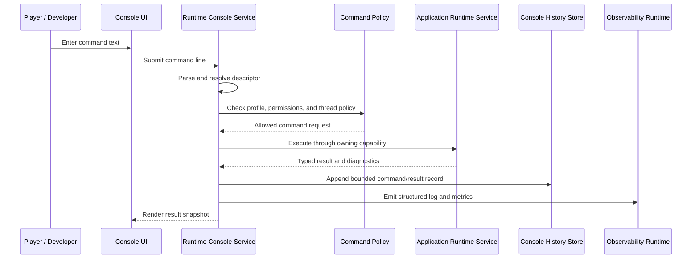

# Runtime Debug Console And Development Overlays

## Purpose

This document defines the runtime debug console, command system, console
variables, and optional development overlays available to games built with Horo
Engine. The goal is to provide runtime control and inspection in editor,
development, profile, and selected shipping builds without turning debug features
into hidden global state or a security liability.

The console is a runtime feature, not an editor-only panel. A game can ship with
the console module present but locked down by profile, policy, platform, and
permissions.

## Horo Target

The default feature set should make a running game inspectable and controllable
without requiring the editor process. Horo should provide:

- an in-game terminal that can execute registered commands and set typed console
  variables
- startup command execution for reproducible local runs
- command history, search, autocomplete, help, and descriptor-driven discovery
- live log stream, metrics charts, profiler controls, and debug-draw toggles
- project/gameplay command registration through the public SDK
- profile-gated behavior so development builds are powerful and shipping builds
  are locked down by default
- optional remote access for diagnostics builds only, with authentication and
  audit logging

The important distinction is that the command registry and data sources are
engine services; the visible terminal, overlay panels, editor tabs, CLI, and MCP
tools are only adapters.

## Runtime Layout

```text
+--------------------------------------------------------------------------------+
| Horo Game Window                                                               |
|                                                                                |
|  Fullscreen Game View                                                          |
|                                                                                |
|       player camera / gameplay / debug.draw.physics / debug.draw.nav           |
|                                                                                |
|  ............................................................................  |
|  . Dimmed game background while runtime debug UI owns focus                 .  |
|  .                                                                          .  |
|  .                                                    +------------------+  .  |
|  .                                                    | Logs             |  .  |
|  .                                                    | warn/error       |  .  |
|  .                                                    | filter: ai.*     |  .  |
|  .                                                    +------------------+  .  |
|  .                                                    +------------------+  .  |
|  .                                                    | Frame            |  .  |
|  .                                                    | cpu/gpu p95      |  .  |
|  .                                                    +------------------+  .  |
|  .                                                    +------------------+  .  |
|  .                                                    | Memory/Jobs      |  .  |
|  .                                                    | rss/assets       |  .  |
|  .                                                    +------------------+  .  |
|  ............................................................................  |
|                                                                                |
|  +---------------------------------------------------------------------------+ |
|  | > help renderer                                                           | |
|  | > log.level renderer debug                                                | |
|  | > sys.profile_capture start --seconds 20 --channels cpu,gpu,jobs          | |
|  | result: capture started: cap_42                                           | |
|  +---------------------------------------------------------------------------+ |
+--------------------------------------------------------------------------------+
```

The game view remains fullscreen and continues to render behind the debug UI.
Opening the terminal or overlay panels applies a dimming layer over the game and
moves input focus to the debug surface. Gameplay input is suppressed while the
debug surface owns focus unless a command explicitly requests a pass-through
inspection mode. The terminal and panels can be hidden independently. Hidden
panels keep no private shadow state; they query bounded stores when opened or
refreshed.

## Product Profiles

| Profile           | Console UI                          | Commands                                      | Variables                               | Overlays            | Remote access                            |
| ----------------- | ----------------------------------- | --------------------------------------------- | --------------------------------------- | ------------------- | ---------------------------------------- |
| Editor            | Available                           | Full editor-safe and runtime-safe sets        | Full development set                    | Available           | Local MCP/editor only                    |
| Game Development  | Available by default or launch flag | Full development set                          | Full development set                    | Available by flag   | Localhost by default                     |
| Game Profile      | Available by launch flag            | Profiling and read-only inspection by default | Tunables marked profile-safe            | Available by flag   | Localhost only unless explicitly enabled |
| Game Shipping     | Hidden by default                   | Allowlisted safe commands only                | Read-only or player-safe variables only | Disabled by default | Disabled                                 |
| Diagnostics build | Available by policy                 | Expanded diagnostics set                      | Expanded diagnostics set                | Available           | Explicit authenticated endpoint only     |

Diagnostics is a standalone non-shipping product profile selected by
`HORO_PROFILE_DIAGNOSTICS`, not a runtime mode of Profile, Server, or Shipping.
Exactly one product-profile macro is active per build. Diagnostics includes
`Public`, diagnostic `Developer`, and authenticated `Restricted` support
commands; `DevelopmentOnly` translation units and `AdminCheat` handlers are
omitted. Remote access is disabled by default and requires explicit opt-in to
an authenticated TLS/token or authenticated host-session endpoint with rate
limits and audit logging. The complete profile and compile-time inclusion
contract, including Dedicated Server, is specified in
[ADR-018 Section 4](../../adr/018-command-registration-permissions-threading-and-packaged-build-policy.md#4-packaged-build-retail-gating-policy).
These macros describe the required build contract rather than existing CMake
implementation; enabling Diagnostics requires a separate build.

Shipping builds must not contain arbitrary file commands, unrestricted scene
mutation, unauthenticated remote execution, source-path disclosure, or commands
that bypass gameplay/security policy. A shipping console may still expose safe
commands such as `help`, `version`, `screenshot`, accessibility
toggles, or other `Public` + `ShippingAllowlist` commands when the product
opts in. `diag.support_bundle` is `Restricted` / `DiagnosticsOnly` and is
not a shipping public command.

Shipping command inclusion does not require console UI inclusion: approved
local startup/CLI options, player-facing actions (such as a screenshot key),
or an explicitly enabled local console UI may invoke allowlisted commands.
Every surface uses the same registry, permission gate, and thread-policy
dispatch; no surface exposes commands absent from the Shipping allowlist.
The console UI is compiled out or disabled by default, and remote command
access remains disabled even when a local surface is enabled.

## Core Concepts

### Console Command

A command is an explicitly registered, inert operation descriptor:

```cpp
enum class CommandPermission : uint32_t {
    Public     = 1 << 0, ///< Safe for all users and players; allowed in shipping builds.
    Developer  = 1 << 1, ///< Internal diagnostics and inspection; non-shipping builds.
    AdminCheat = 1 << 2, ///< State-mutating cheat/debug actions; dev/editor only, server authority.
    Restricted = 1 << 3  ///< Sensitive ops (remote admin, support dumps); requires explicit token/auth.
};

constexpr CommandPermission operator|(CommandPermission lhs, CommandPermission rhs) noexcept {
    return static_cast<CommandPermission>(static_cast<uint32_t>(lhs) | static_cast<uint32_t>(rhs));
}

constexpr CommandPermission operator&(CommandPermission lhs, CommandPermission rhs) noexcept {
    return static_cast<CommandPermission>(static_cast<uint32_t>(lhs) & static_cast<uint32_t>(rhs));
}

enum class CommandThreadPolicy : uint8_t {
    ImmediateConsoleThread, ///< Synchronous pure operations (help, history, parsing).
    OwnerThreadNextFrame,   ///< Main/Editor thread deterministic frame safe point.
    RenderSafePoint,        ///< Render thread execution at frame synchronization point.
    WorkerJob               ///< Asynchronous dispatch via Foundation JobSystem.
};

enum class CommandAvailability : uint8_t {
    NonShipping,       ///< Available in every non-shipping product profile.
    DevelopmentOnly,   ///< Compiled/registered only in Editor and Development builds.
    DiagnosticsOnly,   ///< Available in Editor, Development, and Diagnostics builds.
    ShippingAllowlist  ///< Only registered in Shipping if explicitly allowlisted by project configuration.
};

enum class CommandFlags : uint32_t {
    None            = 0,
    AuditLogged     = 1 << 0, ///< Emit structured security audit records through HostObservability.
    RedactArguments = 1 << 1, ///< Redact every argument in history, logs, and telemetry (in addition to per-argument `sensitive`).
};

constexpr CommandFlags operator|(CommandFlags lhs, CommandFlags rhs) noexcept {
    return static_cast<CommandFlags>(static_cast<uint32_t>(lhs) | static_cast<uint32_t>(rhs));
}

struct DebugArgumentDescriptor {
    std::string_view name;
    std::string_view description;
    DebugArgumentType type;       ///< String, Int32, Int64, Float, Bool, Enum, EntityId.
    bool required{true};
    std::string_view defaultValue{};
    bool sensitive{false};        ///< Redacted from history, logs, and telemetry if true.
};

struct DebugCommandDescriptor {
    DebugCommandId id;
    std::string_view name;        ///< Canonical command identifier (e.g. "log.level", "net.disconnect").
    std::string_view summary;     ///< Short human-readable summary for help and autocomplete.
    std::string_view syntax;      ///< Usage pattern (e.g. "log.level <category> <level>").
    std::span<const DebugArgumentDescriptor> arguments;
    CommandPermission permissions{CommandPermission::Developer};
    CommandThreadPolicy threadPolicy{CommandThreadPolicy::OwnerThreadNextFrame};
    CommandAvailability availability{CommandAvailability::DevelopmentOnly};
    CommandFlags flags{CommandFlags::None};
    DebugCommandHandler handler;  ///< Typed function pointer: Result<DebugCommandOutput, Error>(*)(const DebugCommandContext&, const DebugParsedArguments&)
};

using ConsoleCommandDescriptor = DebugCommandDescriptor;
```

`CommandPermission` is a bitflag so a caller session can hold a grant mask.
A descriptor declares exactly one of the four named permissions; zero,
unknown bits, and combinations on the descriptor are composition failures.
The shared enum intentionally relies on composition validation rather than
separate required-permission and session-mask types. The check is
`(context.permissionMask & descriptor.permissions) == descriptor.permissions`,
not an ordinal comparison. Granting `Developer` composes `Public | Developer`;
granting `AdminCheat` composes `Public | Developer | AdminCheat`. `Restricted`
is an orthogonal capability and is never implied by the other three.
`CommandFlags` values may be OR'd (`AuditLogged | RedactArguments`).
`ShippingAllowlist` is valid only with `CommandPermission::Public`;
`AdminCheat` / `Restricted` paired with `ShippingAllowlist` is rejected at
composition. Canonical names use registered prefixes (`sys.*`, `log.*`,
`net.*`, `wst.*`, `rnd.*`, `phys.*`, `game.*`, `diag.*`); the only un-namespaced
canonical names are `help`, `find`, `version`, `clear`, and `screenshot`.

Commands do not expose raw function pointers to arbitrary callers. Execution
produces a typed result, diagnostics, and structured console output. Handlers
receive a read-only `DebugCommandContext` and strongly-typed `DebugParsedArguments`.
Commands that mutate runtime state run through the owning application or runtime
service and respect lifecycle safe points.

### Console Variable

A console variable is a typed, descriptor-owned setting bridge:

```cpp
struct ConsoleVariableDescriptor {
    ConsoleVariableId id;
    std::string_view name;
    ConsoleValueType type;
    ConsoleValue defaultValue;
    ConsoleValue minValue;
    ConsoleValue maxValue;
    ConsoleVariableAvailability availability;
    ConsoleVariablePersistence persistence;
    ConsoleVariableApplyPolicy applyPolicy;
};
```

Console variables are not an untyped global map. Each variable declares type,
range, profile availability, persistence, and apply behavior. Some variables map
to configuration keys; others are runtime-only diagnostic toggles. Apply policy
is explicit:

| Apply policy      | Meaning                                                     |
| ----------------- | ----------------------------------------------------------- |
| `Immediate`       | Safe to update atomically while running.                    |
| `NextFrame`       | Queued and applied at the next owner-thread frame boundary. |
| `NextSceneLoad`   | Takes effect when a scene is loaded or restarted.           |
| `RestartRequired` | Stored as pending and reported as not active yet.           |
| `ReadOnly`        | Inspectable only.                                           |

### Development Overlay

A development overlay is a runtime UI adapter over observability, console,
debug-draw, and runtime inspection services. It is not the owner of logs,
metrics, profiler captures, or gameplay state.

Default overlay modules should include:

- console terminal and command history
- live log stream with filtering and collapse
- frame time, CPU, memory, jobs, asset streaming, and renderer charts
- profiler capture controls for allowed profiles
- entity/scene inspector in development builds
- debug draw toggles and categories
- input/action monitor
- network/session monitor when networking is enabled

## Module Shape

```text
Process Host
  +-- Configuration Service
  +-- Observability Runtime
  +-- Engine Data Bus
  +-- Runtime Console Service
  |     +-- Command Registry
  |     +-- Variable Registry
  |     +-- Console History Store
  |     +-- Console Script Runner
  |
  +-- Runtime Debug Services
  |     +-- Debug Draw Registry
  |     +-- Runtime Inspector
  |     +-- Overlay Layout Store
  |
  +-- Presentation Adapters
        +-- In-game Console UI
        +-- Development Overlay UI
        +-- Editor Console Tab
        +-- CLI command adapter
        +-- MCP adapter where allowed
```

The runtime console service is constructed by the process host when the selected
product profile and project configuration request it. The visible in-game UI is
optional; commands can still be executed by CLI/MCP/editor adapters when policy
allows.

## Data Flow



No command may mutate scene, renderer, physics, asset, or networking state by
capturing private pointers from registration time. Mutation goes through narrow
capabilities that own validation and safe-point scheduling.

## Launch And Configuration

Recommended launch flags:

```text
--console                 enable the runtime console UI if profile allows it
--dev-overlays            enable default development overlay panels
--dev-overlay=<name>      enable one overlay panel or group
--exec <command>          execute one startup command after configuration load
+<command> [args...]      startup command alias where supported
--console-script <path>   execute an allowlisted script file
--remote-console <addr>   enable authenticated remote console in diagnostics builds
```

Recommended project configuration:

```json
{
  "runtimeConsole": {
    "enabledByDefault": false,
    "toggleChord": "Grave",
    "historyLimit": 500,
    "allowStartupExec": true,
    "shippingAllowlist": ["help", "version", "screenshot"]
  },
  "developmentOverlays": {
    "enabledByDefault": false,
    "defaultPanels": ["logs", "frame", "memory", "jobs"]
  }
}
```

Configuration is resolved through immutable snapshots. Runtime variable changes
that map back to persisted settings must declare persistence and write policy;
most diagnostic variables are session-only.

## Command Language

Initial command language should stay deliberately small:

- whitespace-separated command and arguments
- quoted strings with escaping
- `key value` and `--key value` forms for typed options
- command history and reverse search
- autocomplete from descriptors
- `help`, `help <command>`, and `find <text>`
- optional aliases and key binds in development profiles
- optional startup script execution from allowlisted project/user locations

Pipes, conditionals, loops, and filesystem commands are not part of the initial
runtime contract. They can be added later to a development-only script module if
there is a real need. The first version should optimize for predictable command
execution and low risk, not shell completeness.

## Default Commands And Variables

Minimum command set:

| Command                         | Profile                                          | Behavior                                                   |
| ------------------------------- | ------------------------------------------------ | ---------------------------------------------------------- |
| `help`                          | all enabled profiles                             | List available commands and variables.                     |
| `find <text>`                   | all enabled profiles                             | Search descriptors.                                        |
| `version`                       | all enabled profiles                             | Print engine, game, build, platform, and profile identity. |
| `clear`                         | all enabled profiles                             | Clear visible console buffer, not persistent logs.         |
| `log.level <category> <level>`  | development/profile                              | Change session log level through observability policy.     |
| `sys.metrics`                   | development/profile                              | Show available metric channels.                            |
| `sys.profile_capture <start\|stop>` | development/profile                          | Control bounded profiler captures.                         |
| `screenshot`                    | development/profile, optionally shipping support | Capture the current frame through platform policy.         |
| `game.scene_tree`               | development only                                 | Print runtime scene hierarchy or ECS debug view.           |
| `game.inspect <entity>`         | development only                                 | Inspect safe public entity/component state.                |
| `game.teleport`, `game.give`, `game.god` | project-defined, cheat-gated              | Gameplay-specific commands; un-namespaced aliases optional.|
| `diag.support_bundle`           | diagnostics only                                 | Create user-approved diagnostic bundle (`Restricted`).     |

Minimum variable groups:

```text
console.visible
console.history.limit
log.<category>.level
overlay.logs.visible
overlay.frame.visible
overlay.memory.visible
overlay.jobs.visible
debug.draw.<category>
debug.draw.physics
renderer.debug.<feature>
asset.streaming.debug
```

Project/gameplay commands register under a project namespace such as
`game.player.teleport` or user-facing aliases such as `teleport`. Namespace
collisions are startup diagnostics.

## Development Overlays

Development overlays are optional modules that can be composed per game:

| Overlay    | Data source                            | Notes                                                               |
| ---------- | -------------------------------------- | ------------------------------------------------------------------- |
| Logs       | `StructuredLogStore`                   | Filter by level/category, collapse repeats, no unbounded buffering. |
| Frame      | `MetricsStore` and profiler scopes     | FPS, frame p50/p95/p99, CPU/GPU split where available.              |
| CPU/Memory | platform sampler and allocator metrics | Label process vs engine allocator values explicitly.                |
| Jobs       | `OperationStore` and job metrics       | Queued/running/waiting counts, saturation, slow operations.         |
| Renderer   | renderer metrics and debug views       | Draw calls, passes, GPU memory, frame graph summary.                |
| Assets     | asset service metrics                  | Streaming queue, loaded assets, failed loads, hot reload state.     |
| Scene      | runtime scene inspector                | Development-only, safe public component views.                      |
| Input      | input snapshots/action map             | Current actions, devices, focus/capture state.                      |
| Network    | networking metrics                     | Connection state, packet loss, RTT, replication stats when enabled. |

Overlay rendering must not allocate per visible row every frame. Long lists use
virtualized/recycled rows, bounded stores, and explicit refresh rates. Disabled
overlays must have near-zero cost beyond the underlying always-on metrics that
the product profile already permits.

## Security And Permissions

Console access is a capability decision governed by [ADR-018](../../adr/018-command-registration-permissions-threading-and-packaged-build-policy.md):

- Profile controls which commands and variables exist.
- Project policy controls which project commands are exposed.
- Platform policy controls toggle chords, remote access, and shipping support.
- Multiplayer/server authority controls cheat commands.
- Remote console requires authentication, local opt-in, rate limits, audit logs,
  and a separate threat model.

Commands declare permissions via `CommandPermission`:

| Permission Level | Meaning | Profile Availability |
|---|---|---|
| `CommandPermission::Public` | Non-mutating queries, information discovery, and player-safe utilities (`help`, `version`, `screenshot`, `clear`). | All profiles; Shipping only through project-approved local surfaces for allowlisted commands. |
| `CommandPermission::Developer` | Inspection, logging control, performance monitoring, scene tree inspection (`log.level`, `sys.metrics`, `game.scene_tree`, `game.inspect`, `rnd.debug_draw.*`). | Editor, Game Development, Game Profile, Diagnostics, Dedicated Server. Stripped in Retail Shipping. |
| `CommandPermission::AdminCheat` | State-mutating debug actions (`game.teleport`, `game.god`, `game.give`, `net.simulate_loss`, `wst.evict_cell`). | Editor, Game Development (cheat mode). Requires server authority in multiplayer. Stripped in Retail Shipping. |
| `CommandPermission::Restricted` | High-privilege operations, remote server administration, sensitive diagnostic export (`net.server_shutdown`, `net.remote_admin.*`, `diag.support_bundle`). | Dedicated Server (token-authenticated), Diagnostics builds. Requires token/auth session. |

The command registry refuses to register commands whose permissions are
incompatible with the active product profile unless the command is compiled out
or hidden by policy. `AdminCheat` and `Restricted` descriptors cannot declare
`ShippingAllowlist`; composition fails. Hidden or unauthorized commands must not
be discoverable through `help` or autocomplete and return typed
`CommandError::PermissionDenied` with zero handler side effects.

`AdminCheat` additionally requires `DebugCommandContext::hasServerAuthority`,
which is independent of `permissionMask`. Dedicated server, PIE listen-server
hosts, and single-player authority set it; connected game clients never do.
`Restricted` commands authenticate via token/session rather than this flag.

Sensitive arguments (passwords, auth tokens, player PII) set `sensitive = true` in their `DebugArgumentDescriptor`
and are automatically redacted (`[REDACTED]`) from console history, structured logs, and telemetry.

## Threading And Lifecycle

Command handlers declare where they execute via `CommandThreadPolicy`:

| Thread policy            | Use                                                                 |
| ------------------------ | ------------------------------------------------------------------- |
| `ImmediateConsoleThread` | Pure parsing/help/history operations only. Algorithmic, synchronous.|
| `OwnerThreadNextFrame`   | Scene/runtime/editor mutations queued to deterministic frame phase. |
| `RenderSafePoint`        | Renderer debug toggles requiring render-thread frame boundary sync. |
| `WorkerJob`              | Long-running diagnostics, reports, or support bundle generation.    |

The console UI and external adapters (CLI, MCP, remote socket) accept input at any frame/thread,
queuing mutable commands to the owning safe point:

- **Main Thread Safe Point**: Handlers with `OwnerThreadNextFrame` are drained on the **Main Thread** during a deterministic frame phase (`PreUpdate` / `DebugPhase`) before gameplay simulation ticks.
- **Asynchronous Worker Jobs**: Heavy diagnostics and dumps dispatch background jobs via the Foundation `JobSystem`. In compliance with [ADR-010](../../adr/010-job-waiting-and-operation-store-ownership.md), the **Main Thread never synchronously blocks waiting for worker jobs**. Handlers return an `OperationId` / `JobId` immediately, and progress is projected through `OperationStore`.
- **Shutdown**: Shutdown rejects new commands, cancels pending background operations, and preserves command history only while sinks remain valid.

## Subsystem Reconciliation

Console expectations across dependent subsystems are unified under this policy:

### Dedicated Server Administration (NET-007.9)

- Server management commands (`net.kick`, `net.ban`, `net.change_map`, `net.server_status`) declare `CommandPermission::Restricted` and `CommandThreadPolicy::OwnerThreadNextFrame`.
- Remote administration requires cryptographic token authentication before opening an admin session.
- Execution occurs at server tick safe points without bypassing network admission or gameplay authority. Sensitive arguments are marked `sensitive` and redacted from logs.

### Authorized Network Debug Controls (NET-008.12)

- Network simulation commands (`net.simulate_latency`, `net.simulate_packet_loss`, `net.disconnect`, `net.request_resync`) declare `CommandPermission::AdminCheat` or `Developer`.
- Editor debug panels invoke these typed console commands rather than calling transport internals directly.
- Commands target sessions using generation-safe `SessionHandle` identifiers, failing safely if stale.
- Descriptors are compiled out of Retail Shipping client builds.

### World Streaming Diagnostics (WST-010.8)

- Streaming inspection commands (`wst.snapshot`, `wst.cell_status`) declare `CommandPermission::Developer`.
- Snapshots capture immutable scene/cell state on `OwnerThreadNextFrame`, then dispatch report serialization to a non-blocking `WorkerJob` reporting to `OperationStore`.
- Mutating commands (`wst.force_evict`, `wst.force_load`) declare `CommandPermission::AdminCheat`.

## Relationship To Observability

The console and overlays consume observability. They do not replace it.

- Logs are emitted through the logging contract and displayed from the bounded
  structured log store.
- CPU, memory, frame, job, renderer, and asset charts query metrics stores.
- Detailed captures are controlled through `ProfilerCaptureService`.
- Console command execution emits structured logs and metrics.
- The data bus carries coalesced revision notifications only.

This keeps runtime overlays cheap enough to leave compiled into development and
profile builds without turning every frame sample into UI traffic.

## Modularization

The recommended default feature package is split into modules:

| Module                | Required?                 | Responsibility                                                  |
| --------------------- | ------------------------- | --------------------------------------------------------------- |
| `RuntimeConsoleCore`  | yes when feature enabled  | registry, parser, variables, policy, history, command execution |
| `RuntimeConsoleUi`    | optional                  | in-game terminal presentation                                   |
| `DevelopmentOverlays` | optional                  | default overlay panels and layout                               |
| `DebugDraw`           | optional                  | world-space debug lines, shapes, text, categories               |
| `RuntimeInspector`    | optional development-only | safe public scene, entity, component, input, and session views   |
| `OverlayLayout`       | optional                  | panel placement, visibility, focus order, and persisted layout   |
| `RemoteConsole`       | optional diagnostics-only | authenticated remote command endpoint                           |

Games can remove UI modules while keeping core command execution for CLI/MCP or
diagnostic builds. Project-specific commands and overlays register through public
SDK descriptors, not by modifying engine registries directly.

## Testing

Required tests cover:

- descriptor registration, duplicate-name diagnostics, and namespace rules
- command parsing, quoting, autocomplete, help, and startup execution
- variable type/range validation and apply policies
- product-profile availability and shipping allowlist enforcement
- permission denial does not execute handler side effects
- owner-thread scheduling and lifecycle shutdown rejection
- bounded history, log stream, and overlay list memory behavior
- observability integration without per-sample data-bus traffic
- development overlay enable/disable cost and virtualized row behavior
- packaged development build can open console and execute safe commands
- shipping profile hides denied commands and disables remote access
- remote console authentication/rate-limit/audit behavior if implemented

## Related Documents

- [ADR-018: Command Registration, Permissions, Threading and Packaged-Build Policy](../../adr/018-command-registration-permissions-threading-and-packaged-build-policy.md)
- [ADR-010: Job Waiting and Operation Store Ownership](../../adr/010-job-waiting-and-operation-store-ownership.md)
- [Console Panel](../../../mock-studio/designs.md#architecture-runtime-console-panel): React mock design for the editor
  console tab, command input, log filtering, and record details.
- [Runtime Lifecycle](./runtime-lifecycle.md)
- [Input Architecture](./input-architecture.md)
- [Rendering Architecture](./rendering-architecture.md)
- [Scene Runtime](./scene-runtime.md)
- [Networking Architecture](./networking-architecture.md)
- [Configuration System](../foundation/configuration-system.md)
- [Engine Data Bus](../foundation/engine-data-bus.md)
- [Observability Architecture](../observability/observability.md)
- [Metrics And Profiling Contract](../observability/observability-performance.md)
- [Logging, Context, And Diagnostics Contract](../observability/observability-logging.md)
- [Gameplay Module](../extensions/gameplay-module.md)
- [CLI Architecture](../interfaces/cli-architecture.md)
- [Application Security](../security/application-security.md)
