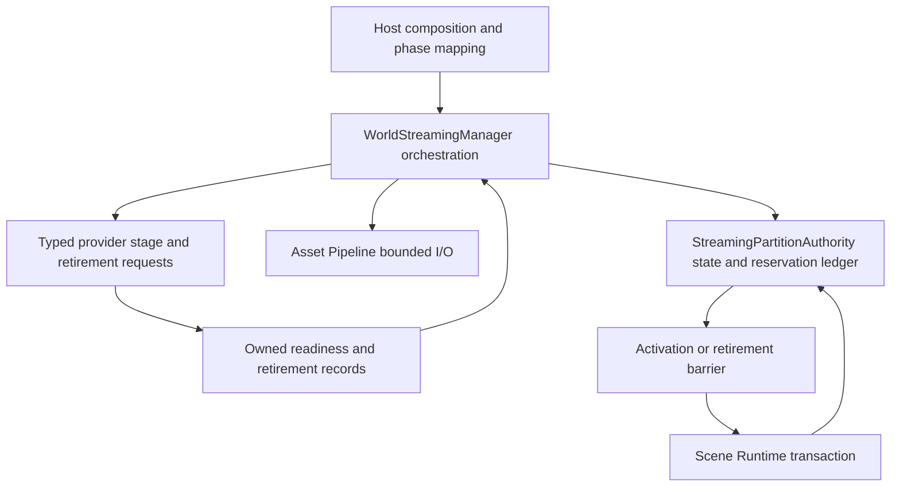
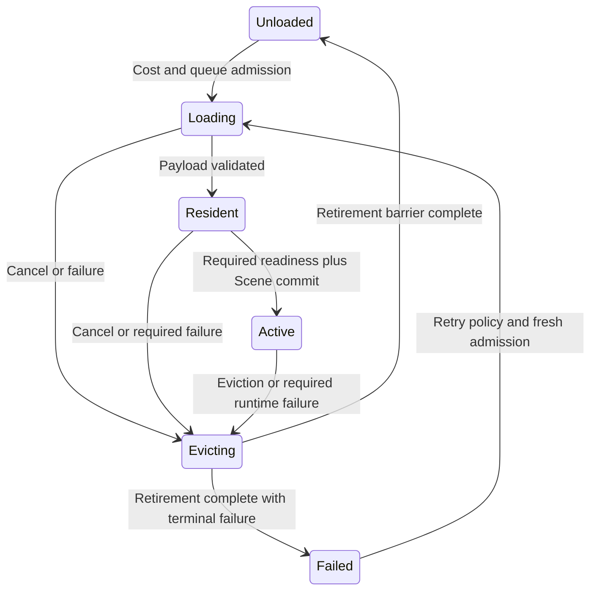

# World Streaming Architecture

## Purpose

This document defines partition ownership, asynchronous provider staging, activation
and retirement barriers, budget admission, generation fencing and host integration.
[ADR-012](../../adr/012-world-streaming-partition-authority-and-subsystem-boundaries.md)
records the decision. The ADR-023 binary formats below remain separate from runtime
lifecycle handles; this change does not alter their wire layout.

## Subsystem Boundaries And Ownership

StreamingPartitionAuthority owns canonical partition topology, cell state, epochs,
generations, priority and the reservation ledger. WorldStreamingManager orchestrates
host frame integration, queues and provider requests **through that authority**.
They are distinct logical roles within one World Streaming subsystem, not alternate
names for the same public type and not two independent residency state machines.
A host may colocate their implementation, but only the authority commits state and
budget changes; the manager never maintains a competing residency cache.

| Domain | Owns | Does not own |
|---|---|---|
| StreamingPartitionAuthority | Grid/layers, volume policy, cell records, fencing, admission and total budget | ECS storage, provider kernels, raw disk/device calls |
| WorldStreamingManager | Bounded queue draining, stage/retire orchestration, frame integration | Another partition model, scheduler or budget ledger |
| Scene Runtime | Detached ECS candidates and transactional structural commit | Cell relevance, topology or load priority |
| Asset Pipeline | Registry/catalog, cooked bytes, validation and bounded I/O | Camera/relevance policy or entity activation |
| Feature providers | Domain-specific candidate resources, native affinity, readiness/retirement acknowledgement | Independent world-cell loads, residency decisions or budget expansion |
| Virtual Texturing | Feature-local page demand, selection and eviction within an admitted reservation | Cell relevance, aggregate budgets, activation barriers or independent cell eviction |
| Editor | Authoring document, independent paging/pins, offline bake and isolated preview | Destructive coupling to runtime cell eviction |

Virtual Texturing participates through the feature-provider boundary defined by
[ADR-164](../../adr/164-virtual-texturing-ownership-product-scope-and-capability-tier.md).
Its page readiness may contribute to a cell barrier, but it cannot run a competing
world scheduler or turn page pressure into an implicit cell transition.

[ADR-166](../../adr/166-vtx-feature-local-residency-and-eviction-within-global-reservations.md)
specializes this boundary: the authority grants a generation-scoped multidimensional
reservation and aggregate priority/criticality; VTX orders and evicts pages only inside
that slice. Shared pages use explicit consumer leases and one charge identity. A VTX
pressure shortfall returns here for global deferral/fallback/cell policy, and reserved
capacity is released only after provider, worker and GPU retirement acknowledgements.



## Spatial Identity And Fencing

The manifest owns grid origin/size, bounds, layer definitions and LOD topology.
Do not invent different runtime default grid sizes or drop the LOD dimension.
Runtime spatial calculations use Math::WorldCoordinate64 and checked conversion
from the validated manifest, following ADR-026. Rebase changes local provider frames,
not cell identity or canonical volume positions. Cross-cell geometry is split or
represented by explicit cooked dependencies; providers cannot infer hidden neighbors.

Schematic runtime identities (not serialized native C++ layouts):

```cpp
struct WorldPartitionId { Guid value; }; // WorldIndexManifest::worldGuid identity
struct PartitionEpoch { uint64_t value; };
struct StreamingGeneration { uint64_t value; }; // per-cell residency attempt
struct StreamingLayerId { uint16_t value; };    // manifest layerId width
struct StreamingVolumeId { uint64_t value; };   // runtime host identity

struct StreamingCellId {
    int32_t x, y, z;
    uint8_t lod;
    uint16_t layerId;
};

struct StreamingFence {
    WorldPartitionId partition;
    PartitionEpoch epoch;
    StreamingCellId cell;
    StreamingGeneration generation;
};
```

The cell tuple is exactly the ADR-023 `(x,y,z,lod,layerId)` identity within a
partition; WorldPartitionId scopes it in every runtime request. Layer validity is
manifest membership, not a blanket nonzero rule. Runtime volume IDs map explicitly
to cooked uint32 volume IDs where present; they do not widen the wire format.

`WorldPartitionDescriptor` is the immutable owned runtime projection of the
versioned world index bounds, grid, layers, cells, and chunk `AssetId` references.
Construction validates mandatory caller ceilings and canonical ordering before
copying caller data; its read-only spans remain valid only while that descriptor
value has not been moved from or destroyed. This public contract adds the narrow
`HoroWorldStreaming -> HoroAssets` dependency because package references use the
existing path-independent asset identity rather than a competing identifier.
Serialized layout, cooked checksums, streaming volumes, and residency lifecycle
state remain owned by their later contracts and are not inferred here.

`WorldPartitionProjectSettings` is the immutable WST-001.9 admission result for
grid size, canonical precision, LOD, descriptor/query capacities, and cell package
mode. The project supplies an exact profile and settings revision; the host supplies
one complete capability snapshot and revision. Resolution accepts the requested
values exactly or returns a typed invalid, unsupported, or capacity failure. It does
not clamp limits, select another package mode, install a provider, or mutate global
configuration. Editor permits standalone `.wcell` or archive-chunk workflows;
standalone, client, and server product profiles require the explicitly requested
archive-chunk representation. A later capability or settings replacement makes the
captured value stale for new work, while work that already owns a captured immutable
settings value keeps its submission-time facts. Cancellation and shutdown close new
admission explicitly.

`WorldPartitionRegistry` is the explicit owner-thread publication boundary over
those validated descriptors. Each successful complete publication advances one
non-wrapping typed registry revision and atomically replaces the current immutable
index. Concurrent consumers retain `WorldPartitionRegistrySnapshot` values that
own their publication independently from later replacement, cancellation, or
shutdown. Lookups return dense handles fenced by registry identity, revision,
partition identity, and partition epoch; a handle issued by one publication cannot
resolve against another even if the same cell tuple remains present.

Snapshot lookup is logarithmic in canonical manifest order. Publication builds one
deterministic immutable bounding-volume hierarchy owned by the snapshot. Spatial
intersection queries prune non-overlapping hierarchy branches, perform no allocation,
emit canonical handles into caller-owned bounded storage, and publish no partial
output when capacity is insufficient. Their typed result exposes match, leaf-candidate,
and visited-node counts so the bounded index work remains testable without timers.
Query bounds use exact inclusive canonical millimeters with optional declared layer
and LOD filters. The registry is an index,
not a second topology or residency authority: it does not mount worlds, perform I/O,
select providers, mutate cell state, or silently fall back to another layer, LOD,
partition epoch, or snapshot revision.

`CookedWorldIndexManifest` is the immutable WST-004.2 aggregate layered over that
descriptor. It takes ownership of exactly one validated `WorldPartitionDescriptor`
and adds exactly one cooked record per declared cell: encoded and decoded byte
counts, aggregate payload CRC32, the canonical cell-artifact SHA-256, and a bounded
canonically ordered set of required cell dependencies. The nested descriptor remains
the sole authority for topology, layers, and package location through its chunk
`AssetId`; cooked records do not repeat those fields or introduce filesystem paths.

Construction validates and allocates all cooked metadata before moving the supplied
descriptor. Success consumes the descriptor once; any typed failure leaves it valid
and unmodified, and caller spans are never retained. Returned spans remain valid only
until the manifest is moved from or destroyed. A replacement owner publishes a newly
validated aggregate by value; this inert model performs no I/O, codec work, runtime
registration, cancellation, or shutdown mutation. WST-004.5 may produce dependency
bundles and soft-reference tables from these required edges, but it does not become a
second manifest or topology authority. Existing descriptor-only callers migrate by
constructing the cooked aggregate at the Asset Pipeline/runtime handoff once complete
cell metadata is available; partial/default cooked metadata is not accepted.

`WorldSpatialAssignment` is the inert WST-004.3 cook-stage projection that maps
page-scoped authored-object addresses and exact immutable authoring revisions onto
descriptor cells. Candidate bounds use inclusive canonical millimeters and the
descriptor's checked half-open quantization policy; a candidate spanning several
cells produces every intersected declared cell in canonical layer, LOD, Z, Y, X
order. Construction rejects duplicate object addresses, malformed or out-of-content
bounds, absent layers or cells, unsupported LODs, and mandatory object/cell ceilings
without publishing partial state. The result owns only the stable partition identity,
object revision metadata, and flat cell assignments: it neither retains nor repeats
the descriptor's grid, topology, layers, or package references. The contract performs
no I/O, authoring mutation, runtime registration, cancellation, or shutdown work;
later spanning-object and dependency cook stages consume its immutable output.

`WorldDependencyPlan` is the inert in-memory WST-004.5 projection built from one
`WorldSpatialAssignment` and a bounded authored dependency graph. Hard edges require
both exact endpoint revisions to be present in the spatial assignment and form
transitive co-load components; cycles are valid and components are emitted by
canonical object address. Soft edges require an admitted exact source revision but
preserve an unresolved exact target for deferred resolution. Duplicate directed
edges, self references, stale revisions, missing hard targets, and configured graph
or bundle ceilings fail transactionally. A soft-only cycle remains deferred and is
therefore valid, while a soft edge whose admitted endpoints are already connected by
the transitive hard graph is an illegal mixed-policy cycle or ambiguity and is
rejected before publication. The plan owns only partition identity,
object-revision bundle members, and canonical soft-reference metadata. It is not a
second manifest, topology authority, persistent schema, residency owner, or resolver;
serialization remains deferred until its wire contract is separately ratified.

PartitionEpoch identifies a mounted partition incarnation. It changes on world
replacement/reload, including replacement by the same worldGuid. StreamingGeneration
changes on each new cell attempt and when an attempt is invalidated; it does not
change between that attempt's Loading, Resident and Active phases. Both counters
reserve zero and never wrap: checked increment failure closes admission with
GenerationExhausted and retires the affected incarnation/slot. Epoch values cannot
be reused within the lifetime of the host's completion routing domain.

Every asset/provider/scene request also has a generation-checked request handle.
Ordinary completions may publish only if partition identity, epoch, cell generation,
request identity and expected phase all match. Cancellation invalidates the active
attempt immediately but retains its old fence in a retirement record. Old Ready
results cannot reactivate a cell; old completion/retirement acknowledgements still
release the **matching retired attempt's** leases and reservations. Fencing means
no stale state mutation, not dropping the information needed to reclaim resources.

## Owner Role And Frame Integration

StreamingAuthorityRole is a logical execution owner, not a new JobSystem thread
pool or an alias that assumes MainEditor exists in every host. Host composition
maps it to the scene mutation executor: editor preview main thread, game simulation
owner, or headless/server simulation owner. It validates provider phase dependencies
before mounting a partition.

Manager admission, priority updates and non-blocking completion drains run in the
host's declared PreUpdate service phase, including while gameplay is paused. ECS
publication/removal runs only at CommitDeferredLifecycleChanges. Provider-native
work runs on the provider's required render/physics/audio execution role, scheduled
through its adapter; worker I/O never invokes live-world lifecycle callbacks.

All entry points below are bounded admission/poll operations on StreamingAuthorityRole.
CPU preparation may use Foundation JobSystem/JobId. Native GPU/physics/audio calls
keep domain affinity. No ordinary main/editor/simulation/render/transport path waits
for a stage or fence, and workers do not wait on nested worker jobs. ADR-010 governs
allowed teardown drains. ADR-018 OwnerThreadNextFrame commands enqueue into these
same owner seams; heavy user-visible operations use the application coordinator's
OperationStore. Providers and manager workers do not create independent stores.

## Provider Composition And Asynchronous Contract

`FallbackStreamingProvider` is the bounded pre-manager composition contract for
small projects, tests and headless hosts. It is not an implementation or alternate
spelling of `IFeatureStreamingProvider`, and it performs no asset I/O, staging,
residency transition or Scene publication. `SingleCell` exposes exactly one
manifest-issued cell as desired manager input; `Null` exposes no cells. Neither
mode reports that a cell is Loaded, Resident or Active.

The fallback owner is fenced by one exact partition/epoch token and a monotonic
configuration revision. Replacement validates the complete candidate before
publication, requires the same owner lifetime and a strictly newer revision, and
may explicitly switch between `SingleCell` and `Null`. Invalid, unsupported, stale
or over-capacity candidates leave the previous snapshot unchanged. Cancellation
immediately closes desired-cell exposure, and terminal shutdown is idempotent;
neither operation fabricates cleanup acknowledgement for later provider or Scene
resources. A different mounted epoch receives a new fallback owner rather than
in-place token reuse.

`WorldStreamingRuntimeComposition` is the concrete explicit host seam for one
mounted owner lifetime. It owns exactly one bounded scheduler admission ledger and
borrows exactly one planner, asset provider and Scene Runtime plus one or more
feature adapters. Every binding has a stable typed identity and immutable revision;
the composition canonicalizes the complete set and rejects missing core roles,
duplicates, unknown roles and adapter-capacity overflow before publication. It
performs no discovery, registration, backend selection or service construction.

Replacement is a complete revisioned transaction and is rejected while scheduler
work is retained. Cancellation closes scheduler admission without releasing or
hiding accepted work. Shutdown keeps all borrowed bindings reachable while the
canonical operations drain, and reports Closed only after the owned ledger has
received terminal retirement acknowledgements and released every reservation.
A moved-from composition is closed, so moving the unique owner cannot leave a
second admission path for the same ledger identity.

The canonical adapter is **IFeatureStreamingProvider**, already used by ADR-023
and ADR-016. The earlier proposed IStreamingFeatureProvider callback-only spelling
is replaced by this one contract, not a second provider hierarchy. Notifications
such as OnCellActive, if offered to observers, occur after commit and are never
entity-creation hooks or readiness acknowledgements.

Host-composed inert provider descriptors declare stable provider/payload IDs,
supported versions, native execution role, resource cost bounds, dependency DAG,
activation policy, finite positive stage/prepare/retirement deadlines and teardown
dependencies. Deadlines use host monotonic service time, including while gameplay
is paused. Stage/prepare expiry applies criticality policy; retirement expiry only
reports a stall and never proves cleanup. Composition rejects duplicate IDs,
cycles, incompatible versions and impossible phase/criticality dependencies. The
CoreEcs payload and every format-required payload remain required; host policy
cannot downgrade an ADR-023 Required block to optional.

| Activation policy | Readiness and failure behavior |
|---|---|
| Required | Must prepare successfully before Active; failure rolls back the cell |
| Optional | Absence/failure is allowed only for optional format data; record unavailable and retire its partial resources without failing the cell |
| Degradable | Declares a validated substitute satisfying its dependency contract; ReadyFallback participates in the barrier; no valid fallback means required failure |

A required consumer cannot depend on an absent optional provider unless its declared
fallback path satisfies the dependency. Policy is explicit per cell/profile; Audio
or Navigation is not globally assumed optional just because of its feature name.
Optional providers may finish after Active through a separate admitted owner-side
attachment transaction. Until then their capability is unavailable. They have bounded
stage deadlines; failure/expiry retires their attempt and records a diagnostic.

The following API shapes express the required protocol, not implemented headers:

```cpp
enum class ProviderStageState : uint8_t { Pending, Ready, ReadyFallback };
enum class ProviderBarrierState : uint8_t { Pending, Prepared, Retired };

class IFeatureStreamingProvider {
public:
    virtual ~IFeatureStreamingProvider() = default;
    virtual Result<ProviderCost> EstimateCellCost(const CellManifestView&) const = 0;
    virtual Result<ProviderStageHandle> BeginStage(ProviderStageRequest request) = 0;
    virtual Result<ProviderStageState> PollStage(ProviderStageHandle) = 0;
    virtual Result<ProviderBarrierHandle> PreparePublish(
        ProviderStageHandle, ActivationTicket) = 0;
    virtual Result<ProviderBarrierHandle> BeginRetire(
        ProviderStageHandle, RetirementTicket) = 0;
    virtual Result<ProviderBarrierState> PollBarrier(ProviderBarrierHandle) = 0;
    virtual void PublishPrepared(ProviderStageHandle, ActivationTicket) noexcept = 0;
};
```

ProviderStageRequest owns/retains the payload lease, StreamingFence, reservation
lease, cancellation token and scene incarnation. Poll never waits; errors preserve
provider identity and underlying cause. Failed BeginStage admission creates no
accepted work or retained resources; an accepted stage that later fails keeps its
handle until BeginRetire/PollBarrier confirms cleanup. Handles include provider incarnation and
slot generation, and operations are idempotent per handle/ticket. The host reserves
completion/retirement queue capacity before starting work, so memory pressure cannot
prevent cleanup admission. Providers publish completion data, not arbitrary callbacks
holding raw ECS, manager or widget pointers.

Ready means resources are privately staged, not visible to live consumers.
PreparePublish schedules provider-affine attachment preparation and acknowledges
Prepared only when a validated no-fail publication action can be performed at the
host's common cell commit boundary. PublishPrepared exposes that prepared state;
it cannot initiate I/O, allocate, wait or discover a new recoverable failure. Providers
unable to honor that contract cannot be activation-critical in this composition.
Unexpected provider contract violations are contained as a partition fault; they do
not justify claiming a partially published cell successfully Active.

BeginRetire stops new access and asynchronously releases stage/active resources in
the registered dependency order. Retired acknowledges that device fences, readers,
worker access and cell-owned allocations have ended. It does not mean merely that
a free/delete command was queued. A retained shared asset cache may outlive the cell
under a separate charged ownership lease; it must not retain an unaccounted cell
reservation or raw entity dependency.

## Residency State Machine And Barriers

There are five normal states plus Failed, six enum values in total:

Cell-operation execution is a separate, fenced transaction state and does not
duplicate the canonical residency state below. Every operation owns a non-zero
operation identity plus its exact `StreamingFence` and progresses through Queued,
Admitted, Preparing, Activating, Retiring, and Terminal phases. Cancellation,
failure, replacement, or shutdown before admission may terminate directly because
no work or resources were accepted. Once admitted, those requests enter Retiring;
their terminal disposition is published only after the matching operation and fence
receive retirement acknowledgement. Stale publication remains rejected while an old
retiring attempt can still accept its own exact acknowledgement and reclaim resources.
The typed operation kind selects a bounded normal path: Load completes after
preparation, Activate continues through activation, and Retire enters the same
acknowledged retirement barrier with a successful disposition.

```cpp
enum class StreamingCellState : uint8_t {
    Unloaded, Loading, Resident, Active, Evicting, Failed
};
```

`StreamingCellStateLedger` is the bounded concrete authority for these six facts.
It reconciles only scheduler-owned canonical `StreamingCellOperation` snapshots;
Queued work, provider `Prepared`, operation `Activating`/`Retiring`, unresolved
lookup and stale fencing do not become additional residency enum values. An admitted
Load creates `Loading`; successful Load and Activate terminals publish `Resident`
and `Active`; accepted interruption first publishes `Evicting`, and only its exact
retirement-acknowledged terminal may publish `Unloaded` or `Failed`.

The ledger retains bounded terminal tombstones to prevent a retired generation from
being replayed. A fresh greater generation may reuse a terminal cell slot, or coexist
with an older `Evicting` generation when capacity was admitted; old completions can
therefore reclaim their own attempt without mutating the newer one. Shutdown closes
new loading and publication while exact retirement snapshots continue to drain.



| State | Invariant |
|---|---|
| Unloaded | No cell-owned resident payload, active entity or cell-scoped provider resource remains; index descriptors and separately owned shared caches may remain |
| Loading | Admitted asset I/O/decode in progress under a fence and reservations |
| Resident | Payload validated; detached Scene candidate/provider stages may still be pending; no live ECS entities from this attempt |
| Active | Required providers and CoreEcs crossed the current attempt's activation barrier; optional capability status remains explicit |
| Evicting | Access revoked and cleanup progressing; retired leases/allocations remain charged until acknowledgement |
| Failed | Terminal failure record after cleanup, with no live cell resources; retry requires policy, capacity and a fresh generation |

Resident -> Active requires all of: validated payload, all Required providers Ready
and Prepared, Degradable providers Ready or ReadyFallback **and Prepared**, reserved
resource costs, a prepared SceneActivationBatch, and a current fence/cancellation
check. Scene Runtime commits the detached ECS candidate transaction at
CommitDeferredLifecycleChanges together with provider publication in the validated
DAG. Cells cannot start ticking with missing critical colliders/nav data. OnCellActive
observation happens only after success. Recoverable failure before publication keeps
the active scene untouched and sends the attempt through Evicting to Failed or retry.
Device/runtime failure after publication uses eviction/fallback policy; it is not
retroactively described as an atomic pre-commit rollback.

Cancellation in Loading requests I/O interruption where supported; it does not
promise physical cancellation of an OS read. The attempt moves to Evicting until
all outstanding buffers and jobs are retired. Resident/Active eviction first revokes
new access, then executes the same registered dependency DAG used on shutdown:
quiesce dependent bindings while needed Scene handles remain valid, commit ECS
removal at the Scene safe point, and release backing resources after their dependents
and GPU/read leases retire. The actual before/after edges are registered, not a
universal Providers -> Entities or Entities -> Providers list.

Evicting -> Unloaded (or Failed) requires Scene removal acknowledgement, every
started provider's Retired acknowledgement, all I/O/read leases retired and every
cell reservation released or transferred to a separately admitted shared owner.
Slow optional cleanup still participates in this barrier. Cleanup timeout keeps the
attempt Evicting with RetirementStalled; it never frees resources still in use or
pretends the cell is Unloaded. Rapid reload cannot reuse that attempt's slots; a
new admitted generation cannot evade accounting for the retiring one.

## Budget Reservation And Admission

StreamingPartitionAuthority owns one aggregate ledger with CPU, GPU, staging,
queue/scratch and retired-resource accounting. Count every allocation once, including
simultaneously resident compressed/decoded/upload copies. Feature sub-budgets are
slices of the global cap, not additional allowances. Shared resources have one
charged owner and explicit leases; a cell may reference them without charging the
same allocation twice. Configuration uses checked byte arithmetic (MiB conversion
is explicit); reservation sums cannot underflow the general pool.

GPU reservation realization follows
[ADR-034](../../adr/034-gpu-memory-and-residency-ownership.md): the host-composed
provider adapter obtains a renderer claim against the host GPU envelope before
native work starts. The cell ledger and renderer record project the same charge
identity, not two additive physical allocations. Whole backing blocks, padding,
overlap and copies remain accounted; mapped UMA backing is not counted twice.
Renderer pools shared across cells require a separately admitted owner and leases.
Renderer pressure requests enter this authority's existing fallback/eviction path;
the renderer does not acquire world-cell policy ownership.

1. EstimateCellCost reads validated metadata and returns bounded CPU/GPU/staging
   peak costs. It performs no allocation, I/O or live-world mutation. Where v1
   metadata lacks a provider estimate, use its validated descriptor upper bound or
   reject admission; unknown cost is never treated as zero.
2. ReserveBudget atomically admits the total peak, provider slices, asset/Scene
   costs and queue slots before Loading. Provider staging/native uploads cannot
   start without their reservation token.
3. Growth discovered during decode/staging requests an additional reservation
   **before** allocation. Denial yields/retries within policy or fails staging; no
   provider may overshoot the ledger and report it afterward.
4. CommitReservation converts reserved staging/peak portions to actual resident
   ownership; unused portions release only after scratch/upload copies retire.
5. ReleaseReservation occurs on acknowledged retirement, never just on Cancel or
   a scheduled GPU free. Old partition work and caller-held leases remain charged.

The scheduler admission layer implements an authority-owned, bounded ledger for
operation count and positive generic capacity units supplied by host policy. A
successful transaction retains an owner-scoped operation-and-fence reservation and
advances a ledger-owned canonical operation from Queued to Admitted; every expected
rejection leaves both unchanged. Only the ledger advances admitted work, so a stale
caller snapshot cannot forge release. Successful operations release capacity at
terminal completion. Cancellation, failure, replacement, and shutdown retain capacity
through Retiring and release only after exact retirement acknowledgement. Shutdown
closes new admission first and reaches Closed only after retained reservations drain.
The ledger is confined to StreamingAuthorityRole and must be drained or transferred
before its owner is destroyed. WST-003.3 defines the multidimensional CPU, I/O,
memory, and frame-time policy that supplies these bounded admission charges.

`StreamingBudgetModel` is the inert WST-003.3 policy and observation boundary.
Every amount vector explicitly carries exactly one known value for CPU-resident,
GPU-resident, staging, in-flight I/O, queue/scratch, retired-resource, and
owner-work-time dimensions; omitted dimensions are invalid rather than assumed to
be zero. Byte dimensions and owner-work nanoseconds remain independent and are never
summed into a synthetic capacity. One immutable policy revision owns a soft target
and positive hard limit for each dimension plus a positive monotonic sampling window.

An immutable usage sample captures the exact policy revision, its own monotonic
revision, a half-open service-time window, observation time, and a complete owned
usage vector. Evaluation requires the authority's expected policy/sample revisions
and a time in the same window. Stale revisions or completed windows return typed
failures. Projected arithmetic is checked per dimension: equality with a soft target
or hard limit is permitted, crossing a soft target returns an explicit defer decision,
and crossing/overflowing a hard limit rejects the request without changing the sample.
Policy replacement never edits or erases already observed usage; if a lowered limit
is below retained usage, new admission remains rejected until real retirement is
observed. The model owns no reservation lifecycle, clock, worker, allocation, or
ambient registry. The authority composes a successful projection with the scheduler
transaction, and acknowledged retirement supplies later samples.

The governing invariant is that a cell cannot enter a state whose required resources
have not been admitted. The host validates per-provider costs and rejects unsupported
unbounded allocations. Default budgets are configurable: four concurrent loads,
four concurrent retirements, 1024 MiB aggregate, a 2 ms owner-work target and five
seconds linger; terrain/foliage/physics/audio reservations of 256/256/128/64 MiB are
sub-caps, leaving 320 MiB for general/other-provider work. These are baseline policy
values, not a guarantee of frame timing or a rendering-tier gate. Each task unit is
bounded; the time target stops starting new units, not preempts a native call.

Providers may evict disposable local cache/LOD entries within their allowance but
cannot discard activation-critical resources beneath an Active cell. They request
cell eviction or an admitted fallback transition through the authority. Navigation
scratch and tile leases likewise remain within its share, including retired tiles.

[ADR-137](../../adr/137-terrain-foliage-ownership-data-tier-and-lifecycle.md)
applies this authority to Terrain/Foliage: TerrainRuntime owns provider-local tile/
cluster semantics and disposable cache policy only inside its admitted slice, while
this authority retains cell demand, priority, aggregate reservation and commit/evict
barriers. Terrain readiness is generation-scoped and multi-dimensional; a cell cannot
infer required collision/navigation/visual readiness from decoded height data alone.
Old/new dataset generations, staging/upload copies and dependent-system retirement stay
charged until their respective owners release the shared reservation identity.

[ADR-138](../../adr/138-terrain-source-cooked-tile-cache-and-streaming-ownership.md)
defines the concrete asset/residency handoff. This authority issues typed cell- and
generation-scoped tile/cluster requests with an accepted reservation token; Terrain
performs provider reads, manifest/digest validation, decode and consumer preparation.
The verified dataset manifest, not directory contents or a Terrain-private camera queue,
defines membership. Terrain may evict disposable decoded detail inside its slice, but
Active/pinned cells and candidate/native leases remain charged. Changed tiles replace
with their manifest-declared seam/dependency closure, and this authority commits only
after the aggregate required readiness barrier succeeds.

[ADR-141](../../adr/141-terrain-foliage-cross-system-ownership-and-readiness.md)
defines how that barrier composes distinct owner safe points. Terrain supplies bounded
immutable consumer snapshots; Render, Physics and Navigation return typed request/
incarnation/revision/fence receipts. Ready is private staging, Prepared means a no-fail
owner-safe-point publication is ready, and Published remains activation-ticket-scoped.
Only after every required/degradable receipt matches does RuntimeScene publish the
aggregate root and this authority mark the cell Active. Optional absence is explicit;
stale/missing evidence is not success. Rollback retains the old root and retires every
started candidate, while eviction releases the shared reservation only after all owners
acknowledge Retired.

## Streaming Volumes, Priority And Retry Policy

Camera, Gameplay, NetworkRelevance and Preload volumes create bounded residency
demands against canonical cell bounds. Multiple covering volumes use the maximum
priority. Pins are owner-scoped demands, released explicitly or on owner teardown;
they do not grant budget bypass. If pinned mandatory content cannot fit, admission
fails visibly and the owning host chooses a safe pause/loading/failure behavior.

Overlapping source state is reduced from an immutable, bounded snapshot for one
exact partition epoch and cell. Contributor order, registration order and container
iteration never affect the result. Effective residency is the strongest requested
`Unloaded < Loaded < Activated` value. The pinned residency floor is computed
separately from pinned contributors only: for example, Loaded+Pinned combined with
Activated+Releasable yields effective Activated with a pinned floor of Loaded, not
an invented Activated pin. Empty input explicitly reduces to Unloaded with no pin.

Reduction retains canonical minimal source/owner/revision provenance so removal or
replacement recomputes from a new snapshot instead of mutating an ambient counter.
Duplicate source identities, foreign partition epochs and contributor-capacity
violations fail transactionally. Source admission and owner cancellation are
validated before snapshot publication; reduction performs no registration, range
query, priority ranking, budget reservation or cell-state mutation. Priority,
distance, age and stable scheduling ties remain the WST-002.5 policy owner.

Priority uses the maximum of `basePriority * typeMultiplier * override / (distance + epsilon)`
plus a bounded queue-age boost. Inputs are finite; epsilon is positive (default 1 m).
Default type multipliers are Camera 1.0, Gameplay 0.9, NetworkRelevance 0.8 and Preload
1.2; override is validated in [0.5,2.0]. Age boost is
`min(waitSeconds * ageSlope, maxAgeBoost)`, default slope 0.1/second and cap 2.0.
Stable cell tuple order breaks ties. The boost only changes priority: it cannot
promise admission for an oversized cell or override pins/required-content policy.
Queue age uses clamped monotonic service time, not gameplay time dilation.

`StreamingPriorityPolicy` is the inert WST-002.5 publication of those numerical
rules. A stable policy identity plus an exact non-wrapping revision fences every
ranking pass; replacement never lets work evaluated under the old coefficients
masquerade as current. Each candidate owns the exact source descriptor, cell tuple,
distance, override and enqueue service timestamp used by the decision. Evaluation
validates the complete immutable snapshot before writing caller-owned output, then
sorts by descending score, canonical cell tuple and complete source/value evidence.
It performs no allocation, registration, reservation, admission or cell-state
mutation. Cancellation and shutdown close new evaluation explicitly.

`StreamingPrefetchPolicy` is the inert WST-002.8 publication for camera and
gameplay velocity prediction. The source owner captures one exact canonical
position, signed millimeter-per-second velocity, source owner/revision and
unscaled service timestamp. Pure evaluation admits that exact source revision,
rejects expired or future samples, and projects a two-point bounded
`StreamingSourcePathVolume` over the configured lookahead. Speed threshold,
sample age, per-axis speed, horizon and swept half-extent are finite policy
limits; no frame-time allocation, registry lookup, backend query or ambient
state participates. A stationary or sub-threshold sample explicitly returns an
Inactive result rather than a fabricated path.

Each evaluation is fenced by stable policy identity/revision and the mounted
partition epoch. Policy replacement, source replacement, owner cancellation and
shutdown reject stale work without mutating admission state. Predicted camera
demand remains presentation-only within the ordinary source, range, priority and
budget contracts: it cannot grant gameplay/network authority, bypass capacity,
pin content, select a fallback shape or duplicate network-owned actors.

Queue age is clamped to zero if a sampled service time precedes the enqueue sample
and is capped by the policy. This provides bounded priority recovery for feasible
waiting work, not a budget bypass or an unconditional admission deadline. Hosts pass
the ranked prefix to the separate scheduler/budget authority, which remains
responsible for capacity, pins, required content and retirement.

Loss of all demands starts the configured linger timer; new demand cancels linger.
`StreamingCellStabilityPolicy` makes that rule an explicit pure per-cell transition
contract. A cell enters only at or inside the inclusive enter margin, remains held
through the inclusive exit margin, and begins its unscaled monotonic linger interval
only after demand is absent or beyond that exit boundary. Exact reentry cancels
linger; expiry returns an explicit Unloaded decision so the authority releases its
bounded record. Pinned demand bypasses geometric thresholds but never the configured
tracked-cell ceiling.

Every decision carries the exact policy identity/revision, partition epoch, cell,
observation time, retained residency, and linger origin. Replaced policy/partition
facts and backward service time are stale. The evaluator allocates nothing and owns
no clock, registry, cell residency, reservation, or ambient mutable state; the
streaming authority owns the optional prior snapshot and applies a successful next
state transactionally. Cancellation and shutdown close new stability evaluation,
while the authority's existing retirement path remains responsible for draining
resources. Zero linger explicitly disables retention rather than selecting a hidden
fallback.

CellBudgetExceeded leaves an unadmitted request pending and re-evaluated under queue
and byte caps; it does not put an unallocated cell into Failed. Preflight reports
permanently oversized cells distinctly so they do not retry forever.

Transient I/O/provider errors may retry only after cleanup and fresh budget admission.
Default policy permits three automatic retries with unscaled monotonic cooldowns
of 2, 4 and 8 seconds, capped by a configurable maximum. Retries are async requeue,
not sleeps. Integrity/schema/missing-required-provider errors are permanent until
content/provider revision changes or explicit authorized retry. Once exhausted,
Failed remains until that change or explicit retry. Volume exit/reentry alone does
not reset the counter; this replaces the ambiguous "volume cooldown trigger" and
prevents camera flapping from creating endless retry storms. Diagnostics expose
attempt count, next retry time and terminal cause.

## Bounded Diagnostic Projection And Decision Evidence

`WorldStreamingDiagnosticSnapshot` is the single immutable diagnostic projection
of an authority safe point. It owns bounded source, cell, failure, queue, budget
and structured decision rows; it does not schedule work, decide admission, change
residency, publish Scene state or become a second lifecycle authority. Every
structured event is bound to the exact runtime owner, composition revision,
snapshot revision, cell-attempt fence and operation identity that produced it.

Decision rows use closed typed categories for cell lifecycle, admission and
rollback, with severity kept independent from the typed operation outcome. Their
context is a small inline set of canonical numeric fields. Provider/native payloads,
arbitrary strings and credentials are not accepted. Snapshot creation sorts rows
and context fields canonically and rejects malformed, stale, duplicated,
unsupported or over-capacity candidates transactionally. Replacement requires the
same owner, a non-decreasing composition revision and a strictly newer diagnostic
revision; failure leaves the previously published immutable snapshot usable.

When structured event instrumentation is disabled, the event input is ignored
before validation or allocation and the published event view is empty. Source,
residency, queue, budget and operation behavior remain identical. Event records are
read-only evidence for later observability adapters; they are not emitted directly
to logs, metrics, EngineDataBus, overlays, CLI or MCP from this boundary.

`WorldStreamingMetricBinding` is the separate WST-010.3 adapter from one mounted
authority owner lifetime to process Telemetry. Host composition registers and
pre-binds every instrument before activation; the authority owner thread publishes
one complete revisioned safe-point sample. The core family measures complete
operation latency, loaded/retired bytes, operation/completion queue depth, aggregate
Loading/Resident/Active/Evicting counts, bounded drops and typed failure causes.
Detailed collection adds only the fixed asset-read, decode, provider-stage,
activation and retirement latency series.

Metric dimensions use the closed `stage`, `flow`, `queue`, `state` and `reason`
vocabularies declared by the binding. Partition, cell, asset, provider, operation,
source and diagnostic-event identities are correlation facts for bounded snapshots,
logs or captures and are prohibited as metric dimensions. Every descriptor declares
an exact `maxSeries`; publisher input contains arrays sized by those vocabularies, so
no runtime string or new series can enter the authority path.

Binding replacement is a same-owner, strictly newer binding revision transaction
and accepts only a same-or-newer runtime-composition revision. Samples carry the
exact owner, composition revision, monotonic sample revision and correlated
diagnostic revision. Malformed, stale, unsupported or over-capacity samples emit
nothing and do not advance the sample fence. Cancellation closes publication
immediately; shutdown closes idempotently and releases the handles. Telemetry
backpressure or shutdown may lose observations but never changes streaming control
flow, budget admission, residency or retirement.

`WorldStreamingTrace` is the WST-010.4 owner-side correlation boundary. One
host-issued root operation joins source evaluation, cell-asset request, activation
and provider work beneath unique typed span identities. A stage may name either the
root or an earlier admitted stage as its parent. Each stage accepts only its closed
typed subject: a source identity for evaluation, request plus fenced cell operation
for asset work, activation plus fenced operation for publication, or provider plus
fenced operation for provider work. These identities are record fields and never
metric dimensions.

The trace preallocates a mandatory lifetime span ceiling and validates complete
parentage and subject facts before retaining evidence. Duplicate spans, missing
parents, stale binding revisions, unsupported vocabulary and over-capacity input
return distinct typed errors without partial state or emission. Completion is
terminal and once-only. Cancellation closes admission and completes every active
stage as cancelled; shutdown is idempotent. Binding replacement is allowed only
when no stage remains active and requires the same owner, a strictly newer binding
revision and a same-or-newer composition revision.

Telemetry publication is best-effort and occurs only for terminal spans. The trace
retains terminal status, monotonic duration and submitted/dropped disposition even
when collection is disabled, the bounded Telemetry queue rejects the record, or
shutdown races publication. Observability loss therefore cannot change streaming
admission, activation, provider ownership, cancellation or replacement decisions.

## Scene, Prefab And Navigation Reconciliation

Cell CoreEcs packages use ADR-017 Tier 0-style offline expansion: placed prefab
instances are expanded during bake into a RuntimeSceneDefinition/component snapshot
for the cell. Stable identities, dependency digests, opaque component preservation
and strict gameplay validation follow the same prefab/scene cook rules. Activation
prepares one detached SceneActivationBatch; it does not synchronously load or spawn
nested CookedPrefab references from OnCellActive.

Runtime-created content uses the separate ADR-017 Tier 1 admission seam
SceneCommandBuffer::RequestSpawnPrefab, its application-owned OperationStore and
commit/cancellation contract. It is not implicitly part of a cell's atomic load.
Every dynamic spawn declares cell-bound or persistent ownership; cell-bound requests
capture the fence, are cancelled on eviction, and cannot publish after the cell
loses authority. Their staged/committed entities and leases participate in teardown.
Persistent/gameplay/network-owned entities are not deleted merely because their
position lies inside an evicted cell. Unsupported dynamic content in a baked required
payload fails cook rather than silently weakening rollback/component guarantees.

ADR-016 NavigationRuntime tile streaming is subordinate resource staging under this
World Streaming policy. A host IFeatureStreamingProvider adapter stages the ADR-023
NavigationMesh block, reports readiness/reservation cost, participates in the cell
transaction, and acknowledges retirement only after tile readers finish. Demand for
missing tiles becomes a bounded authority request; there is no second navigation
cell loader. Standalone navigation without World Streaming keeps its existing host
asset-lifetime adapter. This introduces no concrete WorldStreaming dependency into
NavigationRuntime. The two ADRs describe the same authority boundary.

[ADR-105](../../adr/105-navigation-asset-and-scene-ownership-boundary.md) makes each
cell NavigationMesh block a packaging/residency projection of a published grounded
NavMesh cook, not an independently authored asset. It retains the source definition
AssetId, bake-scope/profile/tile identity, exact input provenance and artifact
digest. Generated cell tiles receive no new sidecars or authoring AssetIds, and
streaming/runtime state never writes back to the Scene, definition or cooked base.
A missing required block prevents cell activation; temporary nonresidency may only
produce the existing bounded residency request plus typed partial/no-data outcome.

[ADR-107](../../adr/107-navigation-query-consistency-and-snapshot-ownership.md)
requires a navigation query snapshot to record the exact PartitionEpoch,
StreamingGeneration and tile generations it observed. Cell activation/replacement
publishes the complete navigation coverage root or none; Resident staging is not
queryable. Eviction first removes coverage logically, making affected late results
stale, then waits for query leases before physical reclamation and budget release.
Missing coverage may create only a bounded authority request here. Complete queries
return `NoNavigationData`, while explicitly partial queries carry missing coverage;
neither Navigation nor a held lease performs direct loading or turns absence into
`NoPath`.

[ADR-108](../../adr/108-dynamic-overlay-carving-and-tile-rebuild-policy.md)
classifies streamed geometry strictly as cooked cell tile installation/removal.
Navigation cannot rebuild from streamed Render/Physics geometry, use TileCache as a
second loader or keep an evicted tile logically active. Cell-bound obstacle overlays
and carve/rebuild candidates carry the exact cell generation and are revoked on
eviction; late completions are stale. Session-persistent semantic obstacles are
reprojected only after replacement cell topology becomes Active. All staging,
retired layers and query leases remain charged to the existing world ledger.

## Runtime Save And Dormant Cell State

[Runtime persistence](./save-game-and-persistence.md) captures a coherent revision of
active ECS plus session-owned persistent cell deltas/tombstones, including Unloaded
cells. Under ADR-114, Persistent World is the sole canonical adapter owner for those
deltas; the core Scene adapter does not serialize a second copy from components or
resident cells. That ledger is not another residency authority. Before releasing the last live
copy during eviction, providers publish dirty state under the same owner safe point
and registered retirement DAG. Failed delta capture/admission retains the source and
keeps retirement charged; it cannot silently discard a dropped item or deletion.
Restore stages the ledger with the candidate runtime, activates required initial cells
through Ready/Prepared barriers and applies other deltas on later normal admission.
Persisted keys use stable world/dataset/cell/entity identity; PartitionEpoch and cell
attempt generations are freshly issued, never restored from disk. Bounded spill
chunks are leased through capture; save archives cannot depend on temporary spill paths.

[ADR-140](../../adr/140-foliage-placement-baked-dynamic-state-and-eviction-ownership.md)
applies the same no-loss edge to Foliage. Cell-bound ephemeral overlays retire with the
exact cell generation. Product-authorized durable baked-instance tombstones, spawns and
updates must transfer from Terrain's active mutation root to the Persistent World ledger
before the last live copy retires. Session/owner-bound ephemeral state needs separate
bounded session ownership and is never silently converted to durable state. Failed dirty
handoff blocks eviction and remains charged; it cannot drop foliage or force a user-slot
save. This authority still chooses cells, while Terrain validates/applies foliage
semantics and Runtime Save owns durable capture/restore.

[ADR-149](../../adr/149-destruction-persistence-replication-streaming-and-authority.md)
applies the edge to destruction. A destructible retains its cooked stable owning cell
even when active Physics chunks move across cell boundaries. Before last-copy eviction,
DFR freezes exact content/revision/seed/chunk/support state and Persistent World returns
a generation-scoped durable handoff receipt. Unsupported active motion, stale revision,
capacity denial or handoff failure blocks retirement. Later admission applies compatible
dormant state before aggregate Scene/DFR/Physics/Render publication. World Streaming
still owns residency; neither DFR nor a server semantic revision can skip local provider
readiness and budgets.

## Multiplayer Authority And Editor Isolation

Server authority decides gameplay cell relevance and replicated entity lifecycle.
Each peer mounts its own partition incarnation, enforces local budgets, and stages
provider resources independently. Server relevance commands identify world dataset/
revision, cell tuple and ordered command sequence; clients validate these against
their mounted world and map them to local PartitionEpoch, never compare remote
counter numbers as if they were local generations. Stale-world/out-of-order commands
cannot resurrect evicted cells.

Clients report Ready/Unavailable/Failed with the matching relevance version. Server
loading/relevance policy must wait for required content or use an explicit safe
fallback before permitting dependent gameplay; it cannot force a client over budget.
Client camera prefetch may optimize presentation only within server-approved content
policy and local capacity. It cannot change server gameplay activation, spawn a
second authoritative actor or evict required relevant cells unilaterally. Network-owned
actors materialize through the replication owner, not duplicate local prefab spawning.
Server and client Active need not occur in the same frame; local residency is not a
network authority grant. Server-only/client-only layer flags remain enforced.

`NetworkStreamingAuthority` is the bounded client-owned projection of this seam for
one admitted peer session and one mounted local partition incarnation. Server commands
carry stable partition/cell identity, desired Loaded/Active intent, and a strictly
increasing peer-session-global sequence beginning at one. They never carry or select
the client's `PartitionEpoch` or `StreamingGeneration`. The client records current
intent without touching the scheduler or cell-state ledger, independently admits local
residency, and may report Ready only with an exact local fence and a Resident/Active
state satisfying that intent. Unavailable and Failed remain client-owned terminal
facts for server fallback/relevance policy; they do not fabricate local fence evidence.

The projection preallocates a mandatory bounded current-cell snapshot. A same-cell
successor atomically replaces intent and resets readiness to Pending; Release removes
the current record. Invalid, skipped/replayed sequence, foreign session/world/epoch,
unsupported result, insufficient readiness, and capacity denial leave both sequence
and snapshot unchanged. Sequence exhaustion never wraps and requires a new admitted
peer-session lifetime. Cancellation closes new server-intent admission while retaining
the snapshot for observation; terminal shutdown clears protocol facts without claiming
that separately owned cell resources retired.

### Rejected: server-authoritative client residency

The server cannot directly drive the client's scheduler/ledger, assign its local epoch
or generation, bypass local budgets, or treat a relevance command as Ready. That model
would create a second residency authority and allow network timing or server pressure
to violate client capacity and provider retirement invariants. The accepted contract
keeps server gameplay relevance and client residency/readiness as related but distinct
authorities.

ADR-018 NET administration and wst.* mutations use the same permission/server-authority
checks and state machine. Forced eviction is an authorized demand-policy override,
not a way to skip provider retirement, budget accounting or generation checks.
Snapshot diagnostics may be read-only; heavy exports use asynchronous operations.

Runtime eviction cannot remove authoring data. Editor documents may page unloaded
geometry and own editing pins under a separate authoring residency policy; the full
world need not be live in memory. BakeStreamingCells reads authored pages/assets
through that policy. Play/Preview uses separate RuntimeScene/partition state and
cannot delete or mutate document-owned content through runtime eviction.

## World Authoring Source And Collaboration Contract

World authoring version one uses independently source-controlled **spatial page
assets** as its durable document granularity. Each page is identified by stable
`AssetId`, belongs to one `WorldPartitionId` and publishes immutable monotonic
`WorldAuthoringRevision` values. The Editor document service owns writable page
state, commands, history, dirty/save/recovery state and editing pins. World Streaming
owns only the inert versioned policy and pure admission validation; it does not open
files, contact a source-control provider or mutate an Editor document.

An authoring page is deliberately not a `StreamingCellId`, `.wcell` archive or
`world.index` entry. Offline bake captures exact immutable page revisions and may
project one page into several cooked cells, or combine several pages into one cooked
cell, without changing page identity or source. Cooked layout changes therefore do
not rename authoring documents or redefine collaboration boundaries.

Publication uses optimistic compare-and-swap at page granularity. A replacement
names the stable page asset, current expected revision and its exact non-wrapping
successor. Source-control checkout, locks and presence are advisory workflow evidence;
they are never the authority that permits a stale revision to overwrite the current
page. A mismatch, identity conflict, unsupported policy, capacity limit or exhausted
revision returns a typed result and leaves the existing page unchanged.

Each object supplied by an immutable page revision is described by an inert
`WorldSpatialObjectDescriptor`. Its durable identity is the page-scoped
`WorldAuthoringObjectAddress`; `sourceAsset` identifies the asset used to construct
the object and is not an object identity. Bounds use inclusive canonical
`WorldCoordinate64` millimeters and therefore remain stable across floating-origin
changes. Version one distinguishes spatial and always-present authored placement
while leaving residency, runtime-spawned ownership and handoff behavior to WST-001.7.

Descriptor validation and admission are pure. They do not resolve assets, inspect
live Scene objects, register content or mutate an owner. A bounded owner snapshot
authorizes either an insert or an exact-successor compare-and-swap replacement.
Unknown versions/classes, malformed bounds/identities, stale revisions, capacity
exhaustion and cancelling/closed owners return typed errors without partial state.

The authoring owner admits a bounded number of open pages. Cancelling closes new
admission while existing page operations retire; Closed rejects all admission.
Replacement and shutdown never rewrite or delete an already published page in place.
Provider integration, merge UI and Editor persistence remain application/Editor
responsibilities layered over this contract rather than alternate sources of truth.

### World layer type and control ownership

`WorldLayerOwnershipDescriptor` is the inert WST-006.1 contract for the stable
identity, classification and control authority of one world layer. It reuses the
manifest-issued `StreamingLayerId`; a runtime publication never renames a layer or
creates a replacement identity from its display name, array position, target filter
or current state. `WorldLayerRevision` is a separate non-wrapping compare-and-swap
revision and is not a partition epoch or cell residency generation.

Placement, residency and audience are orthogonal typed dimensions. Placement is
`Spatial` or `NonSpatial`; residency is `Persistent`, `Streamed` or
`RuntimeControlled`; audience is `Runtime` or `EditorOnly`. Consequently a persistent
spatial layer, demand-loaded non-spatial layer or editor-only spatial layer can be
represented without overloaded flags. Loaded/Activated state remains independent
from physical cell residency and is owned by WST-006.2. Target filtering consumes the
audience and stable identity in WST-006.3 without rewriting source identities.

Every fact carries the exact mounted `StreamingRuntimeOwnerToken` plus one exclusive
control authority. World Streaming controls runtime-visible persistent and streamed
layers without a second authority token. Editor-only layers carry an explicit editor
document authority identity and generation. Runtime-controlled layers carry an
explicit gameplay-script or network-replication authority identity and generation;
neither authority may mutate cell residency or bypass the World Streaming ledger.

Admission is pure and bounded. Insert requires available capacity, while replacement
requires the exact current revision and its non-wrapping successor. Placement,
residency, audience and stable layer identity cannot change during replacement.
Only a runtime-controlled layer may change its explicit control owner. Such a change
requires a `WorldLayerControlHandoffReceipt` that binds the exact stable layer,
current owner, ownership revision, target owner lifetime, authorization identity and authorization
generation. Admission compares that receipt with the authority snapshot's current
authorization and separately validated target lifetime. Same-lineage owner generations
must advance; replay, rewind, expired targets and unauthorized cross-role or cross-owner
changes fail closed. A successful change is reported as a handoff. A context containing
a current record must charge at least one layer. Invalid, contradictory, stale-world,
stale-owner, stale-revision, identity-conflicting, over-capacity, cancelling and closed
requests fail without partial publication. The contract owns no editor document, cell
state, gameplay script, network session or service pointer and performs no registration
or lifecycle callback.

### Editor, runtime and platform layer filtering

`WorldLayerFilterPolicy` and `FilterWorldLayers` form the inert WST-006.3 target
projection boundary. One policy selects Editor, client runtime or dedicated-server
runtime and explicitly includes or excludes layers marked Optional. The input is a
canonical immutable sequence of WST-006.1 ownership facts plus the corresponding
version-one manifest flags. The result and every decision repeat the exact mounted
`StreamingRuntimeOwnerToken`, source `StreamingLayerId` and ownership revision;
filtering never renumbers, hashes, aliases or otherwise replaces a source identity,
and a cached decision cannot be reused across owner, partition or epoch replacement.

Editor includes editor-only, server-only and client-only authored layers so those
sources remain inspectable. Runtime targets exclude editor-only content. Client
runtime additionally excludes ServerOnly layers, while dedicated-server runtime
excludes ClientOnly layers. Optional exclusion applies after audience and target-role
filtering so each omitted layer has one stable observable reason. Persistent manifest
flags must agree with the WST-006.1 residency policy, and ServerOnly plus ClientOnly
is contradictory. A default-constructed decision is explicitly Unresolved and is
never interpreted as included content.

The caller supplies storage for every decision and a mandatory candidate ceiling.
The function validates the complete strictly identity-ordered input, exact mounted
world, filter-policy identity/revision, known flags and output capacity before writing
the first row. Duplicate, unsorted, invalid, unsupported, stale, over-capacity,
cancelling and closed requests therefore leave output untouched. The filter performs
no I/O, package mutation, cell scheduling, layer-state transition or fallback to a
different target policy. A later policy or world replacement makes old evidence stale
for new passes; already owned immutable decisions retain their captured meaning.
Policy replacement preserves stable policy identity, requires its exact non-wrapping
revision successor and is rejected during cancellation or after shutdown.

### Layer Loaded and Activated state

`WorldLayerStateRecord` is the inert WST-006.2 state-machine publication for one
exact layer ownership revision. It retains the stable `StreamingLayerId`, mounted
world lifetime and ownership revision from WST-006.1 plus a separate non-wrapping
`WorldLayerStateRevision`. It deliberately carries no `StreamingCellId`, cell
generation, provider handle or entity pointer: a layer can be Loaded or Activated
independently from the current physical residency of any particular cell.

The ordered normal path is `Unloaded -> Loading -> Loaded -> Activating ->
Activated`. Teardown reverses the published guarantees through `Deactivating ->
Loaded -> Unloading -> Unloaded`. Loaded means the layer's non-cell state and
control contract are prepared; Activated means its behavior is published. Neither
state proves that all spatial cells are resident, and cell residency cannot imply
layer activation.

Every command compares the exact world, stable layer identity, ownership revision
and state revision before producing a new immutable record. Cancellation of Loading
enters Unloading; cancellation of Activating enters Deactivating. The corresponding
completion is still required before the last stable Unloaded or Loaded state is
reported. Repeated cancellation during those rollback states returns the exact record
without advancing its revision, including when the revision is exhausted. Failure
from Loading or Activating records `FailurePending` while entering Unloading or
Deactivating. A failed deactivation must continue through Unloading, and only explicit
unload completion may publish the quiescent Failed state. Failure received during an
existing rollback upgrades its retained disposition without losing the remaining
cleanup obligation. A cancelling authority rejects new load or activation work but
permits the deactivation/unload path to drain. Closed rejects all transitions and
never fabricates cleanup acknowledgement.

Initial state admission is bounded and starts at Unloaded even for a Persistent
layer; the owner must still publish real load completion. Ownership replacement is
allowed only while the state is Unloaded or cleanup-complete Failed and must pass the
WST-006.1 exact successor validation. A control-owner change additionally forwards
the exact current handoff authorization and independently validated target lifetime;
state quiescence never substitutes for ownership authority. Invalid, unsupported,
stale, over-capacity, illegal-transition, cancelling and closed inputs return typed
results without modifying the current record.

### Persistent, non-spatial and dynamic ownership policy

`WorldObjectOwnershipDescriptor` is the inert WST-001.7 policy fact that separates
authored always-present, authored spatial and runtime-spawned provenance from the
runtime authority currently responsible for the object. Authored identities remain
page-scoped `WorldAuthoringObjectAddress` values. Runtime-spawned identities are
stable only within the active runtime contract; promotion into a durable save identity
belongs to SAV-004.3 and is never inferred from ownership class or lifetime.

Every descriptor names exactly one owner: the mounted world, an exact cell-generation
fence, or a typed non-spatial runtime owner plus generation. Authored always-present
objects are world-owned. Authored spatial objects are cell-owned and retire with that
cell. A runtime-spawned cell-owned object explicitly chooses retirement or required
handoff; no missing or failed handoff silently promotes it to world or runtime ownership.
Non-cell owners must use `NotApplicable` rather than carrying a dormant cell-exit rule.

Admission is a pure bounded compare-and-swap decision over immutable values. Inserts
require available capacity; replacements and handoffs require the exact current
revision and its non-wrapping successor. A changed runtime-spawned owner is classified
as a handoff, while authored identity never changes authority class implicitly. Stale
world, cell or runtime-owner generations, ambiguous identity, unsupported policy,
capacity exhaustion and cancelling/closed lifecycle all fail without mutation.
An object whose current cell policy is `Retire` cannot be handed off; changing its
owner requires a current `RequireHandoff` publication rather than overriding the
retirement decision during replacement.

This policy contract does not move entities, retain components or serialize runtime
state. `RuntimeEntityCellExitOperation` is the WST-005.8 transactional executor that
coordinates the retirement boundary without becoming a second ownership registry.
SAV-004.3 continues to own durable identity and persistence.

Each cell-exit operation owns immutable copies of the exact current ownership fact,
optional handoff successor, runtime entity identity, operation identity and source-cell
generation. Creation compares that source observation with an authority-owned current
fact and exact retiring-cell fence, and charges the operation against a positive bounded
in-flight ceiling. A stale entity, ownership revision, world lifetime or cell generation,
closed/cancelling owner, exhausted capacity, malformed descriptor or policy mismatch
fails before work is admitted.

`Retire` policy follows admit, source retirement and exact retirement acknowledgement.
`RequireHandoff` follows admit, destination preparation, destination acceptance, source
retirement and exact acknowledgement. Destination acceptance is still staged: the
source remains canonical until `BeginSourceRetirement` atomically publishes the validated
ownership successor at the owner safe point and begins retiring the old entity
representation. A handoff successor is the exact next ownership revision and names a
different valid owner; it cannot reuse the source cell as a no-op migration.

Cancellation, failure, replacement and shutdown before that commit boundary preserve
the source entity. If destination work was prepared or accepted, the operation remains
in `RollingBackDestination` until the exact rollback acknowledgement arrives. Queued or
merely admitted work can terminate immediately because it owns no destination resources.
After commit, cancellation, failure and replacement cannot rewind canonical ownership;
shutdown uses the normal source-retirement drain and retains the committed `Retired` or
`HandedOff` outcome. A stale acknowledgement cannot retire a replacement operation or a
new cell generation.

The operation value never moves ECS components itself. The Scene/runtime host performs
preparation, ownership publication and representation retirement at its legal safe
points, then advances the immutable operation with the same exact handle. The old and
new representations, prepared destination state and in-flight operation all remain
charged to their owning budgets until acknowledgement. A shutdown that cannot obtain
the required final acknowledgement reports the host's bounded drain failure; it must not
fabricate a terminal operation or discard retained resources.

### Spanning-object cook policy

Spatial assignment first records every descriptor-owned cell covered by an exact
authored-object revision. `WorldSpanningObjectPlan` then applies a separate bounded,
in-memory policy stage when that coverage exceeds the host's direct-cell threshold.
Every oversized object must choose exactly one explicit outcome: one covered cell
owns it, its later payload cook splits it per covered cell, or it is placed in the
non-spatial cooked tier. Objects at or below the threshold remain direct and cannot
silently carry an unused oversized-object directive.

Single-cell ownership names an exact cell already present in the source assignment;
the cook stage never guesses an anchor from iteration order. Split placement retains
the canonical covered-cell sequence as deterministic fragment destinations but does
not define geometry splitting or a persistent wire schema. Non-spatial placement has
an explicit zero-cell result rather than a hidden global bucket. Address and revision
mismatches, duplicate or foreign directives, unknown policies, missing decisions and
capacity exhaustion fail transactionally without changing the spatial assignment.
Serialization, payload production and runtime residency remain later owner stages.

## Error Handling And Shutdown

All fallible operations follow ADR-008 Result/Error. Lifecycle errors preserve the
existing WorldStreaming names below; binary StreamingCellErrorCode values in the
format section remain intact and are retained as underlying causes when translated.

| Lifecycle code | Recovery |
|---|---|
| CellNotFound / InvalidCoordinate / VolumeNotFound | Reject input without mutation; never return an apparently successful empty result for invalid input |
| CellAlreadyActive / CellAlreadyLoading | Return current typed status; do not create duplicate work |
| CellBudgetExceeded | Bounded deferral or explicit oversized rejection; no over-allocation |
| StaleGeneration | Suppress publication, retire only the matching old request's resources |
| ProviderFailed | Required/no-fallback: rollback then Failed; optional: mark unavailable and retire; preserve provider cause |
| Cancelled | Request interruption, suppress active publication and finish retirement |
| GenerationExhausted / InvalidProviderGraph | Close affected admission; no counter wrap or invalid composition |
| ProviderStageTimedOut / RetirementStalled | Apply criticality policy or retain Evicting resources; never fake readiness/retirement |
| ShutdownIncomplete | Report bounded-drain timeout and retain unresolved dependencies safely |

World replacement advances PartitionEpoch, closes old admission and starts retirement
for every old Loading/Resident/Active attempt. Old acknowledgements route only to the
old retirement records. New partition admission, if allowed concurrently, shares the
same host ledger with all old retained resources.

Shutdown stops volume evaluation/admission, cancels work, then uses the **same**
registered dependency DAG and Scene safe points as normal eviction. Asset Pipeline,
provider modules, completion routing and backing storage remain alive until all
streaming-owned work/leases are retired. There is no hardcoded opposite entity/provider
order and no ordinary-frame synchronous teardown loop.

An ADR-010-permitted shutdown drain has a host-configured deadline. On expiry return
ShutdownIncomplete with outstanding fences/owners/bytes; do not detach work that holds
references to destroyed subsystems or free its memory. The host retains an isolated
retirement owner plus all provider/asset/module dependencies until acknowledgement.
It must report shutdown failure rather than claim a clean unload; a process-exit host
may choose controlled process termination, but an in-process world reload cannot use
that policy to destroy live dependencies. No unsafe forced thread cancellation is
part of this contract. Quarantined resources remain charged and may block new loads.

## Streaming Contract Qualification

These are required implementation tests, not runtime changes delivered by this ADR:

- Delayed GPU/physics/nav stages hold Resident; all required Prepared acknowledgements
  and a successful Scene transaction are necessary before Active.
- Required failure rolls back without live ECS mutation; optional/fallback behavior
  is explicit and does not downgrade Required wire payloads.
- Delayed retirement, uncancellable I/O, retained nav readers and GPU fences keep the
  cell Evicting and charged until all relevant acknowledgements arrive.
- World replacement and rapid cell cancel/reload distinguish epoch from generation;
  stale Ready cannot reactivate, stale retirement still frees the right attempt, and
  exhaustion never wraps. Include LOD/layer identity and malformed coordinates.
- Underestimated cost, peak CPU/GPU copies, shared resources and old partition work
  cannot exceed reservations or release credits early. Pins/age priority do not
  bypass capacity; retries are bounded despite volume flapping.
- Normal eviction and shutdown execute the same declared dependency edges. Timeout
  cannot free provider/module/asset state still referenced by work.
- Cell prefab expansion preserves declared components/identity; late cell-bound dynamic
  spawns are cancelled, and persistent/network entities are not accidentally deleted.
- Multiplayer delayed/missing content, stale relevance commands and local budget
  rejection do not grant gameplay authority. Authoring pages survive runtime eviction.

## Cooked World Index Format (`world.index`)

The World Index manifest is the authoritative spatial directory for a streamed
world. It is cooked during asset pipeline packaging and is consumed at runtime
to establish grid boundaries, spatial hierarchies, layer metadata, streaming
volumes, and cryptographic cell checksums.

### Binary and Schema Structure

```cpp
namespace Horo::WorldStreaming {

enum class CoordinateSystem : uint8_t {
    RightHanded_YUp = 0,
    RightHanded_ZUp = 1,
    LeftHanded_YUp  = 2,
    LeftHanded_ZUp  = 3,
};

struct WorldBoundingVolume {
    Vec3 minBounds; // world-space meters (X, Y, Z)
    Vec3 maxBounds; // world-space meters (X, Y, Z)
};

struct WorldGridDimensions {
    float cellSize;             // meters per side (e.g. 64.0f, 128.0f)
    Vec3  gridOrigin;           // world-space anchor for grid coordinate (0, 0, 0)
    int32_t minGridX, maxGridX; // bounding coordinate envelope
    int32_t minGridY, maxGridY;
    int32_t minGridZ, maxGridZ;
    CoordinateSystem coordinateSystem;
    uint8_t lodLevels;          // number of spatial partition hierarchy levels
};

enum class WorldLayerFlags : uint32_t {
    None        = 0,
    Persistent  = 1 << 0, // Always resident, never unstreamed
    Optional    = 1 << 1, // Can be disabled on memory-constrained platforms
    ServerOnly  = 1 << 2, // Excluded from client streaming
    ClientOnly  = 1 << 3, // Excluded from dedicated server streaming
};

enum class WorldLayerOwnership : uint8_t {
    WorldStreaming      = 0, // managed by the streaming system
    GameplayScript      = 1, // managed by gameplay code
    NetworkReplication  = 2, // managed by the networking layer
};

struct WorldLayerDefinition {
    uint16_t layerId;
    std::string layerName;
    WorldLayerOwnership ownership;
    WorldLayerFlags flags;
    float priorityMultiplier;     // multiplier applied to cells in this layer
};

enum class StreamingVolumeType : uint8_t {
    Camera             = 0,
    Gameplay           = 1,
    NetworkRelevance   = 2,
    Preload            = 3,
};

enum class StreamingVolumeShape : uint8_t {
    Sphere     = 0,
    Box        = 1,
    ConvexHull = 2,
};

struct WorldStreamingVolumeDefinition {
    uint32_t volumeId;
    StreamingVolumeType type;
    StreamingVolumeShape shape;
    Vec3 origin;                   // world meters
    Vec3 extents;                  // radius (Sphere) or half-extents (Box)
    float priority;                // base priority weight
    bool unloadOutside;            // true = release outside; false = pin
    uint32_t layerMask;            // bitmask of layer-table ordinals 0-31
};

struct StreamingCellChecksumEntry {
    StreamingCellId cellId;        // (x, y, z, lod, layerId)
    AssetId chunkAssetId;          // logical asset ID inside horopak or wcell path
    uint64_t uncompressedSize;
    uint64_t compressedSize;
    uint32_t payloadCrc32;
    std::array<uint8_t, 32> sha256Hash;
};

struct WorldIndexManifest {
    uint32_t magic;                // 0x58444E49 ("INDX")
    uint16_t versionMajor;         // kWorldIndexVersionMajor = 1
    uint16_t versionMinor;         // kWorldIndexVersionMinor = 0
    Guid worldGuid;                // unique world asset identifier
    std::string worldName;
    WorldBoundingVolume boundingVolume;
    WorldGridDimensions gridDimensions;
    std::vector<WorldLayerDefinition> layers;
    std::vector<WorldStreamingVolumeDefinition> staticVolumes;
    std::vector<StreamingCellChecksumEntry> cellEntries;
    std::array<uint8_t, 32> manifestHash; // SHA-256 of canonical binary manifest
};

} // namespace Horo::WorldStreaming
```

These are logical models, not serialized native C++ object layouts.
`std::string`, `std::vector`, pointer size, padding, and host ABI never enter the
wire format.

### Canonical `world.index` Binary Layout (Version 1)

The binary manifest starts with this 192-byte (`0xC0`) little-endian header:

| Offset | Type | Field | Description |
|:---|:---|:---|:---|
| `0x00` | `uint32` | `magic` | `0x58444E49` (`I`,`N`,`D`,`X` bytes on disk) |
| `0x04` | `uint16` | `versionMajor` | Breaking schema version (`1`) |
| `0x06` | `uint16` | `versionMinor` | Backwards-compatible version (`0`) |
| `0x08` | `uint32` | `headerFlags` | Reserved in v1; zero |
| `0x0C` | `uint32` | `headerSize` | `0x000000C0` |
| `0x10` | `uint8[16]` | `worldGuid` | Canonical Guid bytes |
| `0x20` | `uint32` | `worldNameOffset` | String-table-relative offset |
| `0x24` | `uint32` | `worldNameSize` | UTF-8 bytes; no terminator |
| `0x28` | `float32[3]` | `minBounds` | Finite world-space meters |
| `0x34` | `float32[3]` | `maxBounds` | Finite world-space meters |
| `0x40` | `float32` | `cellSize` | Finite meters per side |
| `0x44` | `float32[3]` | `gridOrigin` | Finite world-space meters |
| `0x50` | `int32` | `minGridX` | Inclusive grid bound |
| `0x54` | `int32` | `maxGridX` | Inclusive grid bound |
| `0x58` | `int32` | `minGridY` | Inclusive grid bound |
| `0x5C` | `int32` | `maxGridY` | Inclusive grid bound |
| `0x60` | `int32` | `minGridZ` | Inclusive grid bound |
| `0x64` | `int32` | `maxGridZ` | Inclusive grid bound |
| `0x68` | `uint8` | `coordinateSystem` | `CoordinateSystem` enum |
| `0x69` | `uint8` | `lodLevels` | Hierarchy-level count |
| `0x6A` | `uint16` | `reserved0` | Zero |
| `0x6C` | `uint32` | `layerTableOffset` | Absolute, 8-byte aligned |
| `0x70` | `uint32` | `layerCount` | 32-byte entry count |
| `0x74` | `uint32` | `volumeTableOffset` | Absolute, 8-byte aligned |
| `0x78` | `uint32` | `volumeCount` | 64-byte entry count |
| `0x7C` | `uint32` | `cellTableOffset` | Absolute, 8-byte aligned |
| `0x80` | `uint32` | `cellEntryCount` | 96-byte entry count |
| `0x84` | `uint32` | `stringTableOffset` | Absolute, 8-byte aligned |
| `0x88` | `uint32` | `stringTableSize` | Exact UTF-8 byte count |
| `0x8C` | `uint32` | `reserved1` | Zero |
| `0x90` | `uint64` | `fileSize` | Exact manifest byte count |
| `0x98` | `uint8[32]` | `manifestHash` | Canonical SHA-256 |
| `0xB8` | `uint8[8]` | `reserved2` | Zero |

Fixed section entries are:

- **Layer (32 bytes):** `uint16 layerId` at `0x00`, `uint8 ownership` at
  `0x02`, zero byte at `0x03`, `uint32 flags` at `0x04`, `float32
  priorityMultiplier` at `0x08`, string-relative `uint32 layerNameOffset` and
  `layerNameSize` at `0x0C`/`0x10`, then twelve zero bytes.
- **Volume (64 bytes):** `uint32 volumeId` at `0x00`; `uint8 type`, `shape`,
  `unloadOutside`, and zero byte at `0x04`–`0x07`; `float32 origin[3]` at
  `0x08`; `float32 extents[3]` at `0x14`; `float32 priority` at `0x20`;
  `uint32 layerMask` at `0x24`; then 24 zero bytes. Mask bits address layer-table
  ordinals 0–31, not `layerId` values.
- **Cell checksum (96 bytes):** `int32 gridX/Y/Z` at `0x00`/`0x04`/`0x08`;
  `uint8 lodLevel` at `0x0C`; zero byte at `0x0D`; `uint16 layerId` at `0x0E`;
  16-byte `chunkAssetId` at `0x10`; aggregate `uint64 uncompressedSize` and
  `compressedSize` at `0x20`/`0x28`; aggregate `uint32 payloadCrc32` at `0x30`;
  zero `uint32` at `0x34`; 32-byte artifact SHA-256 at `0x38`; eight zero bytes at
  `0x58`.

Layer, volume, and cell tables sort by `layerId`, `volumeId`, and
`(layerId, lodLevel, gridZ, gridY, gridX)`; duplicates are invalid. The string
table stores NFC-normalized UTF-8 `worldName` first and layer names in layer
order, with no terminators. All section padding is zero and ranges stay within
`fileSize`.

Version 1 packs sections without discretionary gaps. `layerTableOffset = 0xC0`;
`volumeTableOffset = AlignUp(layerTableOffset + layerCount * 32, 8)`;
`cellTableOffset = AlignUp(volumeTableOffset + volumeCount * 64, 8)`; and
`stringTableOffset = AlignUp(cellTableOffset + cellEntryCount * 96, 8)`.
`fileSize` is exactly `stringTableOffset + stringTableSize`; trailing bytes are
invalid. Floats must be finite and zero uses positive-zero encoding. Guid/AssetId
fields use the Horo value type's persistent 16-byte sequence with no
platform-native GUID field swapping.

`manifestHash` is SHA-256 over exactly `fileSize` bytes after replacing bytes
`0x98`–`0xB7` with 32 zeros. A JSON mirror is a non-authoritative tooling
projection and does not participate in the hash.

---

## Cooked Cell Archive Format (`.wcell` / `HOROCELL`)

A cooked streaming cell is packaged either as a standalone `.wcell` file or as
an individual chunk within a `.horo` package archive (`horopak`).

### Fixed Header Layout (96 Bytes, Little-Endian)

All scalar types and headers are explicitly encoded in **Little-Endian (LE)**.

| Offset | Type | Field | Description |
|:---|:---|:---|:---|
| `0x00` | `uint8[8]` | `magic` | ASCII `HOROCELL` (`0x48, 0x4F, 0x52, 0x4F, 0x43, 0x45, 0x4C, 0x4C`) |
| `0x08` | `uint16` | `versionMajor` | Breaking schema version (`kCellVersionMajor = 1`) |
| `0x0A` | `uint16` | `versionMinor` | Non-breaking minor version (`kCellVersionMinor = 0`) |
| `0x0C` | `uint32` | `headerFlags` | Cell flags (Bit 0: Encrypted, Bit 1: Compressed, Bit 2: DebugInfo) |
| `0x10` | `int32` | `gridX` | Spatial grid X coordinate |
| `0x14` | `int32` | `gridY` | Spatial grid Y coordinate |
| `0x18` | `int32` | `gridZ` | Spatial grid Z coordinate |
| `0x1C` | `uint8` | `lodLevel` | Hierarchy LOD level (0 = base detail) |
| `0x1D` | `uint8` | `coordinateSystem` | `CoordinateSystem` enum |
| `0x1E` | `uint16` | `layerId` | World layer identifier |
| `0x20` | `uint32` | `compressionCodec` | `0` = None, `1` = LZ4, `2` = Zstandard |
| `0x24` | `uint32` | `payloadCrc32` | Aggregate CRC32 of decoded blocks in TOC order |
| `0x28` | `uint64` | `uncompressedSize` | Sum of entry uncompressed sizes |
| `0x30` | `uint64` | `compressedSize` | Cell-body bytes including TOC, zero padding, and compressed blocks |
| `0x38` | `uint32` | `featureTableOffset` | Must be `0x60` in version 1 |
| `0x3C` | `uint32` | `featureTableCount` | Number of entries in Feature Payload TOC |
| `0x40` | `uint8[32]` | `sha256Hash` | Canonical SHA-256 of fixed header and cell body |

The header occupies bytes `0x00`–`0x5F` inclusive (96 bytes). Fields after `0x3C` continue through the 32-byte `sha256Hash` at `0x40`, so the first byte after the header is `0x60`.

### Feature Provider Table of Contents (TOC)

Version 1 places the TOC immediately after the header at `0x60`. An array of
`featureTableCount` fixed 40-byte entries defines independently compressed
payload blocks:

```cpp
namespace Horo::WorldStreaming {

enum class FeatureProviderType : uint16_t {
    CoreEcs        = 0x0001, // Entity archetypes, IDs, hierarchy, component streams
    Terrain        = 0x0002, // Heightfield raster tiles, splatmaps, physics descriptors
    Foliage        = 0x0003, // Instanced foliage clusters and transforms
    PhysicsMesh    = 0x0004, // Static rigid body triangle meshes and convex hulls
    Audio          = 0x0005, // Soundscape emitters, ambient zones, acoustic portals
    NavigationMesh = 0x0006, // Recast NavMesh tile polygons and off-mesh links
    Destruction    = 0x0007, // Pre-fractured chunk geometries and anchor data
    CustomExt      = 0x8000, // Custom game plugin extension base
};

enum class FeaturePayloadFlags : uint16_t {
    None      = 0,
    Required  = 1 << 0, // Must be decoded; failure to decode aborts cell load
    Optional  = 1 << 1, // Can be safely skipped if feature provider is disabled/unsupported
    Encrypted = 1 << 2, // Feature payload block is encrypted
};

struct FeaturePayloadEntry {
    FeatureProviderType providerType;
    FeaturePayloadFlags flags;
    uint32_t version;             // Provider-specific payload schema version
    uint64_t payloadOffset;       // Absolute byte offset in file/chunk
    uint64_t compressedSize;      // Compressed byte count
    uint64_t uncompressedSize;    // Uncompressed byte count
    uint32_t payloadCrc32;        // Checksum of uncompressed provider payload
    uint32_t reserved;            // 8-byte alignment padding
};

} // namespace Horo::WorldStreaming
```

### Canonical Cell Body And Decode Units

Every cell contains exactly one required `CoreEcs` entry as the first TOC row;
there is no separate core block outside the table. Even an entity-empty cell
contains a valid empty-core schema block. The built-in Core ECS provider stages
it into detached `RuntimeSceneStorage`. Terrain, Foliage, Physics Mesh, Audio,
Navigation Mesh, Destruction, and custom providers use the same entry contract.

Entries sort by raw `providerType`; duplicates are invalid. Custom extensions
allocate unique IDs in `0x8000`–`0xFFFF`. Payload offsets are absolute,
non-overlapping, 8-byte aligned, and after the TOC. Inter-range padding is zero.
`WorldLayerDefinition`, `StreamingCellId`, index entries, and cell headers all
use `uint16 layerId`; cooking rejects more than 65,536 unique IDs instead of
truncating.

Exactly one of `Required` or `Optional` is set per entry and `CoreEcs` is always
required. The first block begins at
`AlignUp(0x60 + featureTableCount * 40, 8)`; each next block begins at
`AlignUp(previous.payloadOffset + previous.compressedSize, 8)`. The final block
ends exactly at `0x60 + header.compressedSize`, with no trailing body bytes.

Compression is independent per entry. With `headerFlags.Compressed`, each block
uses the header `compressionCodec` and requires one decompressor invocation.
Without it, the codec is `None` and entry compressed/uncompressed sizes match.
Entry `Encrypted` flags apply per block; the header Encrypted bit is their OR and
decryption precedes decompression. For encrypted entries, `compressedSize` is the
complete on-disk authenticated-envelope size; decrypting the security-versioned
envelope yields the codec input bytes.

The cell body is
`[featureTableOffset, featureTableOffset + compressedSize)`, including TOC,
zero padding, and compressed blocks. Header SHA-256 covers the complete artifact
range `[0x00, 0x60 + compressedSize)`, replacing header bytes `0x40`–`0x5F`
with 32 zeros while hashing. A standalone file or package chunk has exactly that
length, so the hash protects every fixed-header control field, the TOC, padding,
and blocks. The matching `world.index` cell entry must match header compressed
size, uncompressed size, CRC32, and SHA-256 before block decode.

CRC uses CRC-32/ISO-HDLC (IEEE polynomial `0x04C11DB7`, reflected
`0xEDB88320`, initial/final XOR `0xFFFFFFFF`). Each entry CRC covers exactly its
decoded bytes. Header CRC is equivalent to CRC over all decoded blocks
concatenated in TOC order without padding. The decoder may verify this aggregate
without inflating unsupported optional blocks by applying standard GF(2)
`crc32_combine` to each entry CRC and uncompressed size in TOC order.

---

## Versioning, Compatibility, and Error Handling

### Version Negotiation Rules

1. **Major Version Incompatibility**: If `header.versionMajor != kCellVersionMajor`, the cell artifact is unconditionally rejected. The engine does not perform runtime schema transmutation across major versions; assets must be re-cooked.
2. **Minor Version Forward Compatibility**: If `header.versionMinor > kCellVersionMinor`, the runtime continues decoding if and only if all unknown feature payloads have `FeaturePayloadFlags::Optional` set. If any unknown or unhandled feature payload is marked `Required`, the cell load fails.
3. **Provider Versioning**: Each feature provider inspects its own `FeaturePayloadEntry::version`. If a provider receives a version it cannot support:
   - If `Optional`, the provider skips its payload slice and logs a diagnostic warning.
   - If `Required`, the provider returns an error, triggering cell load rejection.

### Typed Error Model

World streaming errors conform to Foundation's `ErrorCode` and `Result<T, Error>` contract:

```cpp
namespace Horo::WorldStreaming {

enum class StreamingCellErrorCode : uint32_t {
    Success                   = 0,
    InvalidMagic              = 1, // Header magic is not 'HOROCELL'
    UnsupportedVersion        = 2, // Incompatible major or unsupported required minor version
    CorruptedIntegrity        = 3, // CRC32 or SHA-256 verification failed
    DecompressionFailed       = 4, // LZ4/ZSTD decompressor reported malformed data
    InvalidOffsetTable        = 5, // Payload offset or size exceeds file/chunk boundary
    RequiredProviderMissing   = 6, // Required feature provider is not registered in runtime host
    ProviderDecodeFailed      = 7, // Specific feature provider failed to parse its payload
    AllocationLimitExceeded   = 8, // Cell memory requirements exceed StreamingBudget allocation
    TruncatedData             = 9, // Unexpected end-of-stream during read
    Cancelled                 = 10,// Decode operation aborted by CancellationToken
    IoReadError               = 11,// Underlying storage or package stream I/O failure
    RequiredPayloadMissing    = 12,// CoreEcs or another format-required entry is absent
    InvalidManifest           = 13,// world.index layout, ordering, or hash is invalid
};

struct StreamingCellError {
    StreamingCellErrorCode code;
    StreamingCellId cellId;
    std::string message;
    std::vector<Diagnostic> diagnostics;
};

template <typename T>
using StreamingResult = Result<T, StreamingCellError>;

} // namespace Horo::WorldStreaming
```

---

## Decode Pipeline, Cancellation, and Failure Guarantees

Decode retains the ADR-023 byte validation/transaction contract and participates in
the runtime fencing, reservation and provider barriers above. Foundation JobSystem
workers stage immutable/private data; only the owner advances cell state.

`StreamingCellCandidate` is the WST-005.3 boundary between parsed artifact facts and
later block/provider preparation. A worker resolves the exact cell against one
immutable `CookedWorldIndexManifest`, compares the fixed-header integrity and size
facts with that manifest, validates canonical bounded TOC rows, and copies them into
one move-only candidate. The candidate owns the package `AssetId`, self-contained
manifest integrity facts, canonical hard dependencies, payload rows and full
`StreamingCellOperationHandle`; it retains no parser or manifest spans or
manifest-relative dependency offsets. Only Load work in Preparing phase may create
it. Cancellation and shutdown close new preparation, and a replacement generation
cannot publish an older candidate. This boundary performs no I/O, decompression,
provider invocation, owner-thread transition or partial publication. The owner revalidates the exact
operation fence before the later atomic commit.

`StreamingCellAssetRequest` is the WST-005.4 asynchronous ownership boundary. It
resolves the candidate package followed by canonical hard-dependency packages against
the same immutable manifest and asset-registry revision, validates the complete bounded
request set and exact canonical dependency slice before submission, and forwards one
explicit parent cancellation token to every `AssetLoadService` child. The move-only
aggregate controller never blocks while polling, requests cancellation on drop, and
publishes owned bytes only after every child reaches success. Partial admission, provider
failure, cancellation, replacement, and shutdown publish no batch; callers must revalidate
the retained operation fence before commit. World Streaming does not discover a provider,
retry with another backend, or translate a missing hard dependency into an optional result.

`StreamingCellActivationTransaction` is the WST-005.5 owner-safe publication
boundary. The authority supplies the complete required Scene/provider participant
set and transfers exactly one prepared, generation-fenced receipt for each entry.
Preparation validates identities, immutable service revisions, exact operation
fences, uniqueness and a mandatory receipt ceiling before any live state changes.
The move-only transaction owns every receipt until it publishes all of them in
canonical participant order at `CommitDeferredLifecycleChanges`, or rolls all of
them back in reverse order. Publication is a bounded no-fail transfer; it performs
no I/O, allocation, waiting or provider discovery. Commit revalidates the complete
current operation snapshot, including its phase and outcome; matching only the
operation handle and generation fence is insufficient. A stale fence, replacement,
cancellation or shutdown before publication rolls back the complete set and leaves
the active Scene unchanged. Calling another frame phase cannot publish and retains
the prepared transaction for the declared Scene safe point.

```text
Admitted I/O -> Integrity checks -> Independent bounded block decode
            -> Resident: detached CoreEcs plus async provider stages
            -> Required Ready/Prepared barrier
            -> CommitDeferredLifecycleChanges transaction -> Active

Cancel/error before commit -> Evicting -> acknowledged resource retirement
                          -> Unloaded, Failed, or admitted retry
```

### Decode Phase Guarantees

1. **Async I/O Phase**: Reads into reserved scratch under the captured StreamingFence. Cancellation requests interruption where supported; a buffer returns to its pool only after the I/O operation relinquishes access. Late completions cannot publish but still retire their matching resources.
2. **Integrity & Validation Phase**: Validates artifact length, computes SHA-256 over the fixed header with its hash field zeroed plus the exact cell body, and compares it with both header and `world.index` before trusting header controls or TOC contents. It then validates magic/version, the exact v1 TOC location, canonical provider ordering, exactly one required first `CoreEcs`, zero padding, aligned non-overlapping block ranges, aggregate sizes, and file containment. Aggregate uncompressed size and CRC are then recomputed from TOC metadata with `crc32_combine` and compared before decompression.
3. **Independent Block Decode Phase**: In canonical order, each required or supported optional entry is decrypted if needed, independently decompressed with the header codec, checked for exact decoded size, and verified against its entry CRC32. Unsupported optional entries may remain compressed and unstaged. Budget failure returns `AllocationLimitExceeded`; size/hash/CRC mismatch returns `CorruptedIntegrity`.
4. **Provider Staging Phase**: The built-in Core ECS provider prepares detached `RuntimeSceneStorage` from cooked flattened definitions. Domain adapters decode private data and admit asynchronous native staging within reservations. Resident does not imply every provider is Ready. Required and valid fallback providers must acknowledge Prepared before the activation barrier opens.
5. **Atomic Synchronization & Commit**: After the current fence, reservations and required provider barrier are validated, Scene Runtime commits the detached candidate and prepared publication actions at `CommitDeferredLifecycleChanges`. Required failure/cancellation before publication leaves the active scene untouched; candidate/provider resources retire asynchronously through Evicting. Optional payload failures follow the declared policy and cannot downgrade a required wire block.

### Binary Format Verification Requirements

- Golden-byte fixtures verify the 192-byte index header; 32/64/96-byte index
  entries; the 96-byte cell header; and 40-byte cell TOC entries.
- Manifest fixtures cover canonical ordering, NFC strings, zero padding, hash-field
  zeroing, malformed ranges, duplicate IDs, and binary/JSON logical equivalence.
- Cell fixtures cover required first `CoreEcs`, every built-in type including
  Destruction, custom IDs, uint16 layers, independent codec calls, optional-block
  skipping, and aggregate CRC combination.
- Corruption tests independently mutate fixed-header control fields, the header
  hash field, TOC bytes, padding, compressed bytes, decoded bytes, and aggregate
  fields and assert the specified artifact-SHA/per-entry-CRC/aggregate-CRC phase.

## Large-World Coordinate Precision and Floating Origin Rebasing

World streaming in Horo Engine operates on a global coordinate grid backed by 64-bit precision, avoiding single-precision float truncation over vast distances:

- **Canonical Global Coordinates**: `Math::WorldCoordinate64` (`IntVector3 cellIndex` + `IntVector3 cellOffsetMm`) serves as the immutable coordinate authority for spatial cell boundaries, streaming volume queries, persistent level saves, and server multiplayer replication. The stored offset is integer millimeters, not fp32.
- **Physics Shape Readiness**: A cell candidate acquires every exact published Physics shape artifact and immutable runtime lease required by its bodies before activation. Missing, incompatible or over-limit artifacts fail candidate preparation; streaming never cooks source or substitutes fallback collision. Retiring cells release leases only after Physics bodies, snapshots, queries and in-flight readers drain, as specified by [ADR-085](../../adr/085-physics-shape-authoring-cook-and-runtime-boundary.md).
- **Floating Origin Rebasing**: When the active player/camera exceeds a configured threshold from the active floating origin ($R_{\text{threshold}} = 1000\,\text{m}$), `OriginRebaseCoordinator` executes an atomic two-phase rebase (`PrepareRebase` -> `CommitRebase`).
- **Subsystem Synchronization**: The resulting `OriginRebaseEvent` translates local simulation frames across Physics, Audio, VFX, Camera, and Navigation without velocity spikes, particle destruction, or Doppler glitching.
- **GPU Compatibility**: GPU shaders remain 32-bit `fp32` across all backends. Camera-relative transformations $(P_{\text{world}} - C_{\text{camera}})$ are computed on the CPU during render extraction.

See [Coordinate Precision And Origin Rebasing](./coordinate-precision-and-origin-rebasing.md) and [ADR-026](../../adr/026-large-world-precision-and-floating-origin-strategy.md) for the complete normative specification.

## Related Documents and ADRs

- [ADR-016: Navigation Ownership](../../adr/016-navigation-target-ownership-and-dependency-boundary.md): Cell-backed navigation staging and reader leases.
- [ADR-017: Prefab Ownership](../../adr/017-prefab-role-ownership-and-capability-tiers.md): Offline expansion versus runtime spawn admission.
- [ADR-018: Command Policy](../../adr/018-command-registration-permissions-threading-and-packaged-build-policy.md): wst/network authority and owner-thread dispatch.
- [ADR-023: World Index and Cell Format](../../adr/023-world-index-and-cell-format-architecture-decision.md): Unchanged canonical wire formats.
- [ADR-114: Canonical Runtime World Persistence Boundary](../../adr/114-canonical-runtime-world-persistence-boundary.md): persistent-world adapter ownership and derived/transient exclusions.
- [ADR-010: Job and Operation Ownership](../../adr/010-job-waiting-and-operation-store-ownership.md): Bounded lifecycle drains and shared OperationStore.

- [ADR-012: World Streaming Partition Authority and Subsystem Boundaries](../../adr/012-world-streaming-partition-authority-and-subsystem-boundaries.md): Partition ownership, provider barriers and resource admission.
- [Scene Runtime](./scene-runtime.md): ECS entity storage, candidate preparation, and transactional structural mutations.
- [Asset Pipeline](./asset-pipeline.md): Streaming cell assets, chunked package archives, and async I/O with `CancellationToken`.
- [Terrain And Foliage Architecture](./terrain-and-foliage-architecture.md): Terrain clipmap streaming and cell-aligned foliage clusters.
- [ADR-137](../../adr/137-terrain-foliage-ownership-data-tier-and-lifecycle.md): Terrain/Foliage data, tier, lifecycle, readiness and reservation ownership.
- [ADR-138](../../adr/138-terrain-source-cooked-tile-cache-and-streaming-ownership.md): Terrain dataset/tile manifests, cache authorities, typed residency requests and seam-safe generation replacement.
- [ADR-140](../../adr/140-foliage-placement-baked-dynamic-state-and-eviction-ownership.md): Foliage state classification, durable delta handoff and no-loss cell eviction.
- [ADR-141](../../adr/141-terrain-foliage-cross-system-ownership-and-readiness.md): Terrain consumer snapshots, typed receipts, aggregate activation and reverse-DAG retirement.
- [ADR-149](../../adr/149-destruction-persistence-replication-streaming-and-authority.md): Destruction canonical state, server authority, durable cell handoff and late-join/streaming compatibility.
- [Physics Architecture](./physics-architecture.md): Static mesh collider registration and scene binding.
- [Networking Architecture](./networking-architecture.md): Server-authoritative cell relevance and replication.
- [Concurrency And Job System](../foundation/concurrency-and-jobs.md): Job workers, cancellation tokens, and thread roles.
- [Error And Diagnostics](../foundation/error-and-diagnostics.md): Fallible `Result<T, Error>` contracts and diagnostic codes.
- [Editor Document Model](../editor/editor-document-model.md): Multi-layer authoring documents and offline cell baking.
